# 런치고 - 직장인 회식 맞춤 식당 추천 및 예약 플랫폼

> 한줄 소개: 직장인의 회식/점심 예약, 선주문/선결제, 맞춤 추천을 한 흐름으로 연결하고, 식당 사업자에겐 직장인 데이터 맞춤 AI 솔루션을 제공하는 플랫폼.

## 프로젝트 소개

- 직장인 팀 회식/점심 예약 과정을 간소화하고, 개인/팀 취향 기반 추천을 제공한다.
- 선주문/선결제로 대기 시간을 줄이고, 방문 확인/리마인더로 노쇼를 완화한다.
- 구내식당 메뉴, 예산, 날씨 등 업무 환경 데이터를 반영해 식당을 제안한다.
- 직장인의 취향과 구내식당 데이터 등 고객의 숨은 니즈를 반영한 데이터를 사업자에게 AI로 최적화하여 제공한다.

## 프로젝트 일정


<details>
<summary>프로젝트 기획 내용</summary>

## 📋 프로젝트 개요

런치고는 **직장인 맞춤형 팀 점심 예약 및 추천 서비스**입니다.
복잡한 팀 점심 예약 과정을 간소화하고, 개인화된 식당 추천을 통해 직장인들의 점심시간을 효율적으로 관리할 수 있는 웹 애플리케이션입니다.

**프로젝트 성격**: Spring Boot + Vue.js 부트캠프 최종 프로젝트

## 🎯 기획 배경

### 1. 메뉴 결정 장애

법인카드 한도와 팀원 식성을 동시에 만족시키는 식당 찾기의 어려움

### 2. 짧은 점심시간

웨이팅과 조리 대기로 실제 휴식 시간 단축

### 3. 노쇼 문제

점심 피크타임 노쇼로 인한 식당의 치명적 매출 손실

### 4. 초개인화 니즈

날씨, 예산, 구내식당 메뉴 등 구체적 상황에 맞는 추천 부재

## 💡 런치고의 솔루션

### 1. 정보 수집의 어려움 → 앱 내 팀 설정 기능

팀장이 메뉴 제한, 가격대, 인원수를 미리 입력하면 모든 팀원이 동일한 기준으로 검색 가능

### 2. 추천의 한계 → 지도 기반, 초개인화 식당 리스트

회사 위치 기반 강력한 필터링과 회식 맞춤 식당으로 새로운 식당 발견

### 3. 전화 확인의 번거로움 → 실시간 예약 가능 여부 확인

앱에서 즉시 예약 가능 여부, 주차 공간, 룸 정보 확인 가능

### 4. 승인 프로세스의 반복 → 원클릭 예약 확정

팀장 승인 후 자동으로 예약 진행, 중복 커뮤니케이션 제거

### 5. 예약 확정의 불안정성 → 메뉴 선주문 및 자동 정산

예약 시 메뉴를 미리 선택하고 선결제하여 현장에서 즉시 식사 가능, 영수증 자동 정산

## 🎬 사용 시나리오

### 시나리오 1: 까다로운 팀원의 취향을 반영한 추천

**상황**: 팀원 중 한 명은 소고기를 못 먹고, 다른 한 명은 해산물 알러지가 있음

**기존 방식의 문제**: 팀장이 일일이 전화로 메뉴를 확인하고 식당을 찾아야 함 (평균 1-2시간 소요)

**런치고의 솔루션**: 앱에서 팀원의 불호 메뉴를 입력하면, 자동으로 해당 메뉴를 피한 식당만 추천

**결과**:

- 5분 만에 모든 팀원이 만족하는 식당 3곳 추천
- 팀원 간 의견 충돌 없음
- 예약 확정까지 15분 이내

### 시나리오 2: 구내 식당 메뉴가 좋지 않은 날의 긴급 추천

**상황**: 수요일 구내 식당 메뉴가 반복되는 메뉴로 팀원들이 외부 식당을 원함

**기존 방식의 문제**: 갑자기 식당을 찾아야 하고, 시간이 부족 → 점심 시간이 압박되어 선택지 제한

**런치고의 솔루션**: 구내식당 메뉴를 OCR로 자동 인식하고, 자동으로 다른 메뉴의 식당 추천

**결과**:

- 아침 10시에 앱을 켜면 이미 추천 식당 목록이 준비됨
- 구내식당과 다른 메뉴의 식당만 필터링
- 점심 시간 최적화로 빠르게 예약 가능

### 시나리오 3: 팀장 출장 중 팀원끼리 회식하는 경우

**상황**: 팀장이 출장 중이지만 팀원들이 회식을 하고 싶음

**기존 방식의 문제**: 팀장 승인을 기다려야 하고, 법인카드 사용 불가 → 회식 계획이 미뤄지거나 개인 카드로 결제해야 함

**런치고의 솔루션**: 팀원이 직접 예약하고, 등록된 법인카드로 선결제 가능 (팀장 사전 승인 설정)

**결과**:

- 팀장 없이도 자유롭게 회식 및 결제 가능
- 영수증 자동 정산으로 번거로움 제거
- 팀장은 나중에 영수증만 확인하면 됨

## 🎁 기대 효과

### 1. 시간 절약

메뉴 고민부터 식사까지 병목 시간 제거

### 2. 예산 최적화

법인카드 한도 내 최적의 선택

### 3. 노쇼 방어

예약금 제도로 식당 매출 보호

</details>

<details>
<summary>벤치마킹 및 설문조사</summary>

### 기존 예약 플랫폼 분석 및 한계점

| 플랫폼          | 주요 특징                               | 직장인 사용 시 한계점 (Pain Point)                                                                                                                                                               |
| :-------------- | :-------------------------------------- | :----------------------------------------------------------------------------------------------------------------------------------------------------------------------------------------------- |
| **네이버 예약** | 범용성/검색 연동<br>가장 방대한 DB 보유 | • **필터링의 한계**: '법인카드 한도', '팀원 알러지', '구내식당 메뉴 회피' 등 직장인 특화 조건 검색 불가<br>• **커뮤니케이션 비용**: 팀원 의견 취합 및 메뉴 선정 과정은 별도 메신저로 해결해야 함 |
| **캐치테이블**  | 파인다이닝/데이트<br>실시간 예약 특화   | • **높은 가격대/분위기 편중**: 데이트나 미식 위주, 가벼운 '팀 점심'이나 '회식' 장소로는 부적합한 경우가 많음<br>• **예산 불일치**: 회사 내규(식대)에 맞는 식당을 찾기 어려움                     |
| **테이블링**    | 줄서기/웨이팅<br>현장 대기 최소화       | • **점심시간 압박**: '줄서기'는 가능하지만, 조리 시간을 포함한 전체 식사 시간을 보장하지 못함<br>• **사전 계획 불가**: 회식처럼 미리 룸을 잡거나 메뉴를 확정해야 하는 상황에 부적합              |

### 설문조사 결과


</details>

## 기술 스택

### 프론트엔드


### 백엔드


### 데이터베이스


### 인프라


### 외부 APIs


- `Kakao Map`: 지도 UI/검색, 위치 기반 식당 탐색
- `Kakao Geocoding`: 주소-좌표 변환
- `Kakao Mobility`: 경로/이동 정보 기반 안내
- `PortOne`: 예약 선결제/결제 처리
- `Clova OCR`: 영수증/구내식당 메뉴 OCR 추출
- `Clova Chatbot`: 사용자 상담/안내 챗봇
- `OpenWeather`: 날씨 기반 추천 가중치
- `CoolSMS`: SMS 인증/알림 발송
- `Gemini`: AI 인사이트/요약 생성
- `Daum Postcode`: 주소 검색/자동 완성

## 시스템 아키텍처


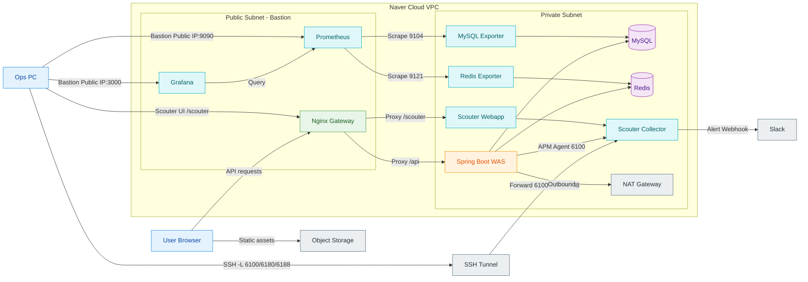

## 핵심 기능

1. 🍽️ 직장인 회식 맞춤 검색 및 선주문/선결제 예약 및 리마인더
   - 거리, 식당 분위기, 기피 재료 등 강력한 필터 검색 제공
   - 착석 즉시 식사를 위한 선주문/선결제 예약 및 방문 확인/리마인더
2. 🌦️ 구내식당 대체, 회식 예산 맞춤, 날씨 맞춤 식당 추천
   - OCR을 통한 구내식당 메뉴 추출 및 본인/팀 취향 태그 매핑으로 대체 식당 추천
   - 정해진 회식 식대에 가장 최적인 식당 추천
   - 날씨 맞춤 메뉴를 파는 식당 추천
3. 🤝 네트워킹 및 유저친화 기능
   - 우리 회사/나만 아는 즐겨찾기 공유
   - AI 챗봇
   - OCR 영수증, 태그 기반 리뷰
4. 📈 직장인 데이터 기반 사업자 AI 인사이트 제공
   - 식당 통계 분석
   - 방문 손님, 즐겨찾기 손님, 연동된 취향 태그 분석
   - 회사 구내식당 메뉴 및 미운영일에 따른 방문 수요 예측
   - 주간 TODO 리스트를 통한 실행 액션 유도

## 팀 구성

- 박기웅 (팀장): 추천(구내식당, 트렌드)/리뷰/동시성/서버 관리 및 모니터링 툴 연동, 일정관리
- 김다혜: 예약 생성, 조회/환불/리마인더, 동시성 제어 스터디장
- 강우혁: 식당정보관리/필터 기반 검색/지도/추천(날씨), 예약취소, Notion 관리
- 이현빈: 식당정보관리/지도기반 검색(예약 날짜, 시간, 인원수, 선결제 여부), 동시성, ERD 관리
- 전예원: 로그인/회원가입/회원관리/추천(예산, 취향 맞춤)/챗봇/AI insights, Git Master

## 협업 방식

### 1) GitHub Projects 기반 주간 버전 관리


- 일요일 22시 기준으로 프로젝트 버전을 업그레이드하고 주간 작업량을 점검
- 분석
  - 초기 단계: 화면/UX 중심 개발로 작업량 증가
  - 개발 중: DB 구조 및 API 설계에 시간 소요 → 작업량 감소
  - 통합 개발: 애자일 기반 동시성 처리/배포 후 통합 테스트/부하 테스트로 작업량 증가
- 예측 및 결과
  - 예측: 하루 평균 인당 1.5개 이슈 × 5명 × 35일 = 262개
  - 결과: 닫힌 이슈 261개
- 약 5주 개발 단계에서 구조적 완성도 우선 전략을 유지해 협업 효율과 계획 수립을 안정화

### 2) GitHub Wiki + Notion 문서화


- 목적
  - 기획 문서 및 데일리 스크럼 정리
  - 서비스 개발에 필요한 아키텍처 적용 문서 정리
- 선정 이유
  - 타임라인 기반 일정 관리에 유용
  - "문서도 개발 과정의 일부" 원칙에 따라 개발 직후 문서화로 버전 관리
- 적용
  - 회의록, 기획 문서
  - 외부 API 적용 방식, 개인 트러블슈팅
- 링크
  - Notion: https://www.notion.so/LunchGo-2bc48507a0fd80fe8e79ed66f2478214
  - GitHub Wiki: https://github.com/SSG9-FINAL-LunchGO/LunchGO/wiki

## 프로젝트 구조

```
/LunchGO/
├── frontend/   # Vue 프론트엔드
├── src/        # Spring Boot 백엔드
├── docs/       # 기술 문서/정리
├── scripts/    # 유틸리티 스크립트
├── scouter/    # 모니터링 설정/에이전트
└── Dockerfile
```

## 깃 브랜치 전략

- `main`: 프로덕션 브랜치
- `dev`: 개발 메인 브랜치
- `feat/*`: 기능 개발 브랜치
- `design/*`: 디자인 작업 브랜치
- 커밋 메시지 규칙(Husky/commitlint): `type(scope): subject` (Conventional Commits)

## ERD

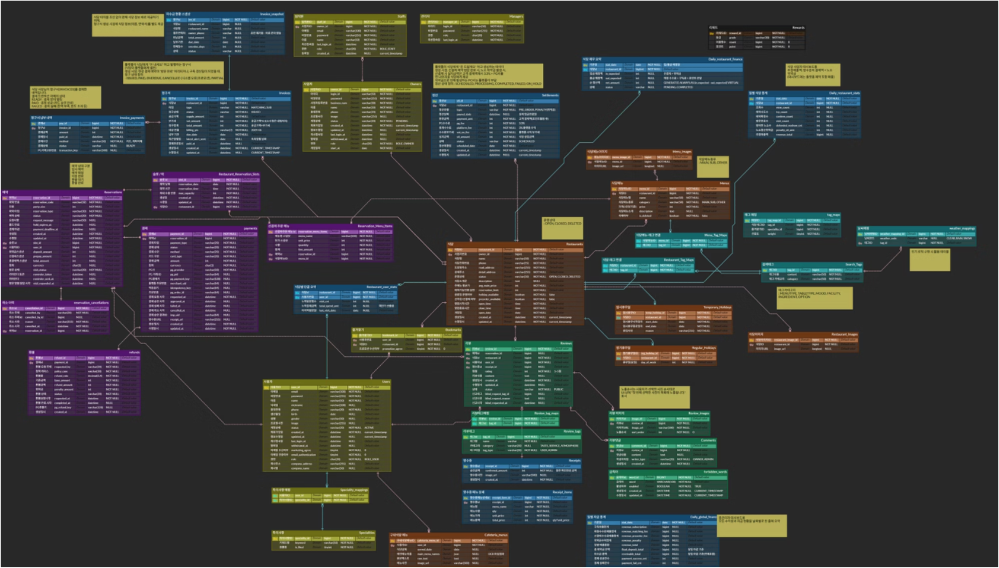

### 📋 ERD 테이블 색상 분류

- 🟧 **주황**: 식당 정보/구내식당
- 🟨 **노랑**: 회원 관리
- 🟦 **파랑**: 재무/통계
- 🧊 **하늘**: 태그/검색
- 🟩 **초록**: 리뷰
- 🟪 **보라**: 예약

## 동시성 제어 전략

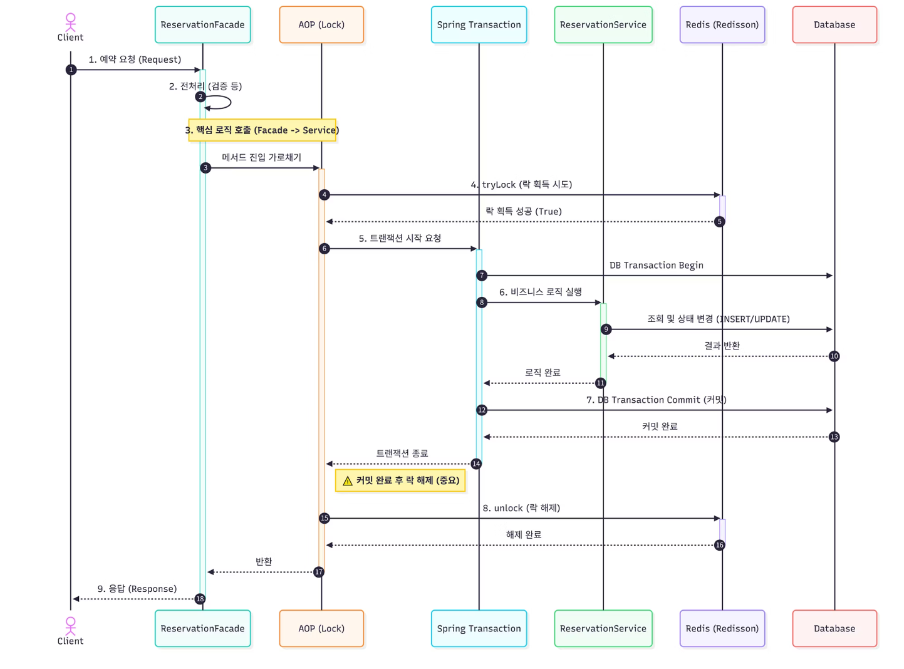

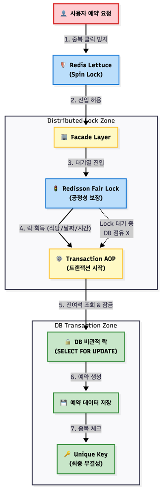

- Redis `SETNX` 기반 짧은 락으로 중복 예약 요청을 사전 차단 (`docs/reservation-idempotence-troubleshooting.md`)
- DB 비관적 락(FOR UPDATE)로 예약 슬롯 정원 동시성 제어 (`docs/reservation-seat-calculation-troubleshooting.md`)
- 조건부 unique 인덱스로 예약 멱등성/재예약 허용을 동시에 보장 (`docs/reservation-idempotence-troubleshooting.md`)
- 예약 생성 전 분산 락 AOP 적용과 락 구간 축소 (`docs/reservation-architecture-troubleshooting.md`)

## AI 인사이트 구현

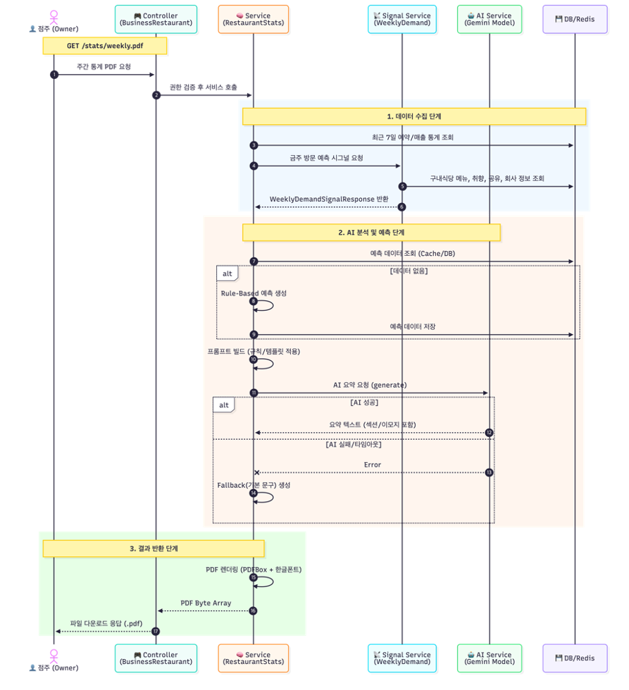

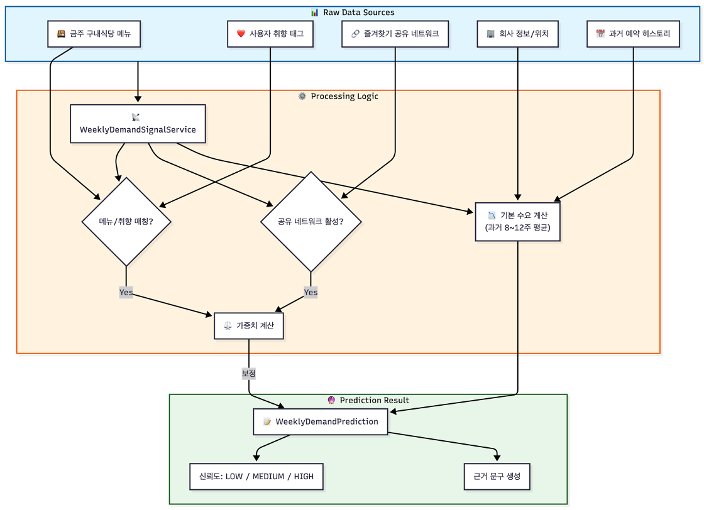

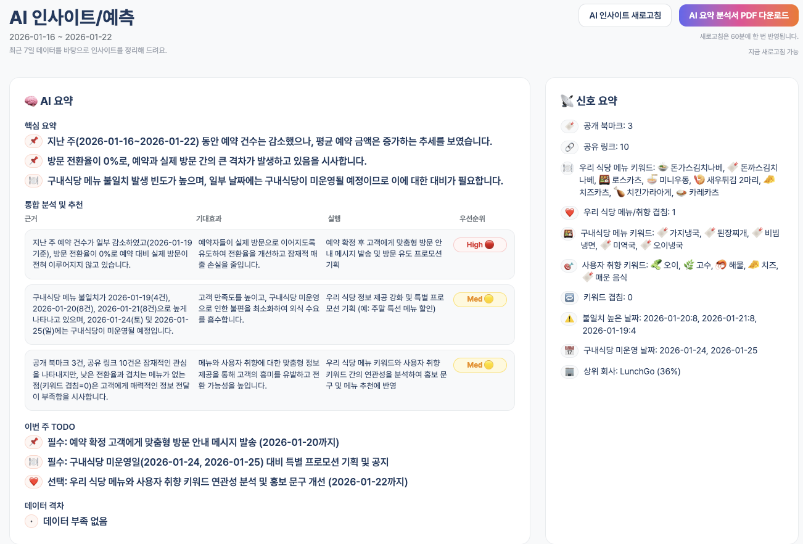

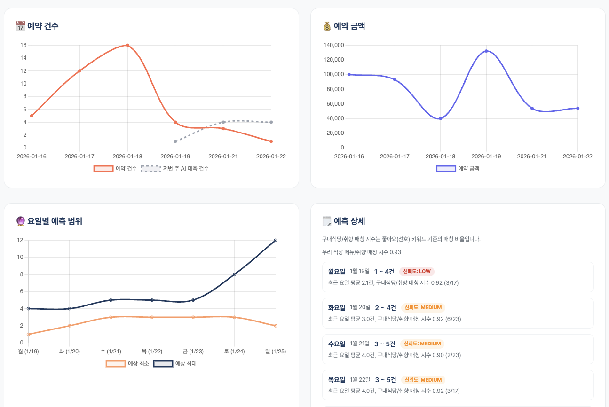

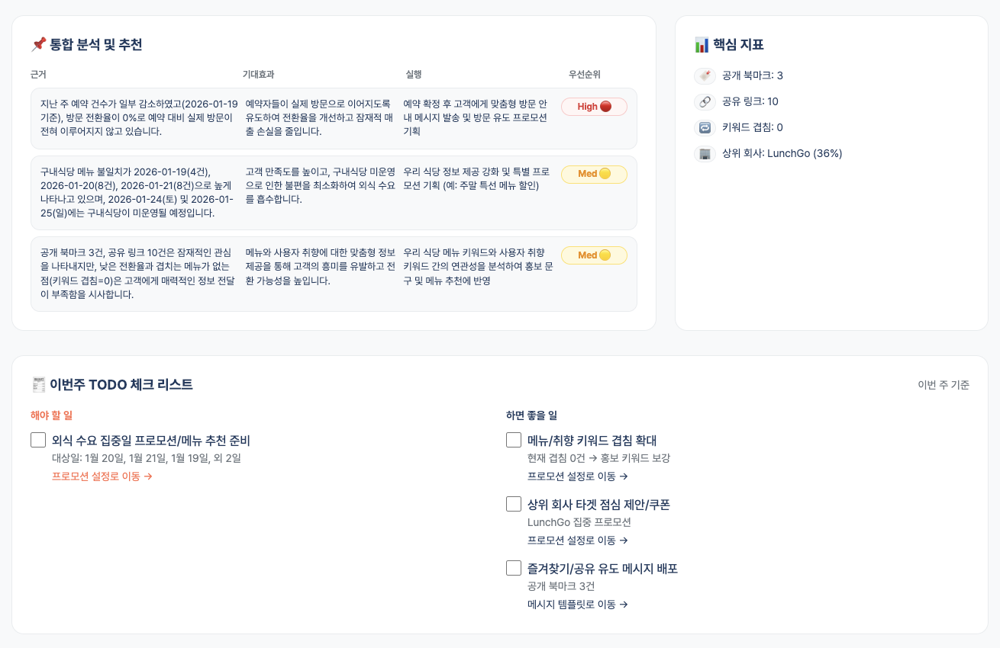

## 성능 최적화

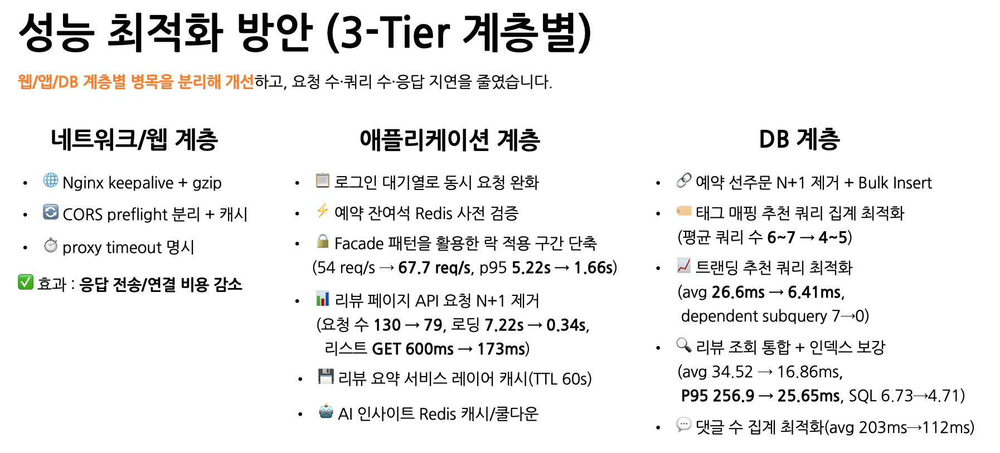

- 네트워크/웹
  - Nginx keepalive, gzip, preflight 분리, proxy timeout (`docs/nginx-conf-improvement.md`)
- 애플리케이션
  - 로그인 대기열, 예약 잔여석 Redis 사전 검증, 리뷰 비즈니스 페이지 요청 N+1 제거
  - 리뷰 요약 캐시, AI 인사이트 캐시/쿨다운 (`docs/lunchgo-performance-optimization-summary.md`)
- DB
  - 태그 매핑/트렌딩 추천 쿼리 최적화, 리뷰 조회 통합+인덱스
  - 댓글 수 집계 최적화, 예약 선주문/선결제 N+1 제거+Bulk Insert
  - (`docs/lunchgo-performance-optimization-summary.md`)

## 부하 테스트 결과

- 1,000명 동시 접속 처리 평균 : 49s, 최대 : 95s
  - Queue capacity=12로, 12명씩 동시에 로그인 연산을 처리
  - poll=1.5s 마다 클라이언트가 서버에 차례를 물음
- 이론상 총 시간 ≈ (N / capacity) X (login 처리시간 + 평균 폴링 지연) = 83.3 큐 X (286ms + 750ms) = 84s < 실제 95s

- 로그인 부하 테스트: Queue OFF avg 743ms/p95 880ms → ON avg 28~38ms/p95 72~132ms (`docs/login-loadtest-summary.md`)

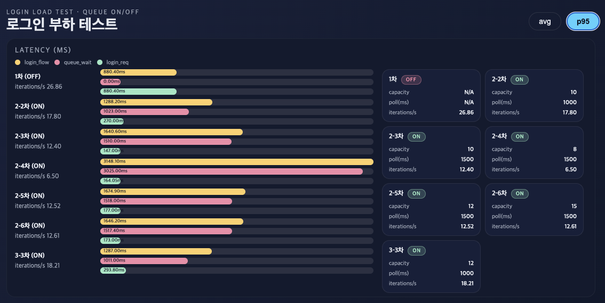


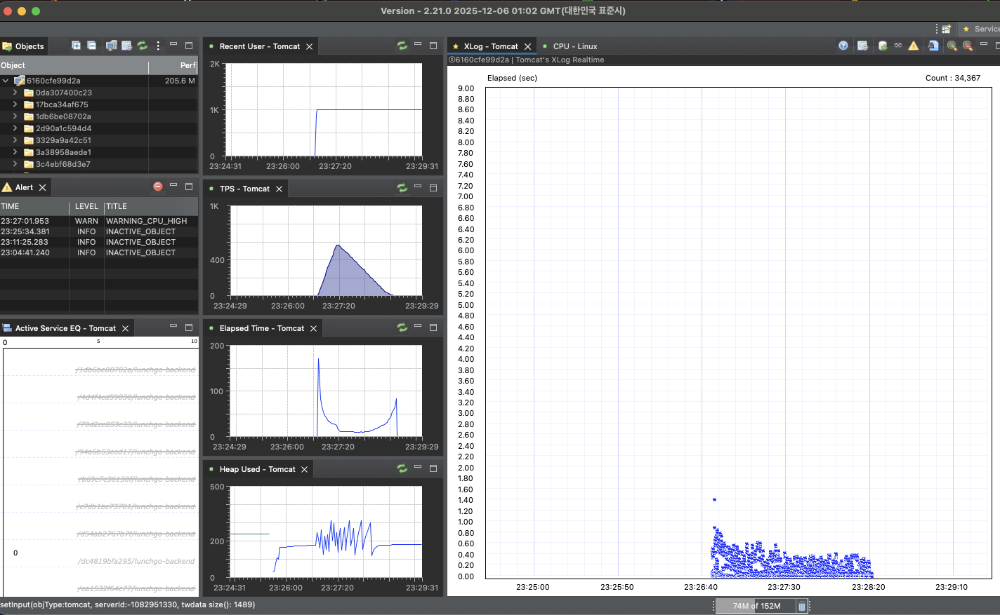

- 예약 부하 테스트 결과

시나리오 구성

- 사용자 수 및 제한시간: VU 2000, 30s
- 식당의 예약 정원: 40명
- 예약 날짜 및 시간대 : 2026-01-17 오전 11:00
- 예약금 결제 방식, 예약 건당 인원수는 4명
- 총 예약 인원은 예약 정원 초과 불가 → 10건만 접수 가능
- 각 사용자마다 동일 예약 요청을 3회씩 전송 (총 6,000건의 요청)

결과

- 성공 응답 : 0.07s 내 총 10건만 접수됨
- 실패 응답 : 최대 1.17s 내 응답 받음

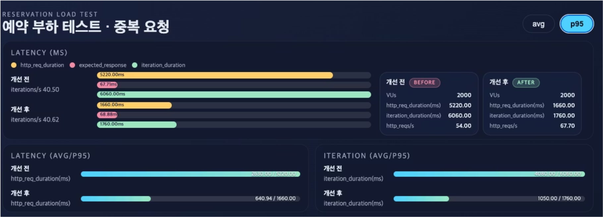
