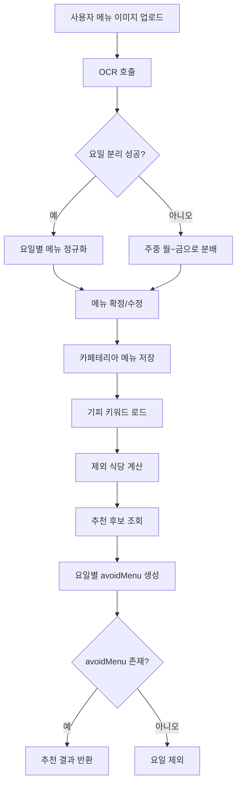
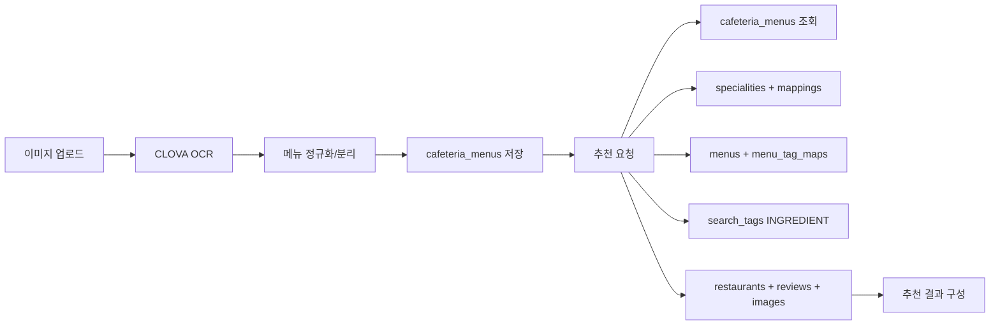
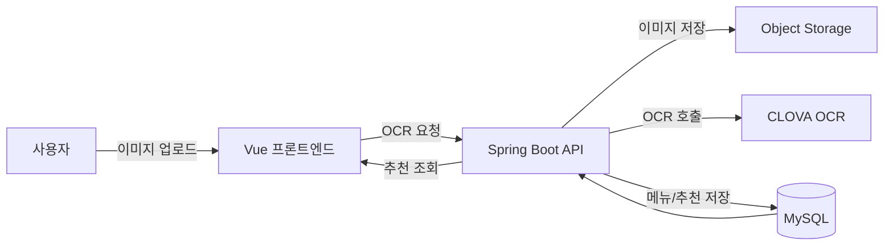

# 🥗 구내식당 대체 추천 구현 정리 (Ver 1.0)

작성일: 2025-12-29
갱신일: 2025-12-29
담당: 추천 시스템

## 🎯 목표

- 사용자 업로드 구내식당 메뉴 이미지를 OCR로 인식
- 주중(월~금) 메뉴 확정 후 대체 식당 추천
- 기피 키워드 기반 제외 메뉴 표시 및 추천 제공

## 📌 정책 결정 사항

- 주간 기준: 검색일자 기준 주중(월~금)로 날짜 매핑
- 메뉴 정규화: 특수문자 제거, 표준 메뉴명 매핑(예: 돈까쓰 → 돈가스)
- 기피 판별 조건:
  - 메뉴명 LIKE 사용자 기피 키워드
  - 메뉴 태그(INGREDIENT) 중 기피 키워드와 매칭된 태그
- 추천 결과 포맷: 프론트 샘플 구조 유지

## 🗂️ 사용 데이터

- cafeteria_menus
  - user_id, served_date, main_menu_names(JSON), raw_text, image_url
- specialities + speciality_mappings
  - 사용자 기피/선호 키워드 (is_liked=0이 기피)
- menus + menu_tag_maps
  - 메뉴명 기반 제외 및 태그 기반 제외
- search_tags
  - INGREDIENT 태그 매칭
- restaurants + restaurant_images + reviews + review_tag_maps + review_tags
  - 추천 후보 및 태그/리뷰 표시

## 🔗 API

### 1) OCR 인식
- POST `/api/cafeteria/menus/ocr`
- Params: `userId`, `baseDate`
- Body: `multipart/form-data` (`file`)

### 2) 확정 저장
- POST `/api/cafeteria/menus/confirm`
- Body(JSON):
```json
{
  "userId": 2,
  "imageUrl": "...",
  "rawText": "...",
  "days": [
    { "day": "월", "date": "2025-12-29", "menus": ["제육", "된장찌개"] }
  ]
}
```

### 3) 추천 조회
- GET `/api/cafeteria/recommendations?userId=2&baseDate=2025-12-29&limit=2`

### 4) 주간 메뉴 조회
- GET `/api/cafeteria/menus/week?userId=2&baseDate=2025-12-29`

## 📦 응답 구조

### OCR 응답
- ocrSuccess, imageUrl, imageKey, rawText
- detectedMenus, unassignedMenus
- days: [{ day, date, menus }]

### 추천 응답
- recommendations: [{ day, date, avoidMenu, restaurants }]
- restaurants: { id, name, address, price, rating, reviews, image, topTags }

## ⚙️ 정규화/파싱 로직

1) OCR 라인 정리
- 특수문자 제거
- 숫자/날짜 텍스트 정리

2) 요일 인식
- 한글 요일(`월~금`), 영문 요일(`MON~FRI`), 괄호 요일(`(월)`)
- 날짜 라인(`1월`, `20일`)은 제외

3) 요일 매핑 실패 시 fallback
- 메뉴가 한 요일에 몰릴 경우 주중 5일로 분배

4) 표준 메뉴명 매핑
- 돈까스/돈까쓰/돈카츠 → 돈가스
- 제육볶음 → 제육

## 🧠 요일 분리 알고리즘 상세

### 핵심 아이디어
- OCR 결과를 위에서 아래로 **한 줄씩 스캔**하며 `currentDay`를 유지한다.
- 요일 라인을 만나면 `currentDay`를 갱신하고, 이후 라인들을 해당 요일에 누적한다.
- 날짜 라인(예: `1월`, `20일`)은 메뉴로 취급하지 않는다.
- 요일이 분리되지 않거나 한 요일에 몰리면 주중 5일로 균등 분배한다.

### 동작 단계
1. OCR 텍스트를 줄 단위로 순회한다.\n
2. 한글 요일(`월~금`), 영문 요일(`MON~FRI`), 괄호 요일(`(월)`)을 만나면 `currentDay` 설정.\n
3. `currentDay`가 설정된 상태에서 나오는 라인들은 해당 요일 메뉴 목록에 추가.\n
4. 날짜 라인(`1월`, `20일`)은 무시.\n
5. 분리 실패/편중 시 fallback 분배.

### 예시 입력 → 분리 결과

**입력(OCR lines 일부)**
```
MON
TUE
WED
THU
FRI
1월
20일
(월)
제육볶음
흰밥
김치
(화)
오이냉국
된장찌개
```

**출력(dayMenus)**
```
월: [제육, 흰밥, 김치]
화: [오이냉국, 된장찌개]
수: []
목: []
금: []
```

**fallback 분배 예시**
```
입력: [제육, 흰밥, 김치, 오이냉국, 된장찌개]
결과: 월~금으로 균등 분배
```

### 실제 OCR 샘플 기반 예시

**입력(OCR rawText 일부)**
```
The
Fiesta
Menu
MON
TUE
WED
THU
FRI
1월
20일
(월)
1월
21일
(화)
흰밥
잡곡밥
도토리묵(양념간장)
시래기된장국
오징어볶음
콩나물국
제육볶음
생선까스,소스
소고기미역국
콩나물잡채
닭갈비
봄동생채무침
쌈채소,쌈장
김치
샐러드
요구르트
```

**분리 결과 예시(정규화/노이즈 제거 후)**  
```
월: [흰밥, 잡곡밥, 도토리묵 양념간장, 시래기된장국, 오징어볶음]
화: [콩나물국, 제육, 생선까스, 소고기미역국, 콩나물잡채]
수: [닭갈비, 봄동생채무침, 쌈채소, 쌈장, 김치]
목: [샐러드, 요구르트]
금: []
```

## 🧠 추천 로직

1) 사용자 기피 키워드 로드
- `specialities.is_liked = 0`만 사용

2) 제외 식당 계산
- 메뉴명 LIKE 기피 키워드
- 메뉴 태그(INGREDIENT) 매칭

3) 추천 후보 조회
- 오픈 식당 중 평점/리뷰수/평균가격 기준 정렬
- 리뷰 태그 Top3 + count 우선
- 리뷰 태그 없을 경우 식당 태그 Top3 fallback

4) 요일별 추천 생성
- 기피 키워드가 포함된 메뉴만 `avoidMenu`로 표시
- `avoidMenu`가 없는 요일은 결과에서 제외
- 후보 리스트에서 라운드로빈 방식으로 2개 선택

## 🧪 기피 키워드 매칭 개선 (MENU_INGREDIENT_MAP)

### 왜 필요한가
- 사용자 기피 키워드가 `돼지고기/소고기/계란`처럼 재료 기준인데,\n  구내식당 메뉴는 `제육/돈가스/계란국`처럼 요리명으로만 표현되는 경우가 많음.
- 단순 문자열 포함 매칭만으로는 기피 재료가 들어간 요리를 걸러내기 어려움.

### 어떻게 구현했나
- `CafeteriaRecommendationService`에 `MENU_INGREDIENT_MAP` 사전을 추가.
- 메뉴명에 특정 키워드가 포함되면 재료 태그 키워드로 매칭되도록 보강.
- `containsAnyKeyword()`에서 직접 매칭 + 재료 매핑 매칭을 모두 수행.

### 매핑 예시
- 제육/돈가스/삼겹/목살/보쌈/수육 → 돼지고기
- 소고기/갈비/불고기/스테이크 → 소고기
- 치킨/닭갈비 → 닭고기
- 새우/게 → 갑각류
- 조개/바지락/굴 → 조개류
- 오징어/낙지/해물/해산물 → 해물/해산물
- 계란/달걀 → 계란
- 치즈/크림/우유 → 유제품
- 김치 → 김치

### 적용 파일
- `src/main/java/com/example/LunchGo/cafeteria/service/CafeteriaRecommendationService.java`

## 🧭 구현 위치

- OCR
  - 서비스: `src/main/java/com/example/LunchGo/cafeteria/service/CafeteriaOcrService.java`
  - 컨트롤러: `src/main/java/com/example/LunchGo/cafeteria/controller/CafeteriaMenuController.java`

- 메뉴 저장/조회
  - 엔티티: `src/main/java/com/example/LunchGo/cafeteria/entity/CafeteriaMenu.java`
  - 서비스: `src/main/java/com/example/LunchGo/cafeteria/service/CafeteriaMenuService.java`
  - 리포지토리: `src/main/java/com/example/LunchGo/cafeteria/repository/CafeteriaMenuRepository.java`

- 추천
  - 서비스: `src/main/java/com/example/LunchGo/cafeteria/service/CafeteriaRecommendationService.java`
  - 후보 쿼리: `src/main/java/com/example/LunchGo/cafeteria/repository/CafeteriaRestaurantRepository.java`

- 프론트
  - 모달: `frontend/src/components/ui/CafeteriaMenuUploadModal.vue`
  - 섹션: `frontend/src/components/ui/CafeteriaRecommendationSection.vue`
  - 상태 로직: `frontend/src/composables/useCafeteriaRecommendation.js`
  - 홈 연결: `frontend/src/views/HomeView.vue`

## 🧩 구현 코드 상세 (토글)

<details>
<summary>API 엔드포인트 (CafeteriaMenuController)</summary>

```java
// OCR 인식 요청
@PostMapping("/menus/ocr")
public ResponseEntity<CafeteriaOcrResponse> recognizeMenu(
    @RequestParam("file") MultipartFile file,
    @RequestParam(value = "userId", required = false) Long userId,
    @RequestParam(value = "baseDate", required = false) LocalDate baseDate
) {
    // OCR 결과 + 주간 분리 결과 반환
    CafeteriaOcrResponse response = cafeteriaMenuService.recognizeMenus(userId, baseDate, file);
    return ResponseEntity.ok(response);
}

// 메뉴 확정 저장
@PostMapping("/menus/confirm")
public ResponseEntity<CafeteriaMenuWeekResponse> confirmMenus(
    @RequestBody CafeteriaMenuConfirmRequest request
) {
    // 날짜별 메뉴 저장
    return ResponseEntity.ok(cafeteriaMenuService.saveWeeklyMenus(request));
}

// 추천 조회
@GetMapping("/recommendations")
public ResponseEntity<CafeteriaRecommendationResponse> getRecommendations(
    @RequestParam("userId") Long userId,
    @RequestParam(value = "baseDate", required = false) LocalDate baseDate,
    @RequestParam(value = "limit", required = false) Integer limit
) {
    // 요일별 추천 결과 반환
    CafeteriaRecommendationResponse response = limit == null
        ? cafeteriaRecommendationService.recommend(userId, baseDate)
        : cafeteriaRecommendationService.recommend(userId, baseDate, limit);
    return ResponseEntity.ok(response);
}
```
</details>

<details>
<summary>OCR 요청 및 텍스트 추출 (CafeteriaOcrService)</summary>

```java
// OCR 호출 요청을 만들고, 결과 텍스트를 라인 단위로 추출한다.
public OcrResult recognizeMenu(MultipartFile file) {
    // ... 요청 JSON 생성 및 OCR 호출 생략 ...
    return parseOcrResponse(response.toString());
}

private OcrResult parseOcrResponse(String responseBody) {
    JsonNode root = objectMapper.readTree(responseBody);
    JsonNode fields = root.path("images").get(0).path("fields");
    // inferText 라인을 모아 rawText 및 lines에 담는다.
    List<String> lines = new ArrayList<>();
    for (JsonNode field : fields) {
        String text = field.path("inferText").asText();
        if (text != null && !text.isBlank()) {
            lines.add(text.trim());
        }
    }
    String rawText = String.join("\n", lines);
    return new OcrResult(true, rawText, lines);
}
```
</details>

<details>
<summary>OCR → 주간 메뉴 분리 (CafeteriaMenuService)</summary>

```java
// OCR 결과에서 메뉴를 정규화한 뒤 주중(월~금)으로 나눈다.
public CafeteriaOcrResponse recognizeMenus(Long userId, LocalDate baseDate, MultipartFile file) {
    ImageUploadResponse uploadResponse = objectStorageService.upload("cafeteria", file);
    OcrResult ocrResult = cafeteriaOcrService.recognizeMenu(file);
    List<String> detectedMenus = normalizeMenus(ocrResult.lines());

    Map<String, List<String>> dayMenus = splitMenusByDay(ocrResult.lines());
    if (shouldFallbackDistribution(dayMenus)) {
        // 요일 매칭 실패 시 주중 분배 fallback
        dayMenus = distributeMenusAcrossWeek(detectedMenus);
    }

    List<CafeteriaDayMenuDto> dayDtos = buildWeekDays(baseDate, dayMenus);
    return new CafeteriaOcrResponse(true, uploadResponse.getFileUrl(), uploadResponse.getKey(),
        ocrResult.rawText(), detectedMenus, List.of(), dayDtos);
}
```
</details>

<details>
<summary>요일 분리 및 메뉴 정규화 (CafeteriaMenuService)</summary>

```java
// 한글/영문 요일, 괄호 요일을 인식하여 메뉴를 요일별로 분리한다.
private Map<String, List<String>> splitMenusByDay(List<String> lines) {
    Map<String, List<String>> result = new LinkedHashMap<>();
    String currentDay = null;
    for (String line : lines) {
        String trimmed = line.trim();
        // 월~금 라인
        Matcher matcher = KOREAN_DAY_PATTERN.matcher(trimmed);
        if (matcher.find()) {
            currentDay = matcher.group(1);
            addMenus(result, currentDay, trimmed);
            continue;
        }
        // MON~FRI 라인
        Matcher englishMatcher = ENGLISH_DAY_PATTERN.matcher(trimmed);
        if (englishMatcher.find()) {
            currentDay = normalizeEnglishDay(englishMatcher.group(1));
            addMenus(result, currentDay, trimmed);
            continue;
        }
        // (월) 같은 라인
        Matcher parenMatcher = PAREN_DAY_PATTERN.matcher(trimmed);
        if (parenMatcher.find()) {
            currentDay = parenMatcher.group(1);
            continue;
        }
        // 날짜 라인은 메뉴에서 제외
        if (currentDay != null && !isDateLine(trimmed)) {
            addMenus(result, currentDay, trimmed);
        }
    }
    return result;
}

// 요일이 제대로 분리되지 않으면 주중 5일로 분배한다.
private Map<String, List<String>> distributeMenusAcrossWeek(List<String> detectedMenus) {
    Map<String, List<String>> result = new LinkedHashMap<>();
    for (String day : WEEK_DAYS) {
        result.put(day, new ArrayList<>());
    }
    // 노이즈 제거 후 균등 분배
    List<String> filteredMenus = detectedMenus.stream()
        .filter(menu -> menu != null && !menu.isBlank())
        .filter(menu -> !isNoiseMenu(menu))
        .toList();
    int chunkSize = (int) Math.ceil(filteredMenus.size() / (double) WEEK_DAYS.size());
    int index = 0;
    for (String day : WEEK_DAYS) {
        for (int i = 0; i < chunkSize && index < filteredMenus.size(); i++) {
            result.get(day).add(filteredMenus.get(index++));
        }
    }
    return result;
}
```
</details>

<details>
<summary>메뉴 확정 저장 (CafeteriaMenuService)</summary>

```java
// 날짜별 메뉴를 cafeteria_menus에 저장한다.
public CafeteriaMenuWeekResponse saveWeeklyMenus(CafeteriaMenuConfirmRequest request) {
    for (CafeteriaDayMenuDto day : request.getDays()) {
        LocalDate servedDate = LocalDate.parse(day.getDate(), DATE_FORMATTER);
        CafeteriaMenu menu = cafeteriaMenuRepository
            .findByUserIdAndServedDate(request.getUserId(), servedDate)
            .orElseGet(() -> CafeteriaMenu.builder()
                .userId(request.getUserId())
                .servedDate(servedDate)
                .build());
        menu.updateMenus(toJson(day.getMenus()), request.getRawText(), request.getImageUrl());
        cafeteriaMenuRepository.save(menu);
    }
    return new CafeteriaMenuWeekResponse(request.getImageUrl(), request.getDays());
}
```
</details>

<details>
<summary>기피 메뉴 반영 및 추천 생성 (CafeteriaRecommendationService)</summary>

```java
// 기피 키워드가 포함된 메뉴만 avoidMenu로 표시한다.
private String buildAvoidMenu(List<String> menus, List<String> dislikedKeywords) {
    if (menus == null || menus.isEmpty() || dislikedKeywords == null || dislikedKeywords.isEmpty()) {
        return "-";
    }
    String matched = menus.stream()
        .filter(menu -> menu != null && !menu.isBlank())
        .filter(menu -> containsAnyKeyword(menu, dislikedKeywords))
        .collect(Collectors.joining(", "));
    return matched.isBlank() ? "-" : matched;
}

// avoidMenu가 없으면 해당 요일은 추천 결과에서 제외한다.
for (CafeteriaDayMenuDto day : days) {
    String avoidMenu = buildAvoidMenu(day.getMenus(), dislikedKeywords);
    if ("-".equals(avoidMenu)) {
        continue;
    }
    List<CafeteriaRestaurantRecommendationDto> selected = pickRecommendations(candidates, limitPerDay, index);
    recommendations.add(new CafeteriaDayRecommendationDto(day.getDay(), day.getDate(), avoidMenu, selected));
}
```
</details>

<details>
<summary>후보 식당 조회 쿼리 (CafeteriaRestaurantRepository)</summary>

```sql
-- 평점/리뷰수/가격 기준으로 후보 식당을 조회하고 태그 정보를 함께 로드한다.
SELECT
  r.restaurant_id AS restaurantId,
  r.name AS name,
  r.road_address AS roadAddress,
  r.detail_address AS detailAddress,
  r.avg_main_price AS avgMainPrice,
  COALESCE(rv.reviewCount, 0) AS reviewCount,
  COALESCE(rv.rating, 0) AS rating,
  img.imageUrl AS imageUrl,
  rt.tagContents AS tagContents,
  rvt.reviewTagContents AS reviewTagContents,
  rvt.reviewTagCounts AS reviewTagCounts
FROM restaurants r
LEFT JOIN (
  SELECT restaurant_id, COUNT(*) AS reviewCount, ROUND(AVG(rating), 1) AS rating
  FROM reviews WHERE status = 'PUBLIC' GROUP BY restaurant_id
) rv ON r.restaurant_id = rv.restaurant_id
LEFT JOIN (
  SELECT restaurant_id, SUBSTRING_INDEX(GROUP_CONCAT(image_url ORDER BY restaurant_image_id), ',', 1) AS imageUrl
  FROM restaurant_images GROUP BY restaurant_id
) img ON r.restaurant_id = img.restaurant_id
LEFT JOIN (
  SELECT rtm.restaurant_id, GROUP_CONCAT(st.content ORDER BY st.tag_id SEPARATOR ',') AS tagContents
  FROM restaurant_tag_maps rtm
  JOIN search_tags st ON st.tag_id = rtm.tag_id
  GROUP BY rtm.restaurant_id
) rt ON r.restaurant_id = rt.restaurant_id
LEFT JOIN (
  SELECT restaurant_id,
         GROUP_CONCAT(name ORDER BY tag_count DESC, tag_id SEPARATOR ',') AS reviewTagContents,
         GROUP_CONCAT(tag_count ORDER BY tag_count DESC, tag_id SEPARATOR ',') AS reviewTagCounts
  FROM (
    SELECT rv.restaurant_id, rt.tag_id, rt.name, COUNT(*) AS tag_count,
           ROW_NUMBER() OVER (PARTITION BY rv.restaurant_id ORDER BY COUNT(*) DESC, rt.tag_id) AS rn
    FROM reviews rv
    JOIN review_tag_maps rtm ON rv.review_id = rtm.review_id
    JOIN review_tags rt ON rt.tag_id = rtm.tag_id
    WHERE rv.status = 'PUBLIC' AND rt.tag_type = 'USER'
    GROUP BY rv.restaurant_id, rt.tag_id, rt.name
  ) ranked
  WHERE rn <= 3
  GROUP BY restaurant_id
) rvt ON r.restaurant_id = rvt.restaurant_id
WHERE r.status = 'OPEN'
ORDER BY COALESCE(rv.rating, 0) DESC, COALESCE(rv.reviewCount, 0) DESC, r.avg_main_price ASC
LIMIT :limit;
```
</details>

<details>
<summary>프론트 상태 로직 (useCafeteriaRecommendation)</summary>

```js
// OCR → 확정 → 추천의 상태를 관리하는 composable
const handleCafeteriaOcr = async (baseDate) => {
  // 파일 업로드 후 OCR 요청
  const response = await axios.post("/api/cafeteria/menus/ocr", formData, {
    params: { userId, baseDate },
    headers: { "Content-Type": "multipart/form-data" },
  });
  // OCR 결과를 모달에 주입
  cafeteriaOcrResult.value = response.data;
  cafeteriaDaysDraft.value = response.data?.days ?? [];
};
```
</details>

<details>
<summary>프론트 UI 흐름 (HomeView + Section)</summary>

```vue
<!-- 추천옵션에서 메뉴 입력/수정, 추천 받기 제공 -->
<div v-if="filterForm.recommendation === '구내식당 대체 추천'">
  <button @click="handleCafeteriaMenuEdit">
    {{ hasConfirmedMenus ? '구내식당 메뉴 수정' : '구내식당 메뉴 입력' }}
  </button>
  <button v-if="hasConfirmedMenus" @click="handleCafeteriaRecommendNow">
    추천받기
  </button>
</div>
```
</details>

## ✅ 테스트 체크리스트

- OCR 업로드 후 days 메뉴 분리 확인
- 모달에서 메뉴 수정/확정 가능
- 확정 후 추천 조회 시 avoidMenu 정상 출력
- 기피 키워드 없는 요일은 결과 제외
- 리뷰 태그 Top3 표시 확인 (없으면 식당 태그 fallback)

## 🧭 플로우 다이어그램



## 🗺️ 데이터 흐름 다이어그램



## 🏗️ 시스템 아키텍처 다이어그램


