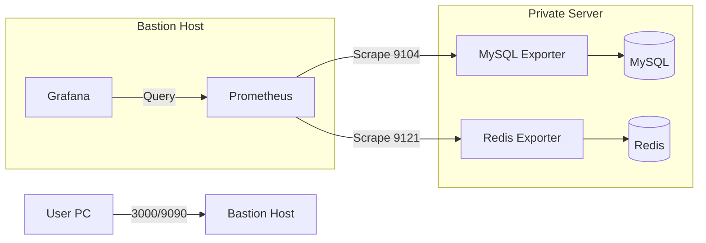
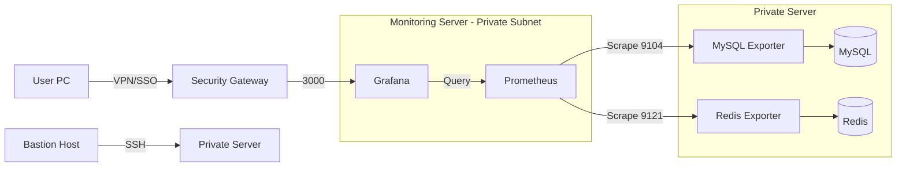

# DB 모니터링 구현 (Prometheus + Grafana)

## 목적
- Naver Cloud bastion host에 Prometheus/Grafana 설치
- Private 서버의 MySQL/Redis exporter를 연동해 Prometheus가 지표를 수집하도록 구성

## 모니터링 서버 구조 (Mermaid)


## Bastion host 구성
### 디렉터리 구조
- `~/monitoring`
  - `docker-compose.yml`
  - `prometheus/`
    - `prometheus.yml`

### docker-compose.yml
```yaml
services:
  prometheus:
    image: prom/prometheus:v2.53.0
    container_name: prometheus
    volumes:
      - ./prometheus/prometheus.yml:/etc/prometheus/prometheus.yml
      - prometheus_data:/prometheus
    command:
      - '--config.file=/etc/prometheus/prometheus.yml'
      - '--storage.tsdb.path=/prometheus'
      - '--storage.tsdb.retention.time=15d' # 데이터 15일만 보관 (디스크 절약)
    ports:
      - "9090:9090"
    restart: always

  grafana:
    image: grafana/grafana:latest
    container_name: grafana
    ports:
      - "3000:3000"
    volumes:
      - grafana_data:/var/lib/grafana
    environment:
      - GF_SECURITY_ADMIN_PASSWORD=<STRONG_PASSWORD_HERE> # 초기 비밀번호
    restart: always

volumes:
  prometheus_data:
  grafana_data:
```

### prometheus.yml
```yaml
global:
  scrape_interval: 15s # 데이터를 긁어오는 주기

scrape_configs:
  - job_name: 'mysql-db'
    static_configs:
      - targets: ['10.0.2.6:9104'] # Private 서버 IP 입력

  - job_name: 'redis-db'
    static_configs:
      - targets: ['10.0.2.6:9121'] # Private 서버 IP 입력

  - job_name: 'bastion-host' # Bastion 서버 자신도 모니터링 (선택)
    static_configs:
      - targets: ['localhost:9100']
```

## ACG (보안 그룹) 규칙
### Bastion host (ssg-team1-bastion-host) inbound
| 목적 | 프로토콜 | 접근 소스 | 허용 포트 | 설명 |
| --- | --- | --- | --- | --- |
| SSH 접속 | TCP | MyIP | 22 | 내 PC에서 Bastion 서버로 SSH 접속 |
| Grafana 대시보드 접속 | TCP | MyIP | 3000 | 내 PC 웹 브라우저에서 Grafana 접속 |
| Prometheus UI 접속 | TCP | MyIP | 9090 | 내 PC 웹 브라우저에서 Prometheus 직접 접속 |

### Private 서버 inbound
| 목적 | 프로토콜 | 접근 소스 | 허용 포트 | 설명 |
| --- | --- | --- | --- | --- |
| MySQL 지표 수집 | TCP | Bastion Host ACG | 9104 | Prometheus가 MySQL Exporter 지표 수집 |
| Redis 지표 수집 | TCP | Bastion Host ACG | 9121 | Prometheus가 Redis Exporter 지표 수집 |

## Private 서버 exporter 설치 (Docker Compose)
### MySQL exporter 계정 생성
```bash
# DB 컨테이너 진입
docker exec -it lunchgo-db mysql -uroot -p<YOUR_ROOT_PASSWORD>

# MySQL 내부에서 실행
CREATE USER 'exporter'@'%' IDENTIFIED BY '<YOUR_EXPORTER_PASSWORD>';
GRANT PROCESS, REPLICATION CLIENT, SELECT ON *.* TO 'exporter'@'%';
FLUSH PRIVILEGES;
```

### MySQL exporter 설정 파일 생성
```bash
mkdir -p ./mysql-exporter
cat <<'EOF' > ./mysql-exporter/exporter.cnf
[client]
user=exporter
password=<YOUR_EXPORTER_PASSWORD>
host=db
port=3306
EOF
```

### docker-compose.yml에 exporter 서비스 추가
```yaml
  mysql-exporter:
    image: prom/mysqld-exporter:latest
    container_name: lunchgo-mysql-exporter
    restart: always
    command:
      - '--config.my-cnf=/etc/mysql/exporter.cnf'
    volumes:
      - ./mysql-exporter/exporter.cnf:/etc/mysql/exporter.cnf:ro
    ports:
      - "9104:9104"
    depends_on:
      - db

  redis-exporter:
    image: oliver006/redis_exporter:latest
    container_name: lunchgo-redis-exporter
    restart: always
    command:
      - '--redis.addr=redis://redis:6379'
      - '--redis.password=${REDIS_PASSWORD}'
    ports:
      - "9121:9121"
    depends_on:
      - redis
```

### 기동 및 확인
```bash
docker compose up -d

curl http://localhost:9104/metrics
curl http://localhost:9121/metrics
```

## 트러블슈팅
### MySQL exporter가 계속 재시작되며 `no user specified` 오류가 나는 경우
- 원인: `mysqld-exporter`가 설정 파일을 못 읽어서 `.my.cnf` 기본값을 찾는 상태.
- 해결: `docker-compose.yml`에서 `environment`가 아니라 `command`로 `--config.my-cnf`를 전달하고, `exporter.cnf`를 `volumes`로 마운트한다.

```yaml
  mysql-exporter:
    image: prom/mysqld-exporter:latest
    container_name: lunchgo-mysql-exporter
    restart: always
    command:
      - '--config.my-cnf=/etc/mysql/exporter.cnf'
    volumes:
      - ./mysql-exporter/exporter.cnf:/etc/mysql/exporter.cnf:ro
    ports:
      - "9104:9104"
    depends_on:
      - db
```

```bash
docker compose up -d --force-recreate mysql-exporter
docker compose logs mysql-exporter
curl http://localhost:9104/metrics
```

## Grafana 대시보드 추가 절차
### 데이터 소스 추가 (Prometheus)
1. Grafana 접속: `http://<bastion-public-ip>:3000`
2. 좌측 메뉴 `Connections` → `Data sources` → `Add data source`
3. Prometheus 선택 후 URL 입력
   - `http://prometheus:9090` (Grafana/Prometheus가 동일 Docker 네트워크일 때)
   - 또는 `http://<bastion-private-ip>:9090`
4. `Save & test`로 연결 확인

### 대시보드 Import
1. 좌측 메뉴 `Dashboards` → `New` → `Import`
2. 아래 ID 중 필요한 것을 선택해 Import
   - MySQL: `14057`
   - Redis: `11835`
   - Node Exporter: `1860` (bastion-host용, 선택)
3. 데이터 소스에 위에서 추가한 Prometheus 선택

## Exporter 보안/보완 설정
- **ACG 제한**: 9104/9121 인바운드는 `Bastion Host ACG`만 허용 (외부 공개 금지).
- **포트 접근 최소화**: 필요하면 OS 방화벽(iptables/ufw)으로 bastion IP만 허용.
- **계정 최소 권한**: MySQL exporter는 `PROCESS, REPLICATION CLIENT, SELECT`만 부여.
- **비밀 관리**: `exporter.cnf`는 `chmod 600`으로 권한 제한, `:ro` 마운트 유지.
- **패스워드 변경/회전**: 운영 정책에 따라 주기적 변경 및 갱신.
- **모니터링 분리**: exporter는 별도 컨테이너로 분리 유지, DB 컨테이너와 네트워크만 공유.

## Bastion host에서 Prometheus/Grafana 실행
```bash
cd ~/monitoring

# 기동
docker compose up -d

# 상태 확인
docker compose ps

# 로그 확인
docker compose logs -f prometheus
docker compose logs -f grafana

# 중지/재시작
docker compose stop
docker compose restart
```

## 보안 이슈 및 선택 배경
### 보안 이슈
- **Bastion 역할 혼합**: 원래 접속/중계 전용인 bastion에 모니터링 서비스가 추가되어 공격면이 확대됨.
- **대외 노출 포트 증가**: 3000/9090 포트가 외부에 열리면 UI 계정 공격/스캐닝 대상이 될 수 있음.
- **내부망 접근 확대**: Prometheus가 private 서버로 스크랩하는 구조라, bastion 침해 시 내부 리소스 접근 경로가 생김.
- **계정/설정 관리 리스크**: Grafana 계정 관리, Prometheus 설정 변경 권한이 bastion에 집중됨.

### 선택 배경 (현실적인 타협)
- **가용 서버 제한**: 별도 모니터링 전용 서버를 확보하기 어려운 상황에서, 즉시 구축 가능한 인프라가 bastion뿐이었음.
- **운영 속도 우선**: DB 상태 가시화가 긴급했고, 기존 bastion에 구성하는 것이 배포/운영 속도를 크게 단축했음.
- **접근 제어로 리스크 완화**: ACG를 MyIP 및 Bastion Host ACG로 제한하여 외부 노출을 최소화함.

### 별도 모니터링 서버 분리 시 개선점
- **역할 분리**: bastion은 접속/중계 전용, 모니터링 서버는 수집/시각화 전용으로 분리해 공격면 축소.
- **네트워크 분리**: 모니터링 서버를 private subnet에 두고, Grafana 접근은 VPN/보안 게이트웨이 경유로 제한.
- **포트 최소화**: 3000/9090 외부 노출 제거, 필요 시 리버스 프록시+인증으로 접근 제어.
- **계정/권한 분리**: Grafana 관리자 권한과 운영 권한을 분리하고 MFA/SSO 적용.
- **감사/로그 강화**: 모니터링 서버 접근 로그, 대시보드 변경 이력, 알림 룰 변경 이력 추적.

### 권장 아키텍처 예시 (Mermaid)

