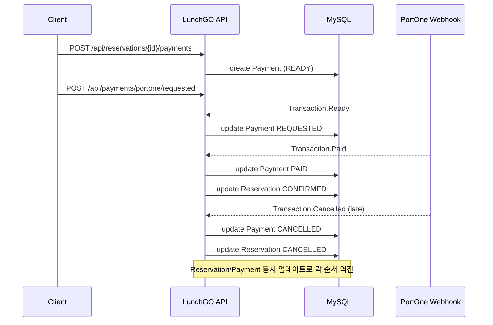

# 예약 결제 웹훅 데드락 트러블슈팅

## 요약
- PortOne 웹훅 자체는 정상 처리되었으나, 서버에서 MySQL 데드락이 발생함.
- 데드락 로그상 **payments → reservations** 업데이트 흐름과 **reservations → payments** 흐름이 동시에 발생해 락 순서가 역전됨.

## 발생 로그
- 에러: `MySQLTransactionRollbackException: Deadlock found when trying to get lock`
- API: `POST /api/payments/portone/webhook`
- 서비스: `ReservationPaymentService.handleWebhookCancelled`

## 관측 타임라인
```
12:44:41  결제 생성/요청
12:44:41  웹훅 Transaction.Ready
12:45:03  웹훅 Transaction.Paid
12:45:25  웹훅 Transaction.Cancelled
12:45:26  handleWebhookCancelled에서 데드락 발생
```



## 데드락 로그 핵심 (InnoDB)
- TX(1)
  - `payments` 레코드 X락 보유
  - `reservations` 레코드 X락 대기
  - 쿼: `update reservations ... status='CANCELLED' where reservation_id=916191`
- TX(2)
  - `reservations` 레코드 X락 보유
  - `payments` 레코드 X락 대기
  - 쿼: `update payments ... status='CANCELLED' where payment_id=2993`

## 원인
- 동일 예약에 대해 동시에 상태 변경이 발생할 때 **락 순서가 뒤바뀜**.
  - 웹훅 취소 처리: `Payment → Reservation`
  - 예약 취소/환불/만료 등: `Reservation → Payment`
- 서로 상대 테이블의 락을 기다리면서 데드락이 발생.
  - 특히 **Paid 이후 Cancelled 웹훅이 지연 도착**하는 경우에 충돌 가능성이 높음.

## 관련 코드 위치
- `src/main/java/com/example/LunchGo/reservation/service/ReservationPaymentService.java`
  - `handleWebhookCancelled` (Payment 먼저 갱신 후 Reservation 갱신)
- `src/main/java/com/example/LunchGo/reservation/service/ReservationCancelService.java`
  - 예약 취소 흐름에서 Reservation 갱신 후 Payment 갱신
- `src/main/java/com/example/LunchGo/reservation/service/ReservationRefundService.java`
- `src/main/java/com/example/LunchGo/reservation/service/ReservationPaymentExpiryService.java`

## 추가 확인 방법
- 최근 데드락 상세 확인:
  - `SHOW ENGINE INNODB STATUS\G`
- 실시간 락 대기 확인:
  - `SELECT * FROM performance_schema.data_lock_waits\G`
  - `SELECT * FROM performance_schema.data_locks\G`

## 대응 방향 (결정 필요)
1) 락 순서 통일 (근본 해결)
   - 모든 흐름에서 Reservation 또는 Payment를 **동일한 순서로** 업데이트.
2) 데드락 재시도 로직 추가
   - 일정 횟수 재시도 + 짧은 backoff.
3) 상태 확인 강화
   - 이미 CANCELLED/PAID 등 최종 상태일 경우 조기 반환.

## 핵심 코드 변경 (락 순서 통일)
- 변경 의도: **Reservation 선락 → Payment 갱신** 순서로 통일
- 포인트: `handleWebhookCancelled`에서 예약 row를 `PESSIMISTIC_WRITE`로 먼저 확보

```java
// ReservationRepository
@Lock(LockModeType.PESSIMISTIC_WRITE)
@Query("select r from Reservation r where r.reservationId = :reservationId")
Optional<Reservation> findByIdForUpdate(@Param("reservationId") Long reservationId);
```

```java
// ReservationPaymentService#handleWebhookCancelled
@Transactional
public void handleWebhookCancelled(String paymentId) {
    if (paymentId == null || paymentId.isBlank()) {
        throw new IllegalArgumentException("결제 정보를 찾을 수 없습니다.");
    }

    Payment payment = paymentRepository.findByMerchantUid(paymentId)
        .orElseThrow(() -> new IllegalArgumentException("결제 정보를 찾을 수 없습니다."));

    // Reservation을 먼저 잠금 확보 (락 순서 통일)
    Reservation reservation = getReservationForUpdate(payment.getReservationId());

    payment.setStatus("CANCELLED");
    payment.setCancelledAt(LocalDateTime.now());

    if (ReservationStatus.TEMPORARY.equals(reservation.getStatus()) && !isPastPaymentDeadline(reservation)) {
        return;
    }
    reservation.setStatus(ReservationStatus.CANCELLED);
}
```

## 재현 테스트 결과 (로컬 + ngrok)
- 환경: 로컬 서버, ngrok으로 웹훅 URL 연결
- 시나리오:
  - 결제 완료 → 예약 취소 → Transaction.Cancelled 웹훅 수신
- 결과:
  - `handleWebhookCancelled` 정상 처리
  - 데드락 발생 로그 없음
