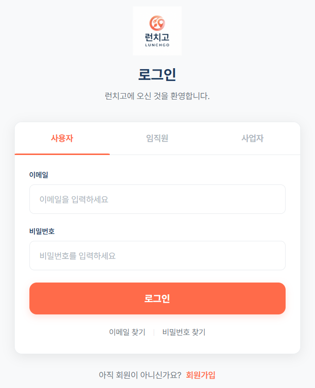
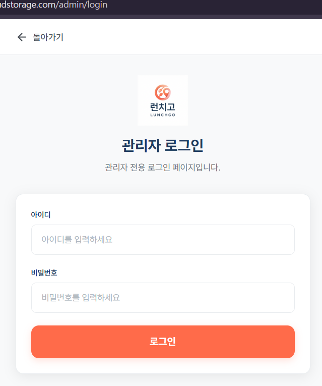
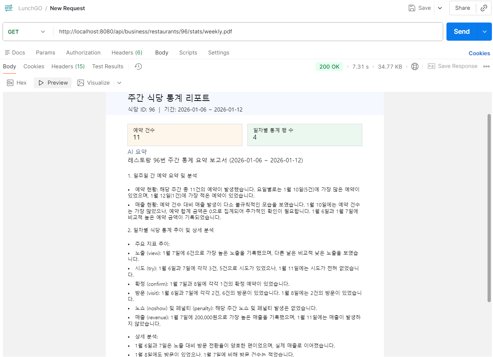
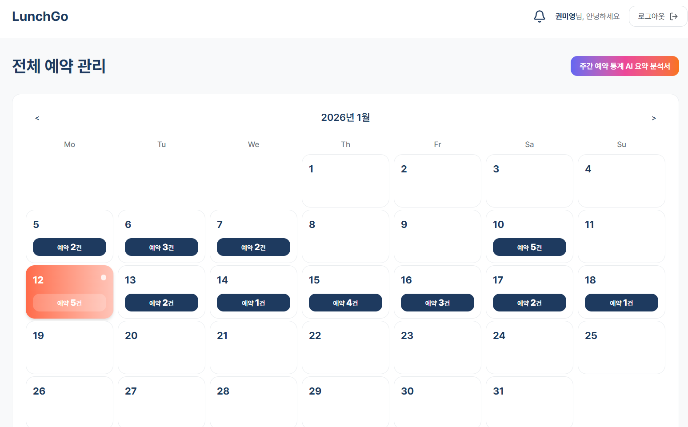

# TroubleShooting

## 1.  로그인 페이지에서 관리자 존재가 보이는 부분

---

### 문제 상황

로그인을 하지 않은 상태에서 로그인 페이지에 들어가면 사용자, 임직원, 사업자, 관리자 4개의 탭을 고르고 로그인할 수 있어, 관리자의 존재가 노출되어 보안적인 문제 발생 가능성이 있었음

### 해결 방안 생각 과정

1. 멘토링 과정에서 멘토님이 관리자의 존재가 안보이게 하는게 맞다는 의견 및 결론을 제시함.
2. 멘토님께서 관리자는 원래 도메인 자체를 분리해서 운영함을 가르쳐주심
3. 현재 LunchGo 프로젝트는 단일 서버로 운영됨을 생각함
4. 도메인 분리는 현실적으로 어렵기에, 요청 주소를 다르게 하는 방법으로 결정
5. 기존 로그인은 /login으로, 관리자 로그인은 /admin/login으로 분리하여 로그인 결정

### 결론

기존 사용자, 임직원, 사업자 로그인은 하나의 로그인 페이지에서 3개의 탭으로 분리하여 사용하는 것으로 수정, 관리자 로그인은 직접 요청 주소를 입력하여 로그인 페이지로 넘어가도록 페이지 분리 및 메소드 수정

### 적용

- /login



- /admin/login



## 2. AI Insights 배포 중 발생한 401 예외 후 로그인 풀림 문제

---

### 문제 상황

로컬에서 테스트 완료하여 AI insights를 이용한 일주일 간 예약 및 재무 통계 분석에 관한 PDF 출력이 정상적으로 이루어짐을 확인



그러나 배포 후 pdf 다운 버튼을 클릭 시 401 예외가 발생하며, 로그인 창으로 redirect 되는 문제 발생

이후, network 창과 서버 로그를 확인하며 예외를 추적했지만 예외 발생 지점을 찾기가 쉽지 않았음

### 해결 방안 생각 과정

1. 해당 api 요청을 제외한 다른 api 요청은 로그인 후 정상 응답을 처리하는 것으로 확인하여 권한 문제는 아니라고 판단
2. 배포 서버 로그를 확인하여 해당 예외의 status code 확인 필수라고 생각
3. private server의 **`/var/log/lunchgo/error.log`** 확인
4. 해당 로그에서 502 문제가 발생한 점을 확인
5. 502 문제는 gemini의 api key가 잘못되었거나, ai를 인식하지 못해서 생기는 문제이므로 배포된 서버의 .env 파일을 열어 환경변수 설정 확인 필요 판단
6. private server의 **`/opt/lunchgo/.env`** 확인
7. OPENAI_API_KEY에 “”가 들어가 API KEY 설정이 잘못됨을 확인 후 수정

### 결론

환경 변수 설정이 잘못되어 API Key를 인식하지 못해 생기는 문제라고 판단하여, 해당 환경 변수 변경 후 rebuild 실행하니, pdf가 예상대로 다운로드 되는 것을 확인


### 적용



해당 버튼 클릭 시 AI insights가 들어간 주간 예약 통계 AI 요약 분석서를 다운받을 수 있음

→ 이후 AI 인사이트 탭을 따로 마련하여 해당 페이지로 버튼 옮김

## 3. 취향 맞춤 추천 스코어링 변동성 저조

---

### 문제 상황

사용자가 특이사항을 마이페이지에서 입력하면, 해당 특이사항 태그와 식당에서 설정한 메뉴 태그를 연결하여 사용자 취향에 맞춘 식당을 추천해주는 취향 맞춤 추천 알고리즘을 먼저 구현함. 이후 최적화 과정을 거쳤음에도 finalScore 점수가 크게 변화가 없으며, 태그를 많이 등록해야 식당 리스트 변화가 보였음. 

```json
[
    {
        "restaurantId": 88,
        "likeScore": 0.11111,
        "dislikePenalty": 0.0,
        "finalScore": 1.234567898765432
    },
    {
        "restaurantId": 79,
        "likeScore": 0.09091,
        "dislikePenalty": 0.0,
        "finalScore": 0.8264462644628099
    },
    {
        "restaurantId": 80,
        "likeScore": 0.08333,
        "dislikePenalty": 0.0,
        "finalScore": 0.6944444388888888
    },
    {
        "restaurantId": 107,
        "likeScore": 0.08333,
        "dislikePenalty": 0.0,
        "finalScore": 0.6944444388888888
    },
    {
        "restaurantId": 29,
        "likeScore": 0.07143,
        "dislikePenalty": 0.0,
        "finalScore": 0.5102040755102041
    },
    {
        "restaurantId": 1,
        "likeScore": 0.0,
        "dislikePenalty": 0.0,
        "finalScore": 0.0
    },
    {
        "restaurantId": 4,
        "likeScore": 0.0,
        "dislikePenalty": 0.0,
        "finalScore": 0.0
    },
    {
        "restaurantId": 5,
        "likeScore": 0.0,
        "dislikePenalty": 0.0,
        "finalScore": 0.0
    },
    {
        "restaurantId": 6,
        "likeScore": 0.0,
        "dislikePenalty": 0.0,
        "finalScore": 0.0
    },
    {
        "restaurantId": 7,
        "likeScore": 0.0,
        "dislikePenalty": 0.0,
        "finalScore": 0.0
    },
    {
        "restaurantId": 8,
        "likeScore": 0.0,
        "dislikePenalty": 0.0,
        "finalScore": 0.0
    },
    {
        "restaurantId": 9,
        "likeScore": 0.0,
        "dislikePenalty": 0.0,
        "finalScore": 0.0
    },
    {
        "restaurantId": 10,
        "likeScore": 0.0,
        "dislikePenalty": 0.0,
        "finalScore": 0.0
    },
    {
        "restaurantId": 11,
        "likeScore": 0.0,
        "dislikePenalty": 0.0,
        "finalScore": 0.0
    }
]
```

- 특이사항을 약 7-8개 정도 입력한 사용자의 취향 맞춤 식당 리스트를 순위대로 가져온 응답 json 파일

상위 50개의 식당 중에서 5개를 제외한 나머지 식당은 **likeScore과 dislikePenalty 자체가 0점**이라 **finalScore도 0점**인 것을 알 수 있음 → 이는 식당 자체에서 음식 재료에 관한 태그를 많이 걸지 않았음을 알 수 있음

### 해결 방안 생각 과정

1. 현재 방식은 사용자가 특이사항을 등록하면, 해당 특이사항의 호불호를 구분한 뒤 식당 재료 태그와 매핑하여 좋아요를 누른 재료가 들어간 식당에 대해서 likeScore를 부여하고, 싫어요가 있는 재료가 들어간 식당에 대해서는 dislikePenalty를 부여하여 최종 finalScore를 반환함
2. 현재 방식의 경우, 식당에서 재료 관련된 태그를 등록하지 않으면 finalScore에 거의 영향을 미치지 않아 순위 변동이 저조함
3. 취향 맞춤 추천 알고리즘이 활발하게 작동하려면 식당 등록 시 등록된 메뉴에 기반하여 AI가 자동으로 식당 태그를 추천해주고 등록해주는 기능이 필요하다고 생각
4. 사용자가 특이사항을 등록하면, AI가 자동으로 식당의 태그 정보와 매핑하는 기능도 필요하다고 생각
5. 현재 tag_maps 테이블이 사용자의 특이사항과 식당 태그를 매핑해주는 테이블인데, 이 테이블을 없애고 중간에 AI 과정을 넣어 스코어링 계산 결과가 나오는 로직으로 구상
6. 그리고 현재 사용자 특이사항도 LunchGo 서비스에서는 22개밖에 제공하지 않아서, 직접 사용자가 특이사항을 입력하도록 하는 방법이 적절하다고 판단
7. 특이사항을 입력할 때는, 음식 및 식당에 관한 정보만 등록하도록 등록 과정에서 금칙어 및 AI 필터링 작업도 필요하다고 판단

### 결론

식당 메뉴 등록시 AI가 메뉴를 분석하여 태그를 자동으로 입력하도록 하는 작업이 필요함. 그리고 사용자 특이사항을 서비스에서 제공하는 태그를 option으로 선택하는 것이 아닌, 사용자가 직접 입력하도록 ui 수정 및 DB 수정이 필수적임.

특이사항은 범주가 식당 분위기 및 알러지와 같은 음식 정보로 정해져있으므로, 금칙어 작업 및 AI 필터링 작업도 필요함.

이후, 사용자가 취향 맞춤 추천 api를 호출하면, 사용자 특이사항과 식당 메뉴 태그를 AI가 자동으로 매핑하여 likeScore와 dislikePenalty를 계산하여 finalScore 도출이 이루어지도록 개선해야함.

### 적용

현재 AI 도입은 비용적인 문제로 AI Insights에만 적용했기 때문에, 프로젝트 마감 후 리팩토링 과정에서 도입해볼 예정임.

## 4. 예외 처리가 401로만 나오는 문제

---

### 문제 상황

로컬에서 사용자 회원가입의 이메일 중복 확인을 처리가 정상적으로 이루어짐을 확인했지만, 배포 환경에서 401 예외가 발생하는 것을 확인하였음. 이메일 중복 확인 처리에서는 200, 409, 500 status code만 나오는 것이 정상인데, 401이 발생하여 SecurityConfig에서 permitAll() 처리를 안했다고 생각하여 SecurityConfig 설정을 확인하였으나, permitAll()이 설정되어 있음을 확인하였음. 이에 2번 상황과 유사하다고 생각함

### 해결 방안 생각 과정

1. 중복 확인 처리에서 error.response.status가 409, 500이 아닌 401이 뜸을 확인함
2. 처음엔, 권한 문제라고 생각하여 SecurityConfig 설정 및 프론트 코드를 확인함
3. 두 부분 모두 문제가 없었고, 서버 로그를 확인한 결과 409가 나는 상황임을 인지함
4. 2번 상황과 유사하다고 판단하여 팀원들에게 자문을 구함
5. service 계층에서 던지는 예외 처리를 controller에서 하지 않으면, Global Exception Handler가 필요하다는 사실을 배우게 됨
6. member와 account 디렉토리의 서비스 계층에서 처리한 ResponseStatusException을 프론트에서 처리하기 쉽도록 MemberExceptionHandler를 구현
7. 이후 배포하여 테스트한 결과 409 처리가 확실하게 이루어짐을 확인

### Global Exception Handler

```java
package com.example.LunchGo.member.exception;

import com.example.LunchGo.account.controller.AccountController;
import com.example.LunchGo.member.controller.MemberController;
import java.util.Map;
import org.springframework.http.ResponseEntity;
import org.springframework.web.bind.annotation.ExceptionHandler;
import org.springframework.web.bind.annotation.RestControllerAdvice;
import org.springframework.web.server.ResponseStatusException;

@RestControllerAdvice(basePackages = {
    "com.example.LunchGo.member",
    "com.example.LunchGo.account"
})
public class MemberExceptionHandler {

    @ExceptionHandler(ResponseStatusException.class)
    public ResponseEntity<Map<String, String>> handleResponseStatus(ResponseStatusException ex) {
        String message = ex.getReason() != null ? ex.getReason() : "Request failed.";
        return ResponseEntity.status(ex.getStatusCode()).body(Map.of("message", message));
    }
}
```

해당 코드는 Spring Boot에서 특정 패키지에 대해 공통으로 예외를 처리하는 **`Global Exception Handler`**

`member`/`account` 패키지에서 발생한 ResponseStatusException을 잡아서 HTTP 상태 코드 + {”message” : “에러 내용”} 형태로 응답해주는 전역 예외 처리기

- **`@RestControllerAdvice`**
    
    컨트롤러 전역 예외 처리기로, @ControllerAdvice + @ResponseBody 합친 형태
    
    → 지정한 패키지에만 적용됨
    
    현재, ResponseStatusException을 전역 처리기로 처리하고 있으니, 해당 예외가 발생하면 자동으로 handleResponseStatus 메소드가 실행됨
    
    - 기존에 설정한 상태코드가 다른 상태 코드로 변환되지 않고 그대로 프론트에 json 형태로 전달되어 예외 처리를 확실하게 할 수 있음

### 결론

Global Exception Handler 구현하여 서비스에서 발생하는 예외가 401로 처리되지 않고 해당 status code를 프론트로 바로 전달하여 발생하는 예외를 성공적으로 분기처리할 수 있었음

### 적용

이메일 중복확인 api 요청 시, 409 처리되어 에러 문구 성공적으로 출력 완료


##