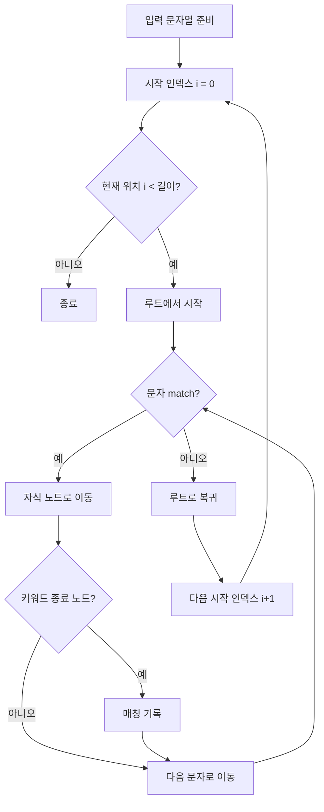
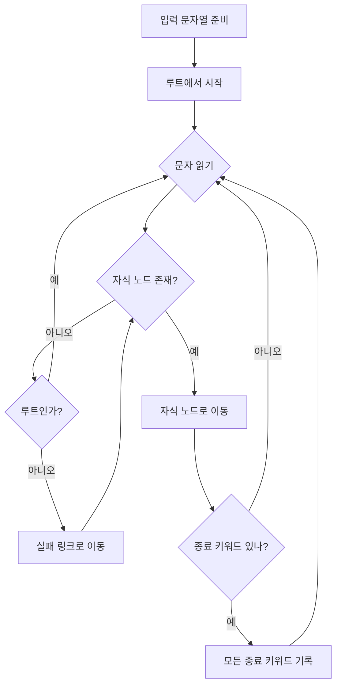

# 금칙어 처리 구현 방안

## 구현 방안 요약
- 입력 단계 차단(blocking)과 조회 단계 마스킹을 함께 적용한다.
- DB 설계 및 초기 데이터 준비를 선행한다.
- Trie/Aho-Corasick 기반 매처를 사용한다.
- DTO 어노테이션 기반 커스텀 validator로 리뷰 생성/수정을 차단한다.
- 예외 처리 및 프론트 응답 메시지를 정의한다.
- 변종 금칙어 대응을 위해 특수문자 제거 후 검사한다.
- 운영자 업데이트는 refresh로 즉시 반영한다.
- 기존 데이터는 조회 시점 마스킹으로 대응한다.

<details>
<summary>Trie/Aho-Corasick 매처란? (알고리즘/동작 방식/예시 코드)</summary>

### 1) 문제의 시작: "단순 비교"는 왜 느릴까?
금칙어가 10,000개라고 가정해 봅시다. ("바보", "멍청이", "해삼", "말미잘" ...)
사용자가 "안녕 바보야"라고 썼다면, 가장 단순한 방식은 금칙어를 전부 반복 검사합니다.

- "바보"가 문장에 있나? (검사) -> 찾음
- "멍청이"가 문장에 있나? (검사) -> 없음
- ... (10,000번 반복)

문장이 길어지고 금칙어가 많아지면 서버가 느려집니다. 그래서 "한 번만 훑어서 다 찾는 방법"이 필요해졌고, 그 해법이 Trie와 Aho-Corasick입니다.

### 2) Trie (트라이): "폴더 구조"라고 생각하세요
Trie는 단어를 글자 단위로 쪼개서 트리(나무) 형태로 저장하는 구조입니다.

금칙어: apple, apply, banana

```text
(ROOT)
 ├── a
 │   └── p
 │       └── p
 │           └── l
 │               ├── e (끝: apple)
 │               └── y (끝: apply)
 └── b
     └── a
         └── n
             └── a
                 └── n
                     └── a (끝: banana)
```

Trie의 동작 방식 (입력값: "app")

1) 루트에서 a 노드로 이동 (성공)
2) p 노드로 이동 (성공)
3) p 노드로 이동 (성공)
4) 입력이 끝남 -> 여기서 끝나는 단어는 아직 없음 (금칙어 아님)

장점: "apple"과 "apply"는 앞부분 "appl"까지의 검사를 공유하므로 효율적입니다.

### 3) Aho-Corasick: "실패했을 때, 텔레포트!"
Trie만 쓰면 중복 탐색이 생길 수 있습니다. 예를 들어 금칙어가 "she", "he"이고 입력값이 "she"라면:

- Trie만 사용하면 "she"를 찾은 뒤, "he"를 찾기 위해 다시 문자열의 다음 위치부터 재탐색해야 합니다.

Aho-Corasick은 Trie에 실패 링크(failure link)를 추가해 "지름길"을 만들어 둡니다.

- "she"까지 왔다는 건, 문장 끝부분이 "he"로 끝난다는 뜻이기도 하다.
- 그래서 she의 끝 노드에서 he의 시작 노드로 미리 연결선을 만들어 둔다.

예시 시나리오: 금칙어 abcd, bcd / 입력 텍스트: abcd

- a -> b -> c -> d 탐색 성공 (abcd 발견)
- Aho-Corasick은 d 노드에서 bcd도 함께 발견 처리

### 4) 정리: 요약 비교

| 구분 | 단순 Trie (접두어 트리) | Aho-Corasick (실패 링크 추가) |
| --- | --- | --- |
| 비유 | 폴더를 하나씩 클릭해서 들어가는 탐색기 | 순간이동 포털이 있는 탐색기 |
| 입력 | "아버지가" | "아버지가" |
| 동작 | 아->버->지 찾고, 다시 처음으로 돌아와 버부터 검사 | 아->버->지->가 진행 중 아버지도 자동 발견 |
| 속도 | 빠르지만 중복 검사 발생 | 입력 길이에 비례해 탐색 |

- **Trie**: 다수의 금칙어를 접두어 트리로 저장한다. 입력 문자열의 각 위치에서 루트부터 자식 노드를 따라가며 가능한 매칭을 확장하고, 더 이상 이어지지 않으면 다음 위치로 이동하는 방식으로 스캔한다.
- **Aho-Corasick**: Trie에 실패 링크(failure link)를 추가해, 한 번의 스캔으로 여러 키워드가 동시에 있는지 찾는 알고리즘이다. 현재 노드에서 문자가 일치하지 않으면 실패 링크를 따라가며 가능한 가장 긴 접두 상태로 이동하고, 그 위치에서 다시 매칭을 이어간다. 각 노드는 자신이 끝나는 키워드뿐 아니라 실패 링크를 통해 도달 가능한 종료 키워드(out)를 누적해 두어, 스캔 중 한 번의 이동으로 여러 매칭을 동시에 발견할 수 있다.
- **장점**: 전수 비교는 입력 길이 × 키워드 수 만큼 비교가 필요하지만, Aho-Corasick은 모든 키워드를 하나의 Trie로 합쳐둔 뒤 입력을 한 글자씩만 진행한다. 실패 링크 덕분에 불일치 시에도 입력 인덱스를 되돌리지 않고 다른 후보 상태로 즉시 이동하므로, 전체 탐색은 입력 길이에 비례(대략 O(입력 길이 + 매칭 결과 수))한다. 키워드 수는 사전 구축 비용에만 주로 반영되고, 스캔 자체는 키워드 개수에 거의 영향을 받지 않는다.

예시 코드 (Aho-Corasick 사용)

```java
Trie trie = Trie.builder()
    .onlyWholeWordsWhiteSpaceSeparated(false)
    .addKeyword("금칙어")
    .addKeyword("테스트")
    .build();

String text = "이 문장에는 금칙어가 포함되어 있습니다.";
Collection<Emit> emits = trie.parseText(text);

boolean hasForbidden = !emits.isEmpty();
```

Trie 매칭 흐름



Aho-Corasick 매칭 흐름



</details>

## 목표
리뷰에 대한 금칙어 처리를 작성 단계 차단 + 조회 단계 마스킹 방식으로 안정적으로 적용한다.

## 괜찮은 점
- 작성 차단 + 조회 마스킹 혼합은 신규/기존 모두 커버 가능.
- DTO 어노테이션 방식은 적용 범위가 명확하고 누락 위험이 낮다.
- refresh 방식은 재시작 없이 정책 변경 반영 가능.

## 주의할 점
- Validator가 스프링 빈을 주입받을 수 있는 구조인지 확인 필요.
- 정규화 규칙은 입력/금칙어 모두 동일해야 매칭이 일관된다.
- 정규화가 과도하면 오탐이 늘 수 있다(숫자/특수문자 제거 범위 주의).
- 마스킹 경로가 일부 누락되면 금칙어가 노출될 수 있다.
- refresh 시 매처 교체는 원자적으로 처리해야 한다.

## 권장 보완
- 정규화 함수 단일화(입력/금칙어 모두 동일 규칙 적용).
- 매처는 immutable 객체로 만들고 교체 시 atomic swap.
- 매처 준비 전에는 로깅 후 차단 or 허용 정책을 명시.
- 마스킹은 서비스/DTO 매핑 레이어에서 공통 적용.

## 데이터 모델
- 테이블: `forbidden_words`
  - `word_id` (PK)
  - `word` (string)
  - `enabled` (boolean)
  - `created_at`, `updated_at`
- 선택: `normalized_word` 컬럼으로 정규화 값 저장

## 작성 단계 차단
- DTO의 `content`에 `@ForbiddenWordCheck` 어노테이션 적용.
- `ConstraintValidator`가 `ForbiddenWordService.containsForbiddenWord(...)` 호출.
- 매칭되면 400 응답으로 차단.

## 실제 구현 코드
금칙어 정규화/매칭 서비스 (요약)

```java
public boolean containsForbiddenWord(String text) {
    if (text == null || text.isBlank()) {
        return false; // 빈 입력은 검사 대상이 아님
    }
    String normalized = normalize(text); // 특수문자/공백 제거 + 소문자화
    Collection<Emit> emits = trieRef.get().parseText(normalized);
    return !emits.isEmpty(); // 매칭 결과가 있으면 금칙어 포함
}
```

DTO 유효성 검사(작성/수정 차단)

```java
public boolean isValid(String value, ConstraintValidatorContext context) {
    if (value == null || value.isBlank()) {
        return true; // 빈 값은 여기서 막지 않음
    }
    if (forbiddenWordService.containsForbiddenWord(value)) {
        context.disableDefaultConstraintViolation();
        context.buildConstraintViolationWithTemplate("금칙어가 포함되어 있습니다.")
            .addConstraintViolation(); // 프론트에 노출될 메시지
        return false;
    }
    return true;
}
```

조회 단계 마스킹 (서비스 레이어 적용 예)

```java
public String maskForbiddenWords(String text) {
    if (text == null || text.isBlank()) {
        return text; // 빈 입력은 그대로 반환
    }
    String normalized = normalize(text);
    Collection<Emit> emits = trieRef.get().parseText(normalized);
    if (emits.isEmpty()) {
        return text; // 매칭이 없으면 원문 유지
    }
    return replaceMatchedSegments(text, emits); // 매칭 구간만 ***로 치환
}
```

## 예외 응답
- 검증 실패 시 400 응답으로 `message` 필드를 내려준다.
- 예시: `{ "message": "금칙어가 포함되어 있습니다." }`

## 조회 단계 마스킹
- 리뷰 응답 DTO 생성 시 `content = maskForbiddenWords(content)` 적용.
- 마스킹은 매칭 구간을 `***`로 치환.
- 목록/상세/관리자 조회 등 모든 경로에서 적용 확인 필요.

## 정규화 전략
- 소문자 변환.
- 공백/특수문자 제거.
- 동일 규칙을 금칙어 로딩 시에도 적용.
- 필요 시 원문 기준 2차 매칭 옵션 고려.

## 동기화 전략
- 운영자 금칙어 추가/수정/삭제 후 `ForbiddenWordService.refresh()` 호출.
- refresh는 새 매처를 생성한 뒤 기존 매처를 교체한다.

## 테스트 체크리스트
- 금칙어 포함 리뷰 작성/수정 -> 차단
- 공백/특수문자 변형 -> 차단
- 기존 리뷰가 신규 금칙어 대상 -> 조회 시 마스킹
- refresh 호출 후 즉시 반영

## 관리자/사용자 테스트 기록
- 관리자 금칙어 추가/수정/삭제 즉시 반영 확인.
- 사용자 리뷰 작성/수정 시 금칙어 포함 -> 차단 응답 확인.
- 사용자 리뷰 조회(목록/상세/내 리뷰)에서 금칙어 마스킹 처리 확인.

## 프론트 구현 메모
- 리뷰 작성/수정 실패 시 서버 메시지를 하단 버튼 영역에 빨간 텍스트로 표시한다.
- 입력값(내용/별점/태그) 변경 시 오류 메시지를 즉시 초기화한다.

## 결정 확정
- 관리자 조회는 마스킹하지 않는다.
- 임시 저장/초안 상태 차단은 적용하지 않는다(현재 기능 없음).
