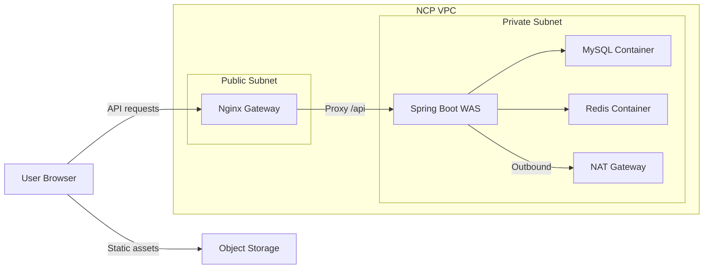

# Naver Cloud VPC 배포 가이드 (초안)

## 목적
LunchGO 프로젝트를 Naver Cloud VPC 환경에 배포하기 위한 코드 변경 사항, 체크리스트, 배포 과정을 정리한다.

## 기준 아키텍처 요약
System-Architecture 문서의 3-Tier 구성을 기준으로 한다.



- 프론트엔드: Object Storage 정적 웹 호스팅
- 게이트웨이: Public Subnet의 Nginx (Reverse Proxy + SSL + Bastion)
- 백엔드: Private Subnet의 Spring Boot WAS
- 데이터: Private Subnet의 MySQL/Redis 컨테이너
- 외부 통신: NAT Gateway 통해 Outbound 허용

## 배포 대상 컴포넌트
- 프론트엔드(Vue): `npm run build` 결과물(Object Storage 업로드)
- 백엔드(Spring Boot): Docker 컨테이너
- Nginx Gateway: Reverse Proxy 설정 + SSL
- Cloud DB(MySQL), Redis

## 코드/설정 변경 필요 항목

### 1) CORS 허용 출처 설정
Object Storage 도메인에서 API 호출이 가능하도록 허용해야 한다.

- 위치 후보: `src/main/java/com/example/LunchGo/common/config/WebConfig.java`
- 반영 내용: `allowedOrigins`에 Object Storage Public URL 또는 CDN 도메인 추가

운영 환경 값 적용 예시
```java
registry.addMapping("/**")
    .allowedOrigins("http://lunchgo-test-bucket.s3-website.kr.object.ncloudstorage.com")
    .allowedMethods("GET", "POST", "PUT", "PATCH", "DELETE", "OPTIONS");
```

API 베이스 URL (임시)
- `http://101.79.9.218`

### 2) 프로덕션 환경 설정 분리
DB/Redis/Object Storage 등 외부 의존성은 환경 변수 또는 prod 프로필로 분리한다.

- 파일: `src/main/resources/application.properties` 또는 `application-prod.properties`
- 예시 항목:
  - `spring.datasource.url`
  - `spring.datasource.username/password`
  - `spring.redis.host/port`
  - Object Storage 접근 키/버킷명

### 3) 프록시/HTTPS 대응
Nginx가 SSL을 종료하므로, Spring Boot가 프록시 헤더를 인식해야 한다.

- 예시 설정: `server.forward-headers-strategy=framework`
- 필요한 경우 `X-Forwarded-*` 헤더 처리

### 3-1) Nginx CORS 프리플라이트 처리(운영 안정성)
운영 환경에서 프론트는 Object Storage 정적 호스팅, API는 Nginx를 통해 `/api`로 프록시되므로
Nginx에서 `OPTIONS` 프리플라이트를 처리하면 백엔드 부하를 줄이고 장애 시에도 CORS 응답을 안정적으로 보장할 수 있다.

- 적용 파일(예시): `/root/nginx-default.conf` (bastion host, bind mount)
- 허용 Origin은 현재 서비스 도메인으로 제한
- 프리플라이트는 `204`로 종료, 실제 요청은 백엔드로 프록시

예시 설정:
```nginx
    # CORS 허용 Origin 제한
    set $cors_origin "";
    if ($http_origin ~* "^https?://lunchgo-test-bucket\\.s3-website\\.kr\\.object\\.ncloudstorage\\.com$") {
        set $cors_origin $http_origin;
    }

    location /api/ {
        client_max_body_size 10m;
        # preflight
        if ($request_method = OPTIONS) {
            add_header Access-Control-Allow-Origin $cors_origin always;
            add_header Access-Control-Allow-Credentials "true" always;
            add_header Access-Control-Allow-Methods "GET, POST, PUT, PATCH, DELETE, OPTIONS" always;
            add_header Access-Control-Allow-Headers "Authorization, Content-Type, X-Requested-With" always;
            add_header Content-Length 0;
            return 204;
        }

        add_header Access-Control-Allow-Origin $cors_origin always;
        add_header Access-Control-Allow-Credentials "true" always;
        add_header Access-Control-Allow-Methods "GET, POST, PUT, PATCH, DELETE, OPTIONS" always;
        add_header Access-Control-Allow-Headers "Authorization, Content-Type, X-Requested-With" always;

        proxy_pass http://10.0.2.6:8080;
        proxy_set_header Host $host;
        proxy_set_header X-Real-IP $remote_addr;
        proxy_set_header X-Forwarded-For $proxy_add_x_forwarded_for;
        proxy_set_header X-Forwarded-Proto $scheme;
    }
```

### 3-2) 이미지 업로드 용량 제한(운영)
Nginx 기본 `client_max_body_size`가 1m인 경우, 업로드가 413으로 차단되고 브라우저는 CORS 에러로 보일 수 있다.

- Nginx: `client_max_body_size 10m;` (또는 원하는 용량)
- Spring Boot:
  - `spring.servlet.multipart.max-file-size=10MB`
  - `spring.servlet.multipart.max-request-size=10MB`
- Object Storage:
  - `ncp.object-storage.max-size-bytes=10485760`

### 4) 정적 리소스/라우팅 처리
SPA 라우팅 대응을 위해 Object Storage 에러 문서를 `index.html`로 설정한다.

## 빌드 대상 코드

### Frontend
- 위치: `frontend/`
- 빌드: `npm run build`
- 산출물: `frontend/dist/`
- 환경 변수: `VITE_API_BASE_URL` (예: `http://101.79.9.218`)
  - 파일 예시: `frontend/.env.production.sample`

### Backend
- 빌드: 로컬에서 JAR 생성 후 Docker 이미지 빌드
- 예시:
  - `./gradlew clean build -x test`
  - `docker build -t lunchgo-backend:prod .`
  - Apple Silicon(M1) 환경에서 서버가 amd64인 경우:
    - `docker buildx build --platform linux/amd64 -t pgw10243/lunchgo-backend:prod --push .`

## 이번 배포를 위한 코드 변경 요약

### CORS 허용 도메인 추가
`src/main/java/com/example/LunchGo/common/config/WebConfig.java`

```java
registry.addMapping("/**")
    .allowedOrigins(
        "http://localhost:5173",
        "http://localhost:3000",
        "http://lunchgo-test-bucket.s3-website.kr.object.ncloudstorage.com"
    )
    .allowedMethods("GET", "POST", "PUT", "PATCH", "DELETE", "OPTIONS")
    .allowedHeaders("*")
    .allowCredentials(true);
```

`src/main/java/com/example/LunchGo/common/config/SecurityConfig.java`

```java
configuration.setAllowedOrigins(List.of(
    "http://localhost:5173",
    "http://localhost:8080",
    "http://lunchgo-test-bucket.s3-website.kr.object.ncloudstorage.com"
));
```

### 프론트 API Base URL 적용
`frontend/src/router/httpRequest.js`

```javascript
const API_BASE_URL = import.meta.env.VITE_API_BASE_URL || "";
axios.defaults.baseURL = API_BASE_URL;

const instance = axios.create({
  withCredentials: true,
  baseURL: API_BASE_URL,
});
```

### 배포용 환경 변수 템플릿
`.env.sample`

```dotenv
SPRING_PROFILES_ACTIVE=prod
DB_USERNAME=
DB_PASSWORD=
REDIS_PASSWORD=
NCP_OBJECT_STORAGE_ACCESS_KEY=
NCP_OBJECT_STORAGE_SECRET_KEY=
NAVER_CLOVA_OCR_SECRET=
NAVER_CLOVA_OCR_INVOKE_URL=
NAVER_CLOVA_OCR_GENERAL_SECRET=
NAVER_CLOVA_OCR_GENERAL_INVOKE_URL=
COOLSMS_API_KEY=
COOLSMS_SECRET_KEY=
COOLSMS_FROM=
SMTP_USERNAME=
SMTP_PASSWORD=
PORTONE_STORE_ID=
PORTONE_CHANNEL_KEY=
PORTONE_API_SECRET=
PORTONE_WEBHOOK_SECRET=
JWT_SECRET=
```

`frontend/.env.production.sample`

```dotenv
VITE_API_BASE_URL=http://101.79.9.218
```

### Docker 이미지 정의
`Dockerfile`

```dockerfile
FROM eclipse-temurin:21-jre
WORKDIR /app
ARG JAR_FILE=build/libs/*.jar
COPY ${JAR_FILE} app.jar
EXPOSE 8080
ENTRYPOINT ["java", "-jar", "/app/app.jar"]
```

### 프론트 업로드 스크립트
`scripts/upload_frontend_object_storage.sh`

```bash
DIST_DIR="${DIST_DIR:-frontend/dist}"
BUCKET="${BUCKET:-lunchgo-test-bucket}"
REGION="${REGION:-kr-standard}"
ENDPOINT_URL="${ENDPOINT_URL:-http://kr.object.ncloudstorage.com}"
ACL="${ACL:-}"
DRY_RUN="${DRY_RUN:-0}"

AWS_S3_FORCE_PATH_STYLE=true aws s3 sync "${DIST_DIR}" "s3://${BUCKET}" \
  --region "${REGION}" --endpoint-url "${ENDPOINT_URL}" --delete
```

### GitHub Actions 배포 설정
`.github/workflows/backend-deploy.yml` 핵심 흐름

```yaml
on:
  push:
    branches: ["dev"]
    paths:
      - "src/**"
      - "build.gradle"
      - "settings.gradle"
      - "Dockerfile"
      - ".github/workflows/backend-deploy.yml"

jobs:
  build-and-deploy:
    steps:
      - uses: actions/checkout@v4
      - uses: actions/setup-java@v4
      - run: ./gradlew clean build -x test
      - uses: docker/setup-buildx-action@v3
      - uses: docker/login-action@v3
      - uses: docker/build-push-action@v6
        with:
          platforms: linux/amd64
          push: true
          tags: pgw10243/lunchgo-backend:dev
      - uses: appleboy/ssh-action@master
```

`.github/workflows/frontend-deploy.yml` 핵심 흐름

```yaml
on:
  push:
    branches: ["dev"]
    paths:
      - "frontend/**"
      - ".github/workflows/frontend-deploy.yml"

jobs:
  build-and-deploy:
    steps:
      - uses: actions/checkout@v4
      - uses: actions/setup-node@v4
      - run: npm ci
        working-directory: frontend
      - run: npm run build
        working-directory: frontend
      - run: |
          aws --endpoint-url=http://kr.object.ncloudstorage.com s3 sync \
            frontend/dist s3://$BUCKET --delete
```

## 배포 체크리스트

### 네트워크/VPC
- VPC 생성 및 Subnet 분리 (Public/Private)
- Public Subnet에 Nginx Gateway 배치
- Private Subnet에 WAS/DB/Redis 배치
- NAT Gateway 생성 및 Route Table에 `0.0.0.0/0` 추가

운영 환경 값
- VPC/Subnet CIDR: `10.0.0.0/16`
- NAT Gateway: `image-vpc-natgw-prod` (ID: 116154233)
- NAT Gateway 공인 IP: `49.50.130.117`
- NAT Gateway 사설 IP: `10.0.1.6`
- NAT Subnet: `image-public-subnet1-natgw (10.0.1.0/24)`

### 보안/접근 제어(ACG)
- Nginx ACG (image-bastion-host-acg, 326799)
  - Inbound: 80/443/22 공개 허용
  - 규칙:
    - TCP 0.0.0.0/0 80 (nginx)
    - TCP 0.0.0.0/0 443 (https)
    - TCP 0.0.0.0/0 22 (ssh)
- Private ACG (image-vpc-prod-default-acg, 326796)
  - Inbound: image-bastion-host-acg에서만 허용
  - 규칙:
    - TCP image-bastion-host-acg 8080 (WAS)
    - TCP image-bastion-host-acg 3306 (MySQL)
    - TCP image-bastion-host-acg 6379 (Redis)
    - TCP image-bastion-host-acg 22 (ssh)
    - TCP image-bastion-host-acg 3389 (rdp)

DB/Redis 사설 엔드포인트
- MySQL: `10.0.2.6:3306`
- Redis: `10.0.2.6:6379`

### Object Storage
- 정적 웹사이트 호스팅 활성화
- Public Read ACL 설정
- 에러 문서: `index.html`
- 배포 파일 업로드 확인
- 버킷: `lunchgo-test-bucket`
- 정적 호스팅 URL: `http://lunchgo-test-bucket.s3-website.kr.object.ncloudstorage.com`

### 도메인/SSL
- 도메인 DNS가 Nginx 공인 IP로 향하는지 확인
- SSL 인증서 적용 (Nginx)

운영 환경 값
- Bastion/Nginx 인스턴스: `ssg-team1-bastion-host`
- 공인 IP: `101.79.9.218`
- 사설 IP: `10.0.0.6`

### 환경 변수/시크릿
- DB/Redis/Object Storage 키 설정 확인
- prod 프로필 적용 여부 확인

## 배포 절차 (예시)

1) **네트워크 준비**
   - VPC/Subnet/NAT/ACG 구성 완료

2) **DB/Redis 준비**
   - Cloud DB 생성 및 접근 설정
   - Redis 생성 및 접근 설정

3) **Backend 배포**
   - 프로덕션 환경 변수/프로필 적용
   - Docker Hub 이미지 pull 후 컨테이너 실행
   - 헬스 체크 확인

4) **Nginx 설정**
   - Reverse Proxy `/api` 설정
   - SSL 적용 및 리다이렉트 설정

5) **Frontend 배포**
   - `frontend/dist` 업로드
   - Object Storage 정적 호스팅 확인

6) **최종 점검**
   - 로그인/리뷰/예약 등 핵심 플로우 점검
   - CORS 및 API 통신 확인

## 배포 테스트 순서
1) 백엔드 Docker 이미지 빌드 및 실행 확인
2) Nginx 리버스 프록시로 `/api` 연결 확인
3) Object Storage에 프론트 `dist` 업로드 후 화면 로드 확인
4) CORS 및 로그인/리뷰 핵심 플로우 점검
5) 외부 API(결제/알림 등) 호출 테스트

## Docker Hub 배포 흐름 (pgw10243/lunchgo-backend)

로컬 빌드/푸시

```bash
docker login
# 로컬에서 JAR 빌드 후 Docker 이미지 생성
docker build -t lunchgo-backend:prod .
# Docker Hub용 태그 지정
docker tag lunchgo-backend:prod pgw10243/lunchgo-backend:prod
# Docker Hub로 이미지 업로드
docker push pgw10243/lunchgo-backend:prod
```

amd64 서버 배포용 빌드/푸시 (M1 기준)

```bash
# buildx 빌더 생성 및 선택
docker buildx create --use --name lunchgo-builder
# amd64 플랫폼으로 이미지 빌드 및 바로 push
docker buildx build --platform linux/amd64 \
  -t pgw10243/lunchgo-backend:prod \
  --push .
```

서버에서 pull/run

```bash
# Docker Hub에서 이미지 내려받기
docker pull pgw10243/lunchgo-backend:prod
# 환경변수 파일(.env)을 주입해 컨테이너 실행
docker run --env-file .env -p 8080:8080 --name lunchgo-backend -d pgw10243/lunchgo-backend:prod
```

## GitHub Actions 배포 설정
Workflow에서 사용하는 Secrets 목록

- `DOCKERHUB_USERNAME`: Docker Hub 계정명 (예: `pgw10243`)
- `DOCKERHUB_TOKEN`: Docker Hub Access Token
- `SERVER_IP`: Bastion 공인 IP (예: `101.79.9.218`)
- `SSH_USER`: Bastion 접속 계정 (예: `root` 또는 `ncp-user`)
- `SSH_KEY`: Bastion SSH private key (pem 내용)
- `NCP_ACCESS_KEY`: Object Storage Access Key (기존 NCP 키 재사용)
- `NCP_SECRET_KEY`: Object Storage Secret Key (기존 NCP 키 재사용)
- `NCP_BUCKET_NAME`: 업로드 대상 버킷명 (예: `lunchgo-test-bucket`)
- `SERVER_IP`: 프론트 빌드용 API 베이스 URL에 사용 (예: `101.79.9.218`)

배포 전제 조건
- Bastion에 `/home/ncp-user/lunchgo.pem` 존재
- Private 서버에 `/opt/lunchgo/.env` 존재

## 배포 이슈 기록
- Docker Hub push 시 credential helper 오류(-50)가 발생할 수 있다.
  - 해결: `~/.docker/config.json`에서 `credsStore` 제거 후 재로그인
- Java 버전 불일치 오류가 발생할 수 있다.
  - 증상: `UnsupportedClassVersionError (class file version 65.0)`
  - 해결: Docker 베이스 이미지를 Java 21로 변경
- Nginx `/api` 프록시에서 `proxy_pass` 끝의 슬래시 유무에 따라 경로가 달라질 수 있다.
  - 잘못된 설정: `proxy_pass http://10.0.2.6:8080/;` (경로가 `/api` 없이 전달됨)
  - 올바른 설정: `proxy_pass http://10.0.2.6:8080;`
- Object Storage CLI 업로드는 `https` 엔드포인트에서 `AccessDenied`가 발생할 수 있다.
  - 대응: `http://kr.object.ncloudstorage.com`으로 호출
- 프론트에서 API 호출 시 403이 발생하면 CORS 설정을 점검한다.
  - `WebConfig`와 `SecurityConfig` 모두에 Object Storage 도메인을 허용해야 한다.
  - 허용 도메인 예시: `http://lunchgo-test-bucket.s3-website.kr.object.ncloudstorage.com`

## 트러블슈팅 정리

### 1) Object Storage 업로드 AccessDenied
- 증상: `PutObject`에서 `AccessDenied`
- 원인: CLI가 권한 없는 키를 사용하거나 버킷 정책에 의해 차단됨
- 대응: Cyberduck 수동 동기화로 우선 배포, CLI는 키 권한 정리 후 재시도
  - 추가: `https` 엔드포인트에서 실패할 수 있으므로 `http` 엔드포인트로 재시도

### 2) Docker Hub push credential helper 오류
- 증상: `error getting credentials ... (-50)`
- 대응: `~/.docker/config.json`에서 `credsStore` 제거 후 `docker login` 재시도

### 3) amd64 서버 pull 실패
- 증상: `no matching manifest for linux/amd64`
- 원인: M1에서 arm64 이미지로 빌드
- 대응: buildx로 `--platform linux/amd64` 빌드 후 push

### 4) Java 버전 불일치
- 증상: `UnsupportedClassVersionError (class file version 65.0)`
- 원인: JAR은 Java 21, 컨테이너는 Java 17
- 대응: Docker 베이스 이미지 `eclipse-temurin:21-jre`로 변경

### 5) Nginx 404 또는 401
- 증상: `/api` 요청이 404 또는 401 응답
- 원인: 프록시 미설정 또는 `proxy_pass` 슬래시 문제
- 대응: `/api` 프록시 추가, `proxy_pass http://10.0.2.6:8080;`로 설정

### 6) 프론트에서 403 (CORS)
- 증상: `Invalid CORS request`, 브라우저 403
- 원인: Security CORS 설정에 Object Storage 도메인 누락
- 대응: `WebConfig`와 `SecurityConfig` 모두에 도메인 추가 후 재배포

### 7) GitHub Actions SSH 인증 실패
- 증상: `ssh: unable to authenticate` 또는 `no key found`
- 원인:
  - `SSH_KEY`에 pem 원문이 아닌 비밀번호 문자열 입력
  - root 계정의 `authorized_keys`에 공개키 미등록 또는 권한 문제
  - `PubkeyAuthentication` 비활성화
- 대응:
  - pem 파일 전체를 `SSH_KEY`로 등록하고 줄바꿈 유지
  - `ssh-keygen -y -f lunchgo.pem`으로 공개키 생성 후 `/root/.ssh/authorized_keys`에 등록
  - 권한 설정: `/root/.ssh`는 `700`, `/root/.ssh/authorized_keys`는 `600`으로 설정
  - 설정 확인: `grep -E "PermitRootLogin|PubkeyAuthentication" /etc/ssh/sshd_config`
  - 설정 적용: `sed -i 's/^#PubkeyAuthentication yes/PubkeyAuthentication yes/' /etc/ssh/sshd_config`
  - 적용 후 `systemctl restart ssh`

### 8) Bastion → Private SSH 실패
- 증상: `Permission denied (publickey,password)`
- 원인: bastion에서 사용하는 pem의 공개키가 private 서버 root에 등록되지 않음
- 대응: bastion의 `/home/ncp-user/lunchgo.pem` 공개키를 private 서버 `/root/.ssh/authorized_keys`에 등록

### 9) DataSource 설정 누락 (CI 빌드)
- 증상: `Failed to configure a DataSource: 'url' attribute is not specified`
- 원인: `application-prod.properties`가 레포에 포함되지 않아 CI 빌드 산출물에 누락됨
- 대응: `application-prod.properties`를 git에 포함하고, 값은 환경변수로 주입되도록 유지

## 프론트 업로드 스크립트 (Object Storage)
스크립트: `scripts/upload_frontend_object_storage.sh`

```bash
export AWS_ACCESS_KEY_ID=...
export AWS_SECRET_ACCESS_KEY=...
export BUCKET=lunchgo-test-bucket
export ENDPOINT_URL=http://kr.object.ncloudstorage.com
export REGION=kr-standard

bash scripts/upload_frontend_object_storage.sh
```

드라이런

```bash
DRY_RUN=1 bash scripts/upload_frontend_object_storage.sh
```

## 프론트 업로드(수동, Cyberduck)
현재 Object Storage CLI 업로드는 권한 문제로 실패하여, Cyberduck으로 로컬 파일을 수동 동기화했다.
CLI 업로드는 권한 정리 후 재시도한다.

## Object Storage CORS 적용 여부
브라우저에서 Object Storage 버킷을 다른 Origin에서 직접 호출하는 경우에만 CORS 설정이 필요하다.
정적 호스팅으로 프론트만 제공하고, API는 별도 서버로 호출한다면 CORS 설정은 필수가 아니다.

## 프로덕션 설정 적용 방식
`application-prod.properties`는 민감 정보를 직접 넣지 않고 환경변수로만 받도록 구성한다.

- prod 프로필 실행 시 `application-secret.properties`는 자동으로 사용되지 않는다.
- 따라서 배포 환경에서는 `.env`(또는 런타임 환경변수)를 반드시 준비해야 한다.
- 대안으로 `application-secret.properties`를 서버에 배포/마운트하고 `spring.config.import`로 불러오는 방식도 가능하다.

## 배포 검증 항목
- 프론트 접속 시 화면 정상 로드
- API 호출 정상 (CORS 포함)
- 로그인/예약/리뷰 기능 정상 동작
- 외부 API 호출(결제/알림 등) 정상 동작

## 로컬 터널링 접속 참고
현재 로컬 환경에서 DB/Redis는 Bastion을 통해 터널링 접속 중이다.

```bash
ssh -L 3307:10.0.2.6:3306 -L 6379:10.0.2.6:6379 root@101.79.9.218 -N
```

## 롤백 전략 (간단)
- Frontend: 이전 빌드 파일로 Object Storage 재업로드
- Backend: 이전 JAR 또는 이미지로 재배포
- DB: 마이그레이션 롤백 또는 백업 복원
