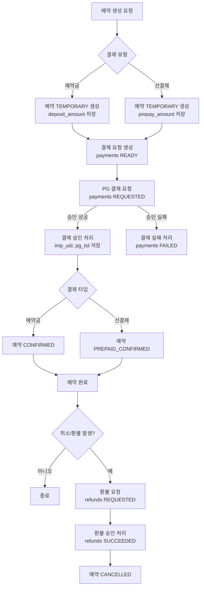

# 결제 API 플로우 다이어그램

본 문서는 `docs/payment-db-changes.md`를 기준으로 예약금/선결제 결제 흐름을 API 관점에서 정리합니다.

## 전체 흐름 (Mermaid)

## 주요 API 단계 요약

1) 예약 생성
   - 입력: 예약금 또는 선결제 금액
   - 저장: `reservations.deposit_amount` 또는 `reservations.prepay_amount`
   - 상태: `TEMPORARY`

2) 결제 요청 생성
   - `payments` 생성 (`READY`)
   - `merchant_uid`, `idempotency_key` 부여

3) PG 결제 요청/응답 처리
   - 요청 시: `REQUESTED`
   - 승인 시: `PAID`, `imp_uid`, `pg_tid` 저장
   - 실패 시: `FAILED`

4) 예약 상태 전이
   - 예약금 승인: `CONFIRMED`
   - 선결제 승인: `PREPAID_CONFIRMED`

5) 취소/환불
   - 환불 시: `refunds` 생성 및 상태 업데이트
   - 예약 상태: `CANCELLED`

## 참고

- 결제 타입은 예약금/선결제 중 하나만 허용
- 금액 검증은 서비스 레벨에서 강제
