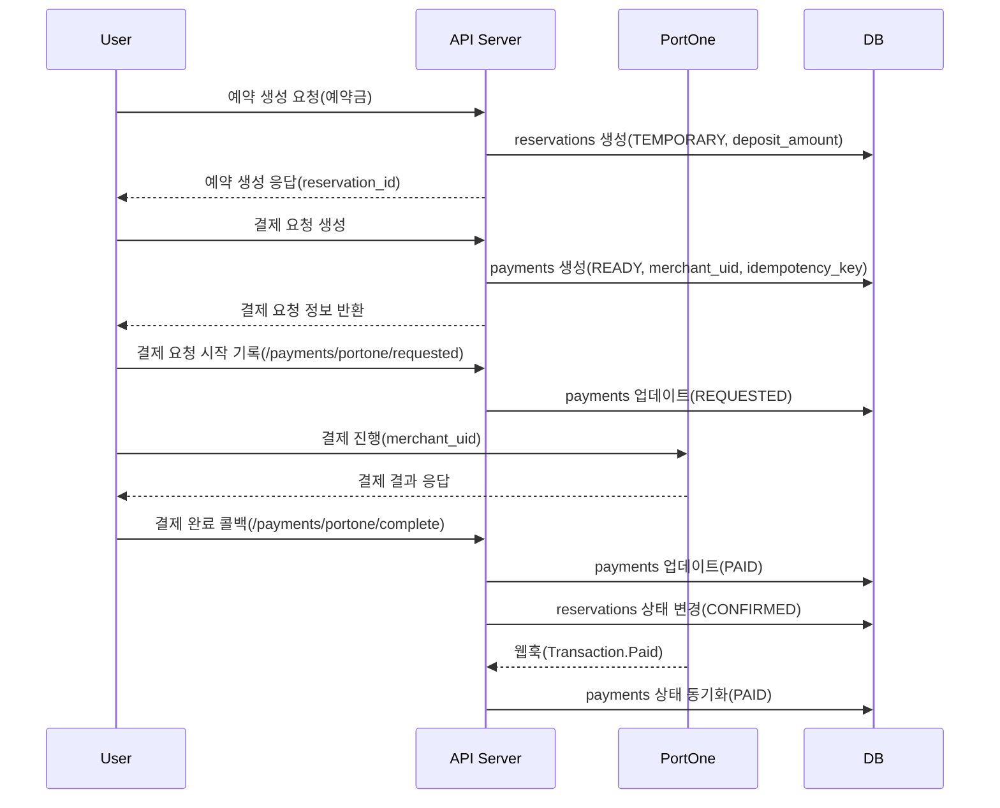
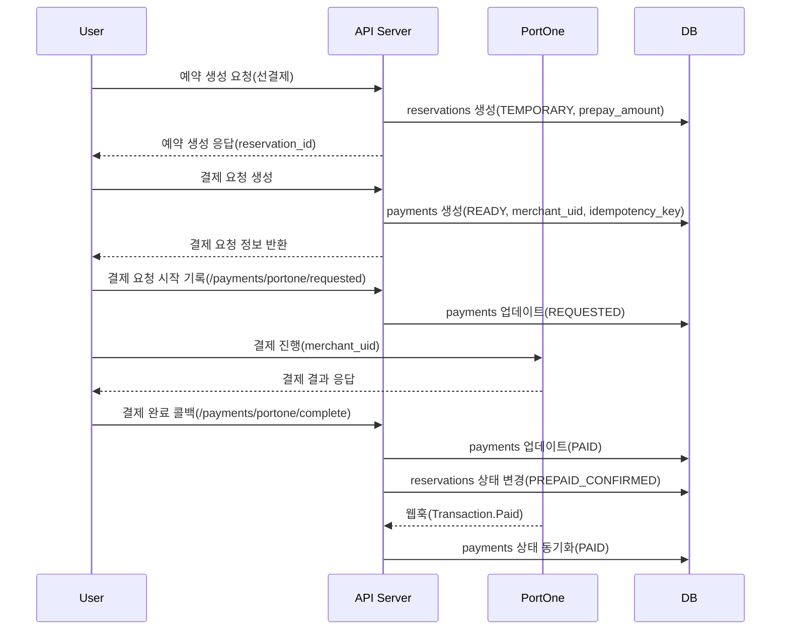

# 결제 API 시퀀스 다이어그램

예약금 결제와 선결제 흐름을 각각 시퀀스 다이어그램으로 정리합니다.

## 예약금 결제 시퀀스

```mermaid
sequenceDiagram
  participant U as User
  participant A as API Server
  participant P as PortOne
  participant D as DB

  U->>A: 예약 생성 요청(예약금)
  A->>D: reservations 생성(TEMPORARY, deposit_amount)
  A-->>U: 예약 생성 응답(reservation_id)

  U->>A: 결제 요청 생성
  A->>D: payments 생성(READY, merchant_uid, idempotency_key)
  A-->>U: 결제 요청 정보 반환

  U->>A: 결제 요청 시작 기록(/payments/portone/requested)
  A->>D: payments 업데이트(REQUESTED)

  U->>P: 결제 진행(merchant_uid)
  P-->>U: 결제 결과 응답
  U->>A: 결제 완료 콜백(/payments/portone/complete)
  A->>D: payments 업데이트(PAID)
  A->>D: reservations 상태 변경(CONFIRMED)
  P-->>A: 웹훅(Transaction.Paid)
  A->>D: payments 상태 동기화(PAID)
```

## 선결제 시퀀스

```mermaid
sequenceDiagram
  participant U as User
  participant A as API Server
  participant P as PortOne
  participant D as DB

  U->>A: 예약 생성 요청(선결제)
  A->>D: reservations 생성(TEMPORARY, prepay_amount)
  A-->>U: 예약 생성 응답(reservation_id)

  U->>A: 결제 요청 생성
  A->>D: payments 생성(READY, merchant_uid, idempotency_key)
  A-->>U: 결제 요청 정보 반환

  U->>A: 결제 요청 시작 기록(/payments/portone/requested)
  A->>D: payments 업데이트(REQUESTED)

  U->>P: 결제 진행(merchant_uid)
  P-->>U: 결제 결과 응답
  U->>A: 결제 완료 콜백(/payments/portone/complete)
  A->>D: payments 업데이트(PAID)
  A->>D: reservations 상태 변경(PREPAID_CONFIRMED)
  P-->>A: 웹훅(Transaction.Paid)
  A->>D: payments 상태 동기화(PAID)
```

## 참고

- 결제 타입은 예약금/선결제 중 하나만 허용
- 결제 금액 검증은 서비스 레벨에서 수행
