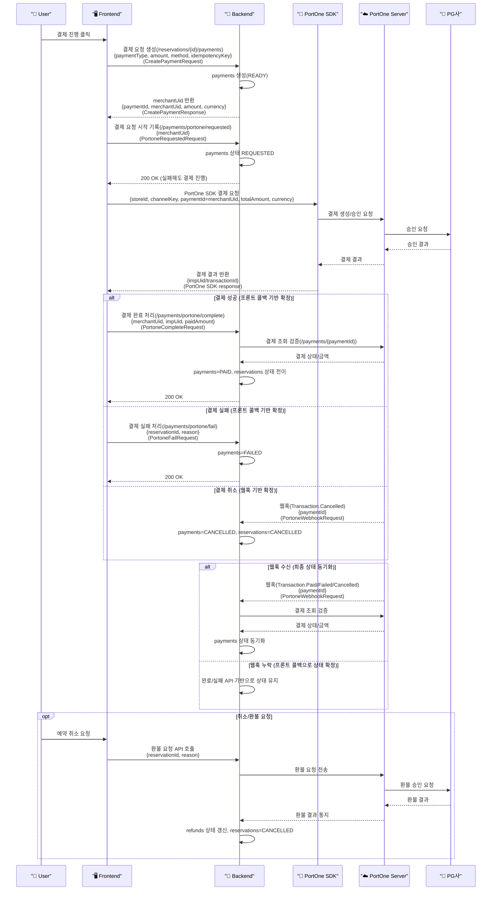
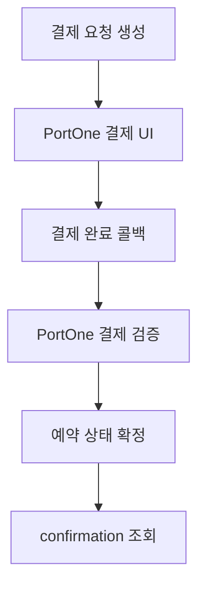
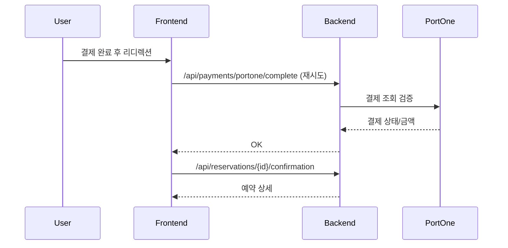

# 결제 모듈 구현 문서

본 문서는 예약금 결제/선결제 모듈의 구현 내용을 정리합니다.

## 0. 전체 시퀀스 다이어그램 (한눈에 보기)



### 참여자 역할/의미

- 👤 User: 결제 시작/취소 의사결정을 하는 실제 사용자
- 🖥️ Frontend: 예약/결제 UI, PortOne SDK 호출, 백엔드 API 연동 담당
- 🧠 Backend: 결제 생성/검증/상태 전이, 웹훅 검증 처리 담당
- 🧩 PortOne SDK: 브라우저에서 결제 UI를 띄우는 클라이언트 라이브러리
- ☁️ PortOne Server: 결제 승인/조회/웹훅 발행 담당
- 🏦 PG사: 카드사/결제대행 승인 처리 시스템

<details>
<summary>웹훅이란? 왜 필요한가?</summary>

- 웹훅(Webhook)은 PortOne Server가 결제 이벤트를 서버로 **비동기 통지**하는 방식입니다.
- 프론트 콜백만으로는 네트워크/리디렉션 문제로 누락될 수 있으므로, 서버가 최종 상태를 **확정/보정**하기 위해 필요합니다.
- 수신 이벤트: `Transaction.Paid`, `Transaction.Failed`, `Transaction.Cancelled`
- 필요한 예시:
  - 사용자가 결제 완료 후 브라우저를 닫아 프론트 콜백이 누락된 경우
  - 모바일 환경에서 리디렉션 실패로 완료 페이지가 열리지 않은 경우
  - 결제 취소가 PG에서 발생했지만 프론트에 즉시 반영되지 않은 경우
- 웹훅 실패 보완 전략:
  - PortOne 콘솔의 재전송 기능으로 웹훅 재발송
  - 결제 완료/실패 API 로그로 상태 확인 후 수동 보정
  - 장애 시나리오 재현을 위한 로컬 스크립트 테스트 수행

</details>


### 역할별 책임/소유 코드 경로

<details>
<summary>자세히 보기</summary>

- 👤 User: 결제/취소 트리거
- 🖥️ Frontend:
  - 결제 요청 생성/요청 시작 기록/완료 콜백 호출
  - 코드: `frontend/src/views/restaurant/id/payment/RestaurantPaymentPage.vue`
  - 리디렉션 복구: `frontend/src/views/restaurant/id/confirmation/RestaurantConfirmationPage.vue`
- 🧠 Backend:
  - 결제 생성/완료/실패/만료/요약/확인
  - 코드: `src/main/java/com/example/LunchGo/reservation/controller/ReservationPaymentController.java`
  - PortOne 콜백/웹훅 처리
  - 코드: `src/main/java/com/example/LunchGo/reservation/controller/PaymentController.java`
  - 비즈니스 로직
  - 코드: `src/main/java/com/example/LunchGo/reservation/service/ReservationPaymentService.java`
  - PortOne 검증
  - 코드: `src/main/java/com/example/LunchGo/reservation/service/PortoneVerificationService.java`
  - 웹훅 서명 검증
  - 코드: `src/main/java/com/example/LunchGo/reservation/service/PortoneWebhookVerifier.java`
  - 리포지토리
  - 코드: `src/main/java/com/example/LunchGo/reservation/repository/PaymentRepository.java`
  - 코드: `src/main/java/com/example/LunchGo/reservation/repository/ReservationRepository.java`
  - 코드: `src/main/java/com/example/LunchGo/reservation/repository/ReservationSlotRepository.java`
  - 결제/예약 DTO
  - 코드: `src/main/java/com/example/LunchGo/reservation/dto/CreatePaymentRequest.java`
  - 코드: `src/main/java/com/example/LunchGo/reservation/dto/CreatePaymentResponse.java`
  - 코드: `src/main/java/com/example/LunchGo/reservation/dto/PortoneCompleteRequest.java`
  - 코드: `src/main/java/com/example/LunchGo/reservation/dto/PortoneFailRequest.java`
  - 코드: `src/main/java/com/example/LunchGo/reservation/dto/PortoneRequestedRequest.java`
  - 코드: `src/main/java/com/example/LunchGo/reservation/dto/PortoneWebhookRequest.java`
  - 코드: `src/main/java/com/example/LunchGo/reservation/dto/ReservationConfirmationResponse.java`
  - 코드: `src/main/java/com/example/LunchGo/reservation/dto/ReservationSummaryResponse.java`
  - 엔티티
  - 코드: `src/main/java/com/example/LunchGo/reservation/entity/Payment.java`
  - 코드: `src/main/java/com/example/LunchGo/reservation/entity/Reservation.java`
  - 코드: `src/main/java/com/example/LunchGo/reservation/entity/ReservationSlot.java`

</details>

## 1. 목적/범위

- 예약금 결제 및 선결제 기능을 구현하고 PortOne 결제 검증을 적용합니다.
- 프론트/백엔드/DB 변경 사항을 한 문서로 정리합니다.

## 2. 동작 재현 과정 요약

아래 흐름만 따라가면 결제 동작을 재현할 수 있습니다.

1) 예약 생성 → `reservationId` 확보  
2) 결제 요청 생성: `POST /api/reservations/{reservationId}/payments`  
   - 응답 `merchantUid`가 **PortOne paymentId**로 사용됨  
3) 결제 요청 시작 기록: `POST /api/payments/portone/requested`  
   - 실패해도 결제 진행(로그만 남김)  
4) PortOne SDK 결제 요청  
   - `paymentId = merchantUid`  
5) 결제 완료 처리: `POST /api/payments/portone/complete`  
6) 웹훅 동기화: `POST /api/payments/portone/webhook`  
   - 서명 검증 후 결제 상태 최종 확정  

## 3. 결제 플로우 개요

- 예약금 결제: 예약 생성 → 결제 요청 → 결제 승인 → 예약 확정
- 선결제: 예약 생성 → 결제 요청 → 결제 승인 → 예약 확정
- 취소/환불은 별도 구현 범위

## 4. 아키텍처 구성

- 프론트: Vue 결제 페이지 + confirmation 완료 처리
- 백엔드: 결제 요청/완료/실패/만료 API
- PortOne: 결제 UI + 서버 검증 API
- DB: reservations/payments/refunds 관련 스키마 확장

## 5. DB 스키마 변경 요약

### 5-1. 핵심 관계

- `reservations (1) - (N) payments`
  - `payments.reservation_id` → `reservations.reservation_id`
- `payments (1) - (N) refunds`
  - `refunds.payment_id` → `payments.payment_id`

### 5-2. 핵심 컬럼 요약

- `reservations`:
  - `deposit_amount`, `prepay_amount`, `total_amount`, `currency`
- `payments`:
  - `merchant_uid`, `imp_uid`, `pg_tid`, `receipt_url`, `idempotency_key`
  - 유니크 키: `merchant_uid`, `imp_uid`, `idempotency_key`, `(reservation_id, payment_type)`
- `refunds`:
  - `payment_type`, `card_type` 스냅샷 추가

### 5-3. payments 컬럼 의미 (핵심만)

- `status`: `READY`(결제 요청 생성) → `REQUESTED`(PG 요청 시작 기록) → `PAID/FAILED`
- `merchant_uid`: 내부 주문번호, PortOne `paymentId`로 사용
- `imp_uid`: PortOne 승인 결과 식별자
- `pg_tid`: PG 거래 ID (정산/CS 추적용)
- `idempotency_key`: 중복 요청 방지 키 (유니크)
- `requested_at/approved_at/failed_at/cancelled_at`: 상태 전이 타임스탬프

관련 SQL:

- `src/main/resources/sql/tables_create_reservation.sql`
- `src/main/resources/sql/migration_add_reservation_payment_fields.sql`
- `src/main/resources/sql/migration_add_refund_snapshot.sql`

## 6. API 설계

### 6-1. 결제 요청 생성

`POST /api/reservations/{reservationId}/payments`

Request:

```json
{
  "paymentType": "DEPOSIT",
  "amount": 20000,
  "method": "CARD",
  "idempotencyKey": "uuid"
}
```

Response:

```json
{
  "paymentId": 1,
  "merchantUid": "RSV-1-...",
  "amount": 20000,
  "pgProvider": "PORTONE",
  "currency": "KRW"
}
```

### 6-2. 결제 요청 시작 기록

`POST /api/payments/portone/requested`

```json
{
  "merchantUid": "RSV-1-..."
}
```
실패해도 결제 진행 (서버는 로그만 남김)

### 6-3. 결제 완료 처리

`POST /api/payments/portone/complete`

```json
{
  "merchantUid": "RSV-1-...",
  "impUid": "tx-...",
  "paidAmount": 20000
}
```

### 6-4. 결제 실패 처리

`POST /api/payments/portone/fail`

```json
{
  "reservationId": 1,
  "reason": "결제 실패"
}
```

### 6-5. 결제 만료 처리

`POST /api/reservations/{reservationId}/payments/expire`

### 6-6. 예약 확인 정보

`GET /api/reservations/{reservationId}/confirmation`

### 6-7. 예약 요약 정보

`GET /api/reservations/{reservationId}/summary`

### 6-8. PortOne 웹훅 수신

`POST /api/payments/portone/webhook`

```json
{
  "type": "Transaction.Paid",
  "timestamp": "2024-04-25T10:00:00.000Z",
  "data": {
    "storeId": "store-test",
    "paymentId": "RSV-1-...",
    "transactionId": "tx-...",
    "cancellationId": "cncl-..."
  }
}
```

### 6-9. 결제 생성/요청 시작 로직 (발췌)

```java
@Transactional
public CreatePaymentResponse createPayment(Long reservationId, CreatePaymentRequest request) {
    Reservation reservation = getReservation(reservationId);
    Integer expectedAmount = resolveExpectedAmount(reservation, request.getPaymentType());

    if (expectedAmount == null || !expectedAmount.equals(request.getAmount())) {
        throw new IllegalArgumentException("결제 금액이 예약 정보와 일치하지 않습니다.");
    }

    if (request.getIdempotencyKey() != null && !request.getIdempotencyKey().isBlank()) {
        Optional<Payment> idempotentPayment = paymentRepository.findByIdempotencyKey(request.getIdempotencyKey());
        if (idempotentPayment.isPresent()) {
            return toCreateResponse(idempotentPayment.get());
        }
    }

    String merchantUid = "RSV-" + reservationId + "-" + System.currentTimeMillis();
    Payment payment = Payment.builder()
        .reservationId(reservationId)
        .paymentType(request.getPaymentType())
        .status(PAYMENT_STATUS_READY)
        .amount(request.getAmount())
        .merchantUid(merchantUid)
        .idempotencyKey(request.getIdempotencyKey())
        .requestedAt(LocalDateTime.now())
        .build();

    return toCreateResponse(paymentRepository.save(payment));
}

@Transactional
public void markPaymentRequested(String merchantUid) {
    Payment payment = paymentRepository.findByMerchantUid(merchantUid)
        .orElseThrow(() -> new IllegalArgumentException("결제 정보를 찾을 수 없습니다."));

    if (PAYMENT_STATUS_READY.equals(payment.getStatus())) {
        payment.setStatus(PAYMENT_STATUS_REQUESTED);
        payment.setRequestedAt(LocalDateTime.now());
    }
}
```

## 7. PortOne 연동 방식

- 프론트: `@portone/browser-sdk/v2`
- 사용 파라미터: `storeId`, `channelKey`, `paymentId`, `orderName`, `totalAmount`, `currency`, `payMethod`
- 팝업 방식(redirectUrl 포함)
- `paymentId`는 **`merchantUid`와 동일 값**을 사용

백엔드 검증:

- `GET https://api.portone.io/payments/{paymentId}`
- 결제 상태 `PAID` + 금액 검증 후 승인 처리

설정값:

```
portone.api-base=https://api.portone.io
portone.api-secret=YOUR_PORTONE_API_SECRET
portone.webhook-secret=YOUR_PORTONE_WEBHOOK_SECRET
```

## 8. 프론트 연동 포인트

파일:

- `frontend/src/views/restaurant/id/payment/RestaurantPaymentPage.vue`
- `frontend/src/views/restaurant/id/confirmation/RestaurantConfirmationPage.vue`
- `frontend/src/views/my-reservations/ReservationCancelView.vue`

### 8-1. 코드 경로별 상세 설명

- `frontend/src/views/restaurant/id/payment/RestaurantPaymentPage.vue`
  - 결제 요청 생성 → PortOne 결제 호출 → 완료 콜백 호출
  - 리디렉션 URL에 `reservationId`, `totalAmount`, `paymentId` 포함
- `frontend/src/views/restaurant/id/confirmation/RestaurantConfirmationPage.vue`
  - 리디렉션/복귀 시 결제 완료 처리 재시도
  - confirmation API로 상세 데이터 로딩
- `frontend/src/views/my-reservations/ReservationCancelView.vue`
  - 예약 요약/취소 API 연동

### 8-2. 백엔드 코드 경로별 상세 설명

- `src/main/java/com/example/LunchGo/reservation/controller/ReservationPaymentController.java`
  - 결제 요청 생성, 결제 만료 처리, confirmation/summary 조회 제공
- `src/main/java/com/example/LunchGo/reservation/controller/PaymentController.java`
  - PortOne 결제 완료/실패 콜백, 요청 시작 기록, 웹훅 처리
- `src/main/java/com/example/LunchGo/reservation/service/ReservationPaymentService.java`
  - 결제 생성, 상태 전이, 예약 상태 갱신, confirmation/summary 구성
- `src/main/java/com/example/LunchGo/reservation/service/PortoneVerificationService.java`
  - PortOne REST 결제 조회 및 금액/상태 검증
- `src/main/java/com/example/LunchGo/reservation/repository/ReservationRepository.java`
  - 예약 조회/저장(JPA)
- `src/main/java/com/example/LunchGo/reservation/repository/PaymentRepository.java`
  - 결제 조회/저장(JPA, merchantUid 조회 포함)
- `src/main/java/com/example/LunchGo/reservation/repository/ReservationSlotRepository.java`
  - 예약 슬롯 조회(JPA)
- `src/main/java/com/example/LunchGo/reservation/service/PortoneWebhookVerifier.java`
  - PortOne 웹훅 서명 검증

### 8-3. 메서드별 책임/입력/출력

#### ReservationPaymentController

- `createPayment(reservationId, request)`
  - 책임: 결제 요청 생성
  - 입력: `reservationId`, `CreatePaymentRequest`
  - 출력: `CreatePaymentResponse`
- `expirePayment(reservationId)`
  - 책임: 결제 만료 처리
  - 입력: `reservationId`
  - 출력: 200 OK
- `getConfirmation(reservationId)`
  - 책임: confirmation 데이터 제공
  - 입력: `reservationId`
  - 출력: `ReservationConfirmationResponse`
- `getSummary(reservationId)`
  - 책임: 요약 데이터 제공(취소 화면)
  - 입력: `reservationId`
  - 출력: `ReservationSummaryResponse`

#### PaymentController

- `markPaymentRequested(request)`
  - 책임: 결제 요청 시작 시점 기록
  - 입력: `PortoneRequestedRequest` (`merchantUid`)
  - 출력: 200 OK (실패 시에도 200 반환, 로그만 기록)
- `completePayment(request)`
  - 책임: PortOne 결제 완료 콜백 처리 (프론트에서 호출)
  - 입력: `PortoneCompleteRequest` (`merchantUid`, `impUid`, `paidAmount`)
  - 출력: 200 OK
- `failPayment(request)`
  - 책임: PortOne 결제 실패 콜백 처리 (프론트에서 호출)
  - 입력: `PortoneFailRequest` (`reservationId`, `reason`)
  - 출력: 200 OK
- `handleWebhook(rawBody, webRequest)`
  - 책임: PortOne 웹훅 수신/검증/상태 동기화
  - 입력: raw JSON, webhook headers
  - 출력: 200 OK 또는 400

#### ReservationPaymentService

- `createPayment(reservationId, request)`
  - 책임: 예약 정보 확인 및 결제 레코드 생성
  - 입력: `reservationId`, `CreatePaymentRequest`
  - 출력: `CreatePaymentResponse`
  - 검증: 금액 일치(예약금/선결제)
  - 중복 처리: `idempotencyKey`가 있으면 기존 결제 반환, 다른 예약/타입/금액이면 예외
- `markPaymentRequested(merchantUid)`
  - 책임: `READY` → `REQUESTED` 전이 + 요청 시각 기록
- `completePayment(request)`
  - 책임: PortOne 검증 후 결제 완료 처리
  - 처리: `payments.status=PAID`, `reservations.status` 갱신
- `handleWebhookPaid(paymentId)`
  - 책임: 웹훅 유입 시 결제 상태 동기화
- `handleWebhookFailed(paymentId)`
  - 책임: 결제 실패 상태 반영
- `handleWebhookCancelled(paymentId)`
  - 책임: 결제 취소 상태 반영
- `failPayment(request)`
  - 책임: 결제 실패 처리(있으면 상태 변경)
- `expirePayment(reservationId)`
  - 책임: 결제 만료 처리
- `getConfirmation(reservationId)`
  - 책임: confirmation 화면용 데이터 구성
- `getSummary(reservationId)`
  - 책임: 취소 화면 요약 데이터 구성

#### PortoneVerificationService

- `verifyPayment(paymentId, expectedAmount)`
  - 책임: PortOne 결제 단건 조회 및 금액/상태 검증
  - 입력: `paymentId(merchantUid)`, `expectedAmount`
  - 출력: `PortonePaymentInfo` (`status`, `amount`, `method`, `cardType`, `pgTid`)
  - 검증 조건: status == `PAID`, amount == expectedAmount

### 8-4. 프론트 결제 흐름

- 결제 요청 생성 → 요청 시작 기록 → PortOne 결제 → 완료 콜백
- 리디렉션 시 confirmation에서 완료 처리 재시도
- 요청 시작 기록 실패는 결제 흐름을 막지 않고 경고 로그만 남김

환경 변수:

```
VITE_PORTONE_STORE_ID=...
VITE_PORTONE_CHANNEL_KEY=...
VITE_PORTONE_SDK_URL=https://cdn.portone.io/v2/browser-sdk.js
VITE_PORTONE_OPEN_TYPE=popup
```

## 9. PortOne 웹훅 🔔

### 9-1. 필요성 ✅

- 프론트 리디렉션/콜백이 누락되거나 네트워크 오류가 발생할 수 있으므로, 서버가 결제 완료/실패/취소를 최종적으로 보장하기 위해 웹훅을 사용합니다.
- 웹훅은 서버가 PortOne 결제 정보를 직접 조회하여 금액/상태를 검증한 뒤, DB 상태를 갱신합니다.

### 9-2. 동작 원리 ⚙️

1) 프론트가 결제 요청 생성 후 `/api/payments/portone/requested` 호출  
2) 결제 요청 시점 기록(`payments.status=REQUESTED`, `requested_at` 업데이트, 실패 시 로그만)  
3) PortOne이 결제 이벤트를 `/api/payments/portone/webhook`으로 전송  
4) `PortoneWebhookVerifier`가 `webhook-id`, `webhook-timestamp`, `webhook-signature` 헤더를 이용해 서명을 검증  
5) 이벤트 타입별로 처리:
   - `Transaction.Paid` → `handleWebhookPaid`
   - `Transaction.Failed` → `handleWebhookFailed`
   - `Transaction.Cancelled` → `handleWebhookCancelled`
6) `handleWebhookPaid`는 PortOne 결제 조회 API로 상태/금액 검증 후 `payments` 및 `reservations` 상태 전이를 수행

### 9-3. 결제 식별자 규칙 🔑

- 웹훅의 `data.paymentId`는 DB의 `payments.merchant_uid`와 1:1로 매칭됩니다.
- 따라서 웹훅 테스트 시 `paymentId`에 **결제 요청 생성 API**의 응답 `merchantUid`를 넣어야 합니다.

### 9-4. 웹훅 구현 코드 🧩

#### Controller

```java
@PostMapping("/payments/portone/requested")
public ResponseEntity<?> markPaymentRequested(@RequestBody PortoneRequestedRequest request) {
    try {
        reservationPaymentService.markPaymentRequested(request.getMerchantUid());
    } catch (Exception e) {
        log.warn("결제 요청 시작 기록 실패", e);
    }
    return ResponseEntity.ok().build();
}

@PostMapping("/payments/portone/webhook")
public ResponseEntity<?> handleWebhook(@RequestBody String rawBody, WebRequest webRequest) {
    portoneWebhookVerifier.verify(rawBody, webRequest);
    try {
        PortoneWebhookRequest request = objectMapper.readValue(rawBody, PortoneWebhookRequest.class);
        String eventType = request.getType();
        String paymentId = request.getData() != null ? request.getData().getPaymentId() : null;

        if ("Transaction.Paid".equalsIgnoreCase(eventType)) {
            reservationPaymentService.handleWebhookPaid(paymentId);
        } else if ("Transaction.Failed".equalsIgnoreCase(eventType)) {
            reservationPaymentService.handleWebhookFailed(paymentId);
        } else if ("Transaction.Cancelled".equalsIgnoreCase(eventType)) {
            reservationPaymentService.handleWebhookCancelled(paymentId);
        }
    } catch (Exception e) {
        log.warn("웹훅 처리 실패", e);
        return new ResponseEntity<>(HttpStatus.BAD_REQUEST);
    }
    return ResponseEntity.ok().build();
}
```

#### Signature Verifier

```java
public void verify(String rawBody, WebRequest request) {
    String webhookId = request.getHeader("webhook-id");
    String webhookTimestamp = request.getHeader("webhook-timestamp");
    String webhookSignature = request.getHeader("webhook-signature");

    String receivedSignature = extractSignature(webhookSignature);
    String payload = webhookId + "." + webhookTimestamp + "." + rawBody;
    String calculatedSignature = calculateHmacSha256(payload, webhookSecret);

    if (!secureEquals(receivedSignature, calculatedSignature)) {
        throw new IllegalArgumentException("웹훅 서명이 일치하지 않습니다.");
    }
}
```

#### Paid Event Handler

```java
public void handleWebhookPaid(String paymentId) {
    if (paymentId == null || paymentId.isBlank()) {
        throw new IllegalArgumentException("결제 정보를 찾을 수 없습니다.");
    }

    Payment payment = paymentRepository.findByMerchantUid(paymentId)
        .orElseThrow(() -> new IllegalArgumentException("결제 정보를 찾을 수 없습니다."));

    if (PAYMENT_STATUS_PAID.equals(payment.getStatus())) {
        return;
    }

    PortoneVerificationService.PortonePaymentInfo info =
        portoneVerificationService.verifyPayment(payment.getMerchantUid(), payment.getAmount());

    payment.setStatus(PAYMENT_STATUS_PAID);
    payment.setApprovedAt(LocalDateTime.now());
    if (info.getPgTid() != null) {
        payment.setPgTid(info.getPgTid());
    }
    if (info.getMethod() != null) {
        payment.setMethod(normalizeMethod(info.getMethod()));
    }
    if (info.getCardType() != null) {
        payment.setCardType(normalizeCardType(info.getCardType()));
    }

    Reservation reservation = getReservation(payment.getReservationId());
    reservation.setStatus(resolveReservationStatus(payment.getPaymentType()));
}
```

### 9-5. 웹훅 테스트 스크립트 🧪

파일: `scripts/test_portone_webhook.sh`

```bash
PORTONE_WEBHOOK_SECRET=포트원_웹훅_시크릿 \
PAYMENT_ID=RSV-1-... \
BASE_URL=https://milagro-unhistoried-olinda.ngrok-free.dev \
./scripts/test_portone_webhook.sh
```

예시 payload (웹훅 본문):

```json
{
  "type": "Transaction.Paid",
  "timestamp": "2024-04-25T10:00:00.000Z",
  "data": {
    "storeId": "store-test",
    "paymentId": "RSV-7-1766734407530",
    "transactionId": "tx-test"
  }
}
```

### 9-6. PortOne 콘솔 설정/테스트 가이드 🧭

<details>
<summary>✅ 웹훅 URL 등록</summary>

- 콘솔 메뉴: 개발자센터 → 웹훅(Webhook) → 엔드포인트 등록
- URL: `https://<ngrok-도메인>/api/payments/portone/webhook`
- 이벤트: `Transaction.Paid`, `Transaction.Failed`, `Transaction.Cancelled` 선택

</details>

<details>
<summary>🔐 웹훅 시크릿 확인/설정</summary>

- 콘솔 메뉴: 개발자센터 → 웹훅(Webhook) → 시크릿(Secret)
- 서버 설정: `portone.webhook-secret`에 동일 값 등록
- 스크립트 테스트 시: `PORTONE_WEBHOOK_SECRET`에 동일 값 사용

</details>

<details>
<summary>🧪 콘솔 웹훅 테스트 시 주의점</summary>

- 콘솔 테스트는 보통 임의의 payload가 들어가므로, `data.paymentId`가 DB에 없는 값일 수 있습니다.
- 반드시 결제 요청 생성 API에서 받은 `merchantUid`를 `data.paymentId`로 사용해야 정상 처리됩니다.
- 콘솔에 JSON 편집 기능이 없으면, 로컬 테스트 스크립트 사용을 권장합니다.

</details>

<details>
<summary>📎 테스트 스크립트 (ngrok)</summary>

```bash
PORTONE_WEBHOOK_SECRET=포트원_웹훅_시크릿 \
PAYMENT_ID=RSV-1-... \
BASE_URL=https://milagro-unhistoried-olinda.ngrok-free.dev \
./scripts/test_portone_webhook.sh
```

</details>

## 10. 상태 정의 및 전이

예약 상태:

- `TEMPORARY` → `CONFIRMED`(예약금) / `PREPAID_CONFIRMED`(선결제)
- 실패/만료 → `EXPIRED`

결제 상태:

- `READY` → `REQUESTED` (요청 시작 기록 API)
- `REQUESTED` → `PAID` 또는 `FAILED`
- `PAID` → `CANCELLED`

## 11. 검증/에러 처리 규칙

- 결제 금액 서버 검증 필수
- 결제 완료 콜백 실패 시 예약 상태 변경 금지
- 결제 실패/만료는 별도 API로 기록
- 현재 전역 예외 처리기 미적용 상태라 `IllegalArgumentException`은 500으로 응답될 수 있음

## 11-1. 에러 코드/응답 포맷

### 공통 응답 포맷(권장)

```json
{
  "code": "PAYMENT_NOT_FOUND",
  "message": "결제 정보를 찾을 수 없습니다."
}
```

### 에러 코드 표

| 코드                    | HTTP | 의미                   | 발생 위치                                |
| ----------------------- | ---- | ---------------------- | ---------------------------------------- |
| RESERVATION_NOT_FOUND   | 400  | 예약 없음              | `/api/reservations/{id}/payments`        |
| PAYMENT_NOT_FOUND       | 400  | 결제 없음              | `/api/payments/portone/complete`         |
| PAYMENT_AMOUNT_MISMATCH | 400  | 결제 금액 불일치       | `/api/payments/portone/complete`         |
| PORTONE_VERIFY_FAILED   | 400  | PortOne 결제 검증 실패 | `/api/payments/portone/complete`         |
| PAYMENT_EXPIRED         | 400  | 결제 만료 처리         | `/api/reservations/{id}/payments/expire` |
| INTERNAL_ERROR          | 500  | 예기치 못한 오류       | 전 구간                                  |

## 12. 테스트 시나리오

- 예약금 결제 성공 → payments=PAID, reservations=CONFIRMED
- 결제 실패 → payments=FAILED
- 결제 만료 → reservations=EXPIRED
- confirmation 리디렉션 시 완료 처리 재시도

## 13. 운영/주의사항

- 실결제 채널은 자동 환불되지 않으므로 테스트 주의
- 안정성을 위해 웹훅 처리 추가 권장
- DB 스키마 변경 후 마이그레이션 적용 필요

## 13-1. 로컬 E2E 테스트 체크리스트

<details>
<summary>체크리스트</summary>

1) 로컬 서버 실행 (백엔드/프론트)  
2) ngrok 실행 후 외부 URL 확보  
3) 포트원 콘솔에 웹훅 URL 등록  
4) 예약 생성 → `reservationId` 확보  
5) 결제 요청 생성 API 호출 → `merchantUid` 확보  
6) 결제 요청 시작 기록 API 호출  
7) PortOne 결제 요청 진행 (SDK)  
8) 결제 완료 처리 API 호출  
9) 웹훅 수신 확인 (로그/DB)  
10) 상태 전이 확인 (`payments`, `reservations`)

</details>

## 13-2. 웹훅 로컬 테스트

스크립트:

- `scripts/test_portone_webhook.sh`

실행 예시:

```bash
PORTONE_WEBHOOK_SECRET=your_secret \
PAYMENT_ID=RSV-7-... \
BASE_URL=http://localhost:8080 \
scripts/test_portone_webhook.sh
```

설명:

- `PAYMENT_ID`는 DB에 저장된 `merchant_uid` 값을 사용합니다.
- `PORTONE_WEBHOOK_SECRET`은 콘솔에서 발급받은 웹훅 시크릿입니다.

## 13-3. 웹훅 콘솔 설정 방법

1. 포트원 콘솔 → 결제 연동 → 연동 관리 → 결제알림(Webhook) 관리
2. 웹훅 버전: **2024-04-25** 선택
3. 설정 모드: 테스트/실연동 중 환경에 맞게 선택
4. Content-Type: `application/json`
5. Endpoint URL 입력:
   - 로컬 테스트: `https://<ngrok-도메인>/api/payments/portone/webhook`
   - 운영: `https://<서비스-도메인>/api/payments/portone/webhook`
6. 저장 후 “호출 테스트”로 정상 수신 확인
7. 웹훅 시크릿 발급 후 `portone.webhook-secret`에 설정

- 코드 경로 요약
  - 백엔드: `src/main/java/com/example/LunchGo/reservation/...`
  - 프론트: `frontend/src/views/restaurant/id/...`

## 13-4. 콘솔 화면 가이드(스크린샷 자리표시)

<details>
<summary>스크린샷 자리표시</summary>

아래 위치에 팀 위키/노션 스크린샷을 붙여주세요.

- 콘솔 진입: 개발자센터 → 웹훅(Webhook)  
  - 이미지: `콘솔_웹훅_메뉴.png`
- 엔드포인트 등록 화면  
  - 이미지: `웹훅_엔드포인트_등록.png`
- 시크릿 확인 화면  
  - 이미지: `웹훅_시크릿_확인.png`
- 호출 테스트 화면  
  - 이미지: `웹훅_호출_테스트.png`

</details>

## 14. 다이어그램

### 14-1. 결제 플로우 (Mermaid)



### 14-2. 리디렉션 복구 플로우


