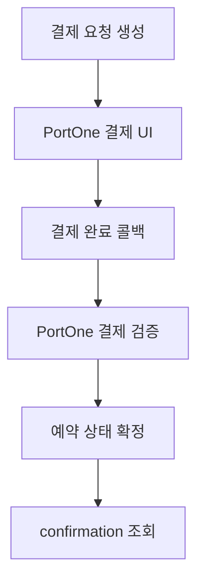
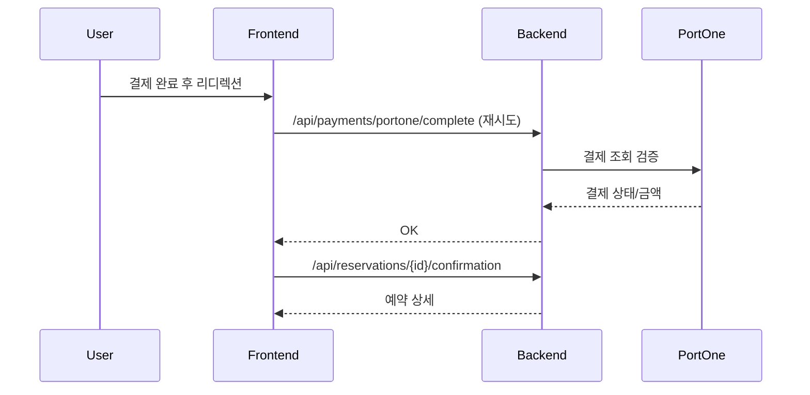

# 결제 모듈 구현 문서

본 문서는 예약금 결제/선결제 모듈의 구현 내용을 정리합니다.

## 1. 목적/범위

- 예약금 결제 및 선결제 기능을 구현하고 PortOne 결제 검증을 적용합니다.
- 프론트/백엔드/DB 변경 사항을 한 문서로 정리합니다.

## 2. 결제 플로우 개요

- 예약금 결제: 예약 생성 → 결제 요청 → 결제 승인 → 예약 확정
- 선결제: 예약 생성 → 결제 요청 → 결제 승인 → 예약 확정
- 취소/환불은 별도 구현 범위

## 3. 아키텍처 구성

- 프론트: Vue 결제 페이지 + confirmation 완료 처리
- 백엔드: 결제 요청/완료/실패/만료 API
- PortOne: 결제 UI + 서버 검증 API
- DB: reservations/payments/refunds 관련 스키마 확장

## 4. DB 스키마 변경 요약

- `reservations`:
  - `deposit_amount`, `prepay_amount`, `total_amount`, `currency`
- `payments`:
  - `merchant_uid`, `imp_uid`, `pg_tid`, `receipt_url`, `idempotency_key`
  - 유니크 키: `merchant_uid`, `imp_uid`, `idempotency_key`, `(reservation_id, payment_type)`
- `refunds`:
  - `payment_type`, `card_type` 스냅샷 추가

관련 SQL:
- `src/main/resources/sql/tables_create_reservation.sql`
- `src/main/resources/sql/migration_add_reservation_payment_fields.sql`
- `src/main/resources/sql/migration_add_refund_snapshot.sql`

## 5. API 설계

### 5-1. 결제 요청 생성

`POST /api/reservations/{reservationId}/payments`

Request:
```json
{
  "paymentType": "DEPOSIT",
  "amount": 20000,
  "method": "CARD",
  "idempotencyKey": "uuid"
}
```

Response:
```json
{
  "paymentId": 1,
  "merchantUid": "RSV-1-...",
  "amount": 20000,
  "pgProvider": "PORTONE",
  "currency": "KRW"
}
```

### 5-2. 결제 완료 처리

`POST /api/payments/portone/complete`

```json
{
  "merchantUid": "RSV-1-...",
  "impUid": "tx-...",
  "paidAmount": 20000
}
```

### 5-3. 결제 실패 처리

`POST /api/payments/portone/fail`

```json
{
  "reservationId": 1,
  "reason": "결제 실패"
}
```

### 5-4. 결제 만료 처리

`POST /api/reservations/{reservationId}/payments/expire`

### 5-5. 예약 확인 정보

`GET /api/reservations/{reservationId}/confirmation`

### 5-6. 예약 요약 정보

`GET /api/reservations/{reservationId}/summary`

## 6. PortOne 연동 방식

- 프론트: `@portone/browser-sdk/v2`
- 사용 파라미터: `storeId`, `channelKey`, `paymentId`, `orderName`, `totalAmount`, `currency`, `payMethod`
- 팝업 방식(redirectUrl 포함)

백엔드 검증:
- `GET https://api.portone.io/payments/{paymentId}`
- 결제 상태 `PAID` + 금액 검증 후 승인 처리

설정값:
```
portone.api-base=https://api.portone.io
portone.api-secret=YOUR_PORTONE_API_SECRET
```

## 7. 프론트 연동 포인트

파일:
- `frontend/src/views/restaurant/id/payment/RestaurantPaymentPage.vue`
- `frontend/src/views/restaurant/id/confirmation/RestaurantConfirmationPage.vue`
- `frontend/src/views/my-reservations/ReservationCancelView.vue`

### 7-1. 코드 경로별 상세 설명

- `frontend/src/views/restaurant/id/payment/RestaurantPaymentPage.vue`
  - 결제 요청 생성 → PortOne 결제 호출 → 완료 콜백 호출
  - 리디렉션 URL에 `reservationId`, `totalAmount`, `paymentId` 포함
- `frontend/src/views/restaurant/id/confirmation/RestaurantConfirmationPage.vue`
  - 리디렉션/복귀 시 결제 완료 처리 재시도
  - confirmation API로 상세 데이터 로딩
- `frontend/src/views/my-reservations/ReservationCancelView.vue`
  - 예약 요약/취소 API 연동

### 7-2. 백엔드 코드 경로별 상세 설명

- `src/main/java/com/example/LunchGo/reservation/controller/ReservationPaymentController.java`
  - 결제 요청 생성, 결제 만료 처리, confirmation/summary 조회 제공
- `src/main/java/com/example/LunchGo/reservation/controller/PaymentController.java`
  - PortOne 결제 완료/실패 콜백 처리
- `src/main/java/com/example/LunchGo/reservation/service/ReservationPaymentService.java`
  - 결제 생성, 상태 전이, 예약 상태 갱신, confirmation/summary 구성
- `src/main/java/com/example/LunchGo/reservation/service/PortoneVerificationService.java`
  - PortOne REST 결제 조회 및 금액/상태 검증
- `src/main/java/com/example/LunchGo/reservation/repository/ReservationRepository.java`
  - 예약 조회/저장(JPA)
- `src/main/java/com/example/LunchGo/reservation/repository/PaymentRepository.java`
  - 결제 조회/저장(JPA, merchantUid 조회 포함)
- `src/main/java/com/example/LunchGo/reservation/repository/ReservationSlotRepository.java`
  - 예약 슬롯 조회(JPA)

### 7-3. 메서드별 책임/입력/출력

#### ReservationPaymentController

- `createPayment(reservationId, request)`
  - 책임: 결제 요청 생성
  - 입력: `reservationId`, `CreatePaymentRequest`
  - 출력: `CreatePaymentResponse`
- `expirePayment(reservationId)`
  - 책임: 결제 만료 처리
  - 입력: `reservationId`
  - 출력: 200 OK
- `getConfirmation(reservationId)`
  - 책임: confirmation 데이터 제공
  - 입력: `reservationId`
  - 출력: `ReservationConfirmationResponse`
- `getSummary(reservationId)`
  - 책임: 요약 데이터 제공(취소 화면)
  - 입력: `reservationId`
  - 출력: `ReservationSummaryResponse`

#### PaymentController

- `completePayment(request)`
  - 책임: PortOne 결제 완료 콜백 처리
  - 입력: `PortoneCompleteRequest` (`merchantUid`, `impUid`, `paidAmount`)
  - 출력: 200 OK
- `failPayment(request)`
  - 책임: PortOne 결제 실패 콜백 처리
  - 입력: `PortoneFailRequest` (`reservationId`, `reason`)
  - 출력: 200 OK

#### ReservationPaymentService

- `createPayment(reservationId, request)`
  - 책임: 예약 정보 확인 및 결제 레코드 생성
  - 입력: `reservationId`, `CreatePaymentRequest`
  - 출력: `CreatePaymentResponse`
  - 검증: 금액 일치(예약금/선결제)
  - 예외:
    - 예약 없음: 400 (IllegalArgumentException)
    - 금액 불일치: 400
    - 중복 결제 요청: 기존 결제 레코드 반환
- `completePayment(request)`
  - 책임: PortOne 검증 후 결제 완료 처리
  - 입력: `PortoneCompleteRequest`
  - 출력: 없음
  - 처리: `payments.status=PAID`, `reservations.status` 갱신
  - 상태 전이:
    - `DEPOSIT` → `CONFIRMED`
    - `PREPAID_FOOD` → `PREPAID_CONFIRMED`
  - 예외:
    - 결제 없음: 400
    - 결제 금액 불일치: 400
    - PortOne 검증 실패: 400
- `failPayment(request)`
  - 책임: 결제 실패 처리(있으면 상태 변경)
  - 입력: `PortoneFailRequest`
  - 출력: 없음
  - 상태 전이:
    - 결제 레코드가 있으면 `FAILED`
    - 결제 레코드가 없으면 no-op
- `expirePayment(reservationId)`
  - 책임: 결제 만료 처리
  - 입력: `reservationId`
  - 출력: 없음
  - 처리: 예약 `EXPIRED`, 결제 `FAILED`
  - 상태 전이:
    - 예약 `TEMPORARY` → `EXPIRED`
    - 결제 `READY/REQUESTED` → `FAILED`
- `getConfirmation(reservationId)`
  - 책임: confirmation 화면용 데이터 구성
  - 입력: `reservationId`
  - 출력: `ReservationConfirmationResponse`
  - 예외:
    - 예약/슬롯/식당 없음: 400
- `getSummary(reservationId)`
  - 책임: 취소 화면 요약 데이터 구성
  - 입력: `reservationId`
  - 출력: `ReservationSummaryResponse`
  - 예외:
    - 예약/슬롯/식당 없음: 400

#### PortoneVerificationService

- `verifyPayment(paymentId, expectedAmount)`
  - 책임: PortOne 결제 단건 조회 및 금액/상태 검증
  - 입력: `paymentId(merchantUid)`, `expectedAmount`
  - 출력: `PortonePaymentInfo` (`status`, `amount`, `method`, `cardType`, `pgTid`)
  - 검증 조건:
    - status == `PAID`
    - amount == expectedAmount
  - 예외:
    - API Secret 미설정: 500
    - 결제 조회 실패: 400
    - 상태 불일치/금액 불일치: 400

결제 페이지:
- 결제 요청 생성 → PortOne 결제 → 완료 콜백
- 리디렉션 시 confirmation에서 완료 처리 재시도

환경 변수:
```
VITE_PORTONE_STORE_ID=...
VITE_PORTONE_CHANNEL_KEY=...
VITE_PORTONE_SDK_URL=https://cdn.portone.io/v2/browser-sdk.js
VITE_PORTONE_OPEN_TYPE=popup
```

## 8. 상태 정의 및 전이

예약 상태:
- `TEMPORARY` → `CONFIRMED`(예약금) / `PREPAID_CONFIRMED`(선결제)
- 실패/만료 → `EXPIRED`

결제 상태:
- `READY` → `PAID`
- 실패 시 `FAILED`

## 9. 검증/에러 처리 규칙

- 결제 금액 서버 검증 필수
- 결제 완료 콜백 실패 시 예약 상태 변경 금지
- 결제 실패/만료는 별도 API로 기록

## 9-1. 에러 코드/응답 포맷

### 공통 응답 포맷(권장)

```json
{
  "code": "PAYMENT_NOT_FOUND",
  "message": "결제 정보를 찾을 수 없습니다."
}
```

### 에러 코드 표

| 코드 | HTTP | 의미 | 발생 위치 |
| --- | --- | --- | --- |
| RESERVATION_NOT_FOUND | 400 | 예약 없음 | `/api/reservations/{id}/payments` |
| PAYMENT_NOT_FOUND | 400 | 결제 없음 | `/api/payments/portone/complete` |
| PAYMENT_AMOUNT_MISMATCH | 400 | 결제 금액 불일치 | `/api/payments/portone/complete` |
| PORTONE_VERIFY_FAILED | 400 | PortOne 결제 검증 실패 | `/api/payments/portone/complete` |
| PAYMENT_EXPIRED | 400 | 결제 만료 처리 | `/api/reservations/{id}/payments/expire` |
| INTERNAL_ERROR | 500 | 예기치 못한 오류 | 전 구간 |

## 10. 테스트 시나리오

- 예약금 결제 성공 → payments=PAID, reservations=CONFIRMED
- 결제 실패 → payments=FAILED
- 결제 만료 → reservations=EXPIRED
- confirmation 리디렉션 시 완료 처리 재시도

## 11. 운영/주의사항

- 실결제 채널은 자동 환불되지 않으므로 테스트 주의
- 안정성을 위해 웹훅 처리 추가 권장
- DB 스키마 변경 후 마이그레이션 적용 필요

## 11-1. 웹훅 로컬 테스트

스크립트:
- `scripts/test_portone_webhook.sh`

실행 예시:
```bash
PORTONE_WEBHOOK_SECRET=your_secret \
PAYMENT_ID=RSV-7-... \
BASE_URL=http://localhost:8080 \
scripts/test_portone_webhook.sh
```

설명:
- `PAYMENT_ID`는 DB에 저장된 `merchant_uid` 값을 사용합니다.
- `PORTONE_WEBHOOK_SECRET`은 콘솔에서 발급받은 웹훅 시크릿입니다.

## 11-2. 웹훅 콘솔 설정 방법

1) 포트원 콘솔 → 결제 연동 → 연동 관리 → 결제알림(Webhook) 관리  
2) 웹훅 버전: **2024-04-25** 선택  
3) 설정 모드: 테스트/실연동 중 환경에 맞게 선택  
4) Content-Type: `application/json`  
5) Endpoint URL 입력:
   - 로컬 테스트: `https://<ngrok-도메인>/api/payments/portone/webhook`
   - 운영: `https://<서비스-도메인>/api/payments/portone/webhook`
6) 저장 후 “호출 테스트”로 정상 수신 확인  
7) 웹훅 시크릿 발급 후 `portone.webhook-secret`에 설정
- 코드 경로 요약
  - 백엔드: `src/main/java/com/example/LunchGo/reservation/...`
  - 프론트: `frontend/src/views/restaurant/id/...`

## 12. 다이어그램

### 12-1. 결제 플로우 (Mermaid)



### 12-2. 리디렉션 복구 플로우


