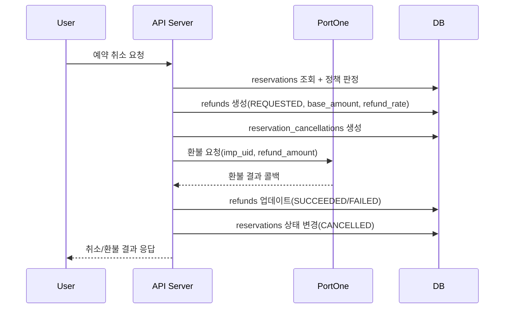
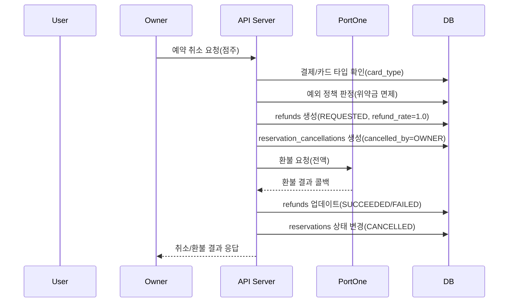

# 환불/취소 API 시퀀스 다이어그램

환불 정책(예약금/선결제 및 예외)을 기준으로 취소/환불 흐름을 시퀀스 다이어그램으로 정리합니다.

## 환불 시퀀스 (기본 정책)

## 예외 시퀀스 (법인카드/점주취소)

## 참고

- 예약금 환불: `예약금 × 환불비율`
- 선결제 환불: `(메뉴금액 - 예약금 가정액) × 환불비율`
- 예외 정책: 법인카드 및 점주취소는 위약금 면제(전액 환불)
