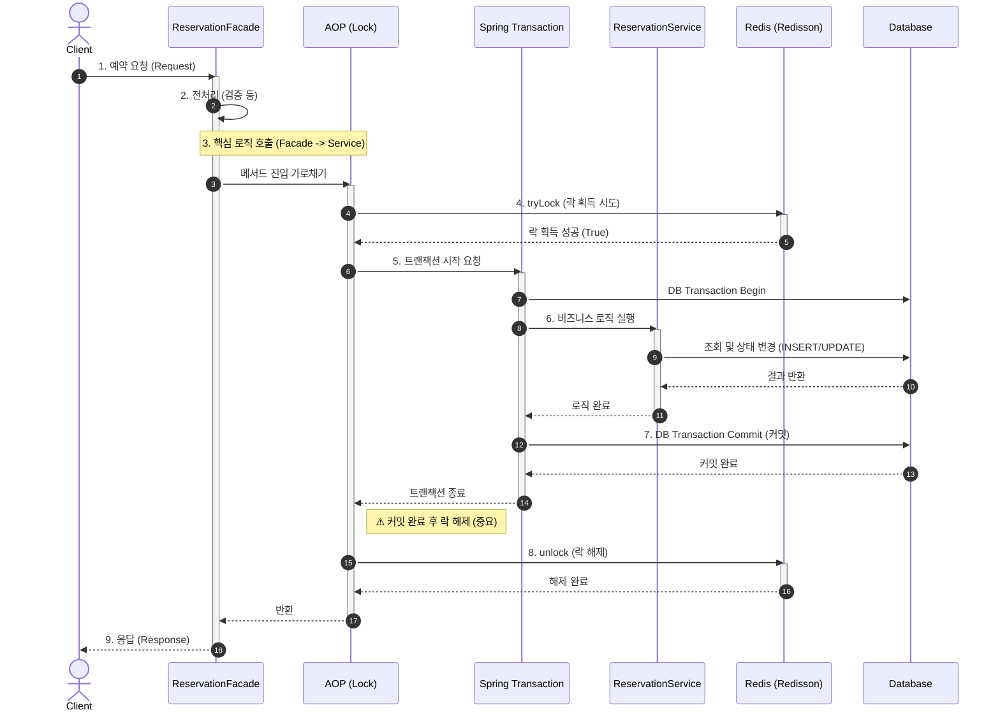

# 예약 생성 로직 관련 트러블슈팅 - 동시성 제어 로직과 예약 생성 트랜잭션의 분리

- `reservation-queue-implementation.md`에 정리한 구현 내용과 연관

## 초기 예약 대기열 구현의 문제점

- 예약 생성에 관한 서비스 로직 내부에 예약 대기열 로직이 추가되면서 예약 생성 트랜잭션의 작업 범위가 증가
  - ReservationServiceImpl의 create 메서드 내부에 중복 예약 방지 및 예약 대기열 락 설정용 try-catch-finally문까지 포함하면서 코드 길이 증가
  - create 메서드 구현부의 분량이 늘어나면서 코드의 가독성을 해치고, 동시성 제어 로직과 예약 생성 로직이 뒤섞이면서 유지보수가 어려워짐
- 서버를 안정시키기 위해 프론트의 예약 대기열에서 재시도 간격을 랜덤화할 시, 예약의 공정성이 훼손될 수 있다는 문제 발생
  - 서버 안정성 우선시
    - 프론트에서 예약 대기 시 락 획득 순서 확인용 재시도 간격을 2~4초로 랜덤화 -> 특정 시점에 락 획득 재시도 작업이 집중되지 않도록 분산
    - 대기 중인 사용자들 간 재시도 시간 랜덤화 + 네트워크 속도 차이로 인해 본래 예약 순서가 뒤바뀔 가능성 존재 -> 선착순 예약 보장 불가
  - 선착순 예약 방침을 유지할 시
    - 예약 생성 트랜잭션 진행 도중 락을 획득하기 때문에 락 대기 시간으로 인해 서버에 가해지는 부하가 증가

---

## 문제의 주요 원인: 락 설정 시점의 문제

- 예약 생성 트랜잭션 내부에 예약 대기열 로직을 포함시킨 것이 문제의 주요 원인
  - 기존 예약 생성 로직: 예약 생성 트랜잭션 시작(DB 커넥션 수립) -> 예약 대기열 진입(락 획득/대기)
  - 위와 같이 진행할 경우 이미 DB 커넥션을 확보한 상태에서 락 획득을 위해 대기 -> 커넥션 낭비를 유발
    - 동시에 DB의 커넥션 개수보다 더 많은 예약 요청이 들어올 경우, DB 커넥션이 고갈되는 문제를 유발
  - 프론트의 재시도 로직 랜덤화로 인한 예약 순서 변경 문제도 결국 기존 구조를 유지하면서 서버의 부하를 최소화하는 과정에서 발생한 문제
  - 부가적으로, 예약 생성 트랜잭션 내부에 예약 대기열 로직을 포함시키면서 트랜잭션의 길이도 증가하는 문제도 유발

---

## 1차 개선: 동시성 제어와 예약 생성의 분리

### 개요

- 락 설정 시점의 변경 + 동시성 제어 로직과 예약 생성 트랜잭션 분리
  - 락을 확보한 이후부터 DB 커넥션을 수립하게 하여 DB 커넥션 고갈 문제를 해결
    - 이를 위해, `락 설정 -> 예약 생성 트랜잭션 실행 -> 락 해제` 순으로 진행 가능하도록 기존 로직을 수정
  - 위와 같이 변경된 순서대로 작업을 진행해야 했기 때문에, 기존 예약 생성 트랜잭션에서 동시성 제어 관련 로직을 분리
    - Facade 패턴이나 Spring AOP 중 하나를 사용하여 동시성 락 관련 로직을 분리

### 동시성 락 로직 분리 방법 선택 - Facade와 AOP

- 기존의 서비스 로직을 다른 서비스 로직과 분리할 때 다음 2가지 방법 중 하나를 활용
  - Facade 패턴
  - Spring AOP 활용

**Facade 패턴**

- 서브시스템을 더 쉽게 사용할 수 있는 높은 수준의 통합된 인터페이스를 제공하기 위해 사용하는 디자인 패턴
  - 여러 개의 부수적인 서비스 로직들을 사용하기 편리하도록 1개의 비즈니스 로직으로 묶어서 제공해야 할 때 활용

**AOP(Aspect=Oriented Programming, 관점 지향 프로그래밍)**

- 특정 비즈니스 로직에 종속되지 않고 공통으로 적용 가능한 부가적인 로직을 분리하기 위해 사용되는 객체지향 기법
  - 특정 조건을 충족하면 미리 지정한 부가적인 기능이, 미리 지정한 시점을 전후하여 수행하도록 설정하는 방식
  - 횡단 관심사: 주로 기술적인 측면에서 여러 비즈니스 로직에 사용되는 기능(로깅, 보안, 트랜잭션, 동시성 락 처리 등)
  - AOP는 횡단 관심사에 해당하는 기능들을 모듈화하여 쉽게 유지보수하기 위해 활용
  - Proxy 패턴에 기반한 객체지향 기법
    - AOP 조건 미충족 시: 프록시 객체가 원본 객체의 핵심 로직만 호출
    - AOP 조건 충족 시: 프록시 객체에서 부가 기능 실행 후 원본 객체의 핵심 로직을 실행

**최종 선택: Spring AOP 활용**

- 동시성 락 분리 시 AOP 활용의 장점
  - 동시성 락 로직 분리 시 Facade 패턴을 활용하는 것의 단점이 곧 AOP 패턴의 장점
    - 예약 생성 로직으로부터 동시성 락 로직을 완전히 분리 가능
    - 예약 생성 로직의 코드가 간결해지고 가독성이 개선됨(이로 인해 동시성 락 로직의 동작 방식을 파악하기가 어려움)
    - AOP 로직을 담당하는 클래스만 수정하면 이를 활용하는 모든 비즈니스 로직에 일괄 적용 가능
- 동시성 락 분리 시 Facade 패턴 활용의 단점
  - Facade 패턴 적용 시 동시성 락 동작 순서를 명시적으로 파악할 수 있으나, 아래와 같은 단점들이 장점을 상회함.
    - 예약 생성 로직이 여전히 동시성 락 로직에 의존
      - 분리된 동시성 제어 로직은 여전히 예약 관련 로직에 섞인 채로 존재
    - 새로운 락을 추가할 때마다 try-catch-finally문을 다시 작성하는 등의 코드 중복이 발생하여 재사용성이 낮음
    - 락 관련 로직을 수정할 경우, Facade가 사용된 로직을 찾아 일일이 수정해야 함.
- 따라서, 동시성 락 로직을 예약 생성 트랜잭션에서 완전히 분리하기 위해 AOP를 적용

### 구현 코드

- 동시성 제어 로직: DistributedLockAop 클래스로 분리
  - 예약 생성 트랜잭션 실행에 앞서 항상 동시성 락을 거는 것을 보장하기 위해, `@Order(Ordered.HIGHEST_PRECEDENCE)` 어노테이션 추가
  - 동시성 제어 로직을 실제로 적용할 비즈니스 로직에 `@DistributedLock` 어노테이션을 붙이는 방식으로 사용
- 기존 비즈니스 로직은 DistributedLockAop 클래스의 `joinPoint.proceed()` 부분에서 실행
  - ReservationServiceImpl의 `create()` 메서드에 해당

[관련 내용 - feat(reservation): redisson 분산 락 활용 예약 대기열 추가 #454](https://github.com/SSG9-FINAL-LunchGO/LunchGO/pull/454)

<details>

<summary>DistributedLockAop 클래스 전체 코드</summary>

```java
/**
 * 분산 락 AOP
 * @Order(Ordered.HIGHEST_PRECEDENCE) 설정 이유:
 * - @Transactional 보다 락 AOP가 먼저 실행되어야 함.
 * - 락 대기 시간(waitTime) 동안 DB 커넥션을 점유하지 않도록 하기 위함 (DB 커넥션 고갈 방지).
 * - 트랜잭션 시작 전에 락을 잡고, 트랜잭션 종료 후에 락을 해제하는 순서를 보장함.
 */
@Aspect
@Component
@Order(Ordered.HIGHEST_PRECEDENCE)
@RequiredArgsConstructor
@Slf4j
public class DistributedLockAop {

    private final RedisUtil redisUtil;

    @Around("@annotation(com.example.LunchGo.reservation.annotation.DistributedLock)")
    public Object lock(final ProceedingJoinPoint joinPoint) throws Throwable {
        MethodSignature signature = (MethodSignature) joinPoint.getSignature();
        Method method = signature.getMethod();
        DistributedLock distributedLock = method.getAnnotation(DistributedLock.class);

        // SpEL 파싱하여 키 생성
        String lockKey = (String) CustomSpringELParser.getDynamicValue(
                signature.getParameterNames(), joinPoint.getArgs(), distributedLock.lockKey());

        String userLockKey = null;
        if (StringUtils.hasText(distributedLock.userLockKey())) {
            userLockKey = (String) CustomSpringELParser.getDynamicValue(
                    signature.getParameterNames(), joinPoint.getArgs(), distributedLock.userLockKey());
        }

        // 1. [개인 락] Lettuce (Fail-Fast)
        if (userLockKey != null) {
            if (!redisUtil.setIfAbsent(userLockKey, "processing", distributedLock.userLockTime())) {
                throw new DuplicateReservationException("이미 처리 중인 예약 요청입니다. 잠시 후 다시 시도해주세요.");
            }
        }

        // 2. [식당 락] Redisson FairLock (선착순 보장)
        // 일반 Lock 대신 FairLock을 사용하여 요청 순서대로 락을 획득하도록 함 (FIFO)
        RLock rLock = redisUtil.getFairLock(lockKey);
        String waitingCountKey = "waiting_count:" + lockKey;

        try {
            // 대기열 진입: 카운트 증가
            redisUtil.increment(waitingCountKey, 1L);

            boolean available;
            if (distributedLock.leaseTime() == -1L) {
                // leaseTime이 -1L이면 Redisson Watchdog 사용
                // Watchdog은 락을 획득한 스레드가 살아있는 동안 락 만료 시간을 자동으로 연장함.
                // Redisson의 기본 Watchdog 타임아웃은 30초이며, 10초마다 갱신 시도.
                // (참고: Watchdog은 락을 연장해주지만, 비즈니스 로직 및 트랜잭션 완료 후 finally 블록에서
                // rLock.unlock()을 통해 명시적으로 해제되므로 불필요하게 락이 유지되지 않음.)
                available = rLock.tryLock(distributedLock.waitTime(), distributedLock.timeUnit());
            } else {
                // leaseTime이 명시된 경우 해당 시간만큼만 락 점유
                available = rLock.tryLock(distributedLock.waitTime(), distributedLock.leaseTime(), distributedLock.timeUnit());
            }

            if (!available) {
                // 대기열 진입 실패 시 (타임아웃)
                // 개인 락 해제하여 재시도 허용
                if (userLockKey != null) {
                    redisUtil.deleteData(userLockKey);
                }

                // 현재 대기 인원 조회
                long currentWaitingCount = redisUtil.getCount(waitingCountKey);
                throw new WaitingReservationException("접속자가 많아 대기 중입니다. 잠시 후 자동으로 재시도합니다.", currentWaitingCount);
            }

            // --- 비즈니스 로직 실행 ---
            return joinPoint.proceed();

        } catch (InterruptedException e) {
            // 인터럽트 발생 시 락 해제 및 상태 복구
            if (userLockKey != null) {
                redisUtil.deleteData(userLockKey);
            }
            Thread.currentThread().interrupt(); // 인터럽트 상태 복구
            throw new IllegalStateException("DistributedLock AOP: Lock acquisition interrupted", e); // 런타임 예외로 래핑
        } finally {
            // 식당 락 해제
            if (rLock != null && rLock.isHeldByCurrentThread()) {
                rLock.unlock();
            }
            // 작업 종료(성공/실패/포기) 후 대기열 이탈: 카운트 감소
            redisUtil.decrement(waitingCountKey, 1L);

            // 개인 락은 성공 시 해제하지 않음 (TTL 유지)
            // 단, 예외가 발생해서 여기까지 왔다면(catch 블록을 거치지 않은 런타임 예외 등) 해제해야 할 수도 있지만,
            // 현재 로직상 성공 시에는 유지하는 것이 정책이므로 그대로 둠.
            // (비즈니스 예외 발생 시에도 개인 락이 유지되는 부작용은 있으나, 이는 5초 후 해소됨)
        }
    }
}
```

</details>

<details>

<summary>DistributedLock 어노테이션 전체 코드</summary>

```java
@Target(ElementType.METHOD)
@Retention(RetentionPolicy.RUNTIME)
public @interface DistributedLock {

    /**
     * 식당 대기열 락 (Redisson) 키 (SpEL 지원)
     */
    String lockKey();

    /**
     * 개인 중복 방지 락 (Lettuce) 키 (SpEL 지원)
     * 값이 비어있으면 개인 락은 사용하지 않음
     */
    String userLockKey() default "";

    /**
     * 식당 락 대기 시간 (Redisson)
     * 2L로 설정하여 가벼운 경합은 서버 내부에서 대기 후 처리하고(Throughput 향상),
     * 대기가 길어질 경우에만 예외를 발생시켜 클라이언트 대기 모달을 유도함 (Fail-Fast).
     * AOP 우선순위 조정(@Order)과 결합하여 대기 시 DB 커넥션 낭비를 방지함.
     */
    long waitTime() default 2L;

    /**
     * 식당 락 점유 시간 (Redisson)
     * Watchdog을 사용하려면 이 값을 -1로 설정하거나 비워둬야 합니다.
     * Watchdog은 락을 점유한 스레드가 살아있는 동안 자동으로 락 만료 시간을 연장하여,
     * 트랜잭션이 길어지더라도 락이 조기 해제되는 것을 방지하는 가장 안전한 방법입니다.
     */
    long leaseTime() default -1L;

    /**
     * 개인 락 점유 시간 (Lettuce)
     */
    long userLockTime() default 3000L;

    TimeUnit timeUnit() default TimeUnit.SECONDS;
}
```

</details>

<details>

<summary>ReservationServiceImpl 클래스의 create() 메서드</summary>

```java
    @Override
    @Transactional
    /**
     * 분산 락(AOP)을 사용하여 예약을 안전하게 생성합니다.(동시성 락 처리 관련 코드는 DistributedLockAop 클래스에서 확인 가능)
     *
     * [이중 락 구조]
     * 1. userLockKey: 동일 유저의 5초 내 중복 요청(따닥)을 즉시 차단 (Fail-Fast)
     * 2. lockKey: 해당 식당의 전체 예약 처리를 순차적으로 제어하여 DB 부하 방지 및 데이터 정합성 보장 (Waiting Queue)
     */
    @DistributedLock(
            lockKey = "'reservation_process_lock:restaurant:' + #request.restaurantId",
            userLockKey = "'reservation_lock:' + #request.userId + ':' + #request.restaurantId + ':' + #request.slotDate + ':' + #request.slotTime",
            userLockTime = 5000L
    )
    public ReservationCreateResponse create(ReservationCreateRequest request) {
        validate(request);

        // 지정한 날짜+시간대의 예약슬롯을 불러오는 서비스 로직(없으면 신규 생성)
        ReservationSlot slot = reservationSlotService.getValidatedSlot(
                request.getRestaurantId(),
                request.getSlotDate(),
                request.getSlotTime(),
                request.getPartySize()
        );

        // PREORDER_PREPAY면 메뉴 스냅샷(이름/가격) 확정 + 합계 계산
        List<ReservationCreateRequest.MenuItem> reqMenuItems = request.getMenuItems();
        List<MenuSnapshot> snapshots = new ArrayList<>();
        Integer preorderSum = null;

        if (ReservationType.PREORDER_PREPAY.equals(request.getReservationType())) {
            int sum = 0;
            for (ReservationCreateRequest.MenuItem mi : reqMenuItems) {
                if (mi == null || mi.getMenuId() == null) {
                    throw new IllegalArgumentException("menuId is required");
                }
                if (mi.getQuantity() == null || mi.getQuantity() <= 0) {
                    throw new IllegalArgumentException("quantity must be positive");
                }

                Menu menu = menuRepository
                        .findByMenuIdAndRestaurantIdAndIsDeletedFalse(mi.getMenuId(), request.getRestaurantId())
                        .orElseThrow(() -> new IllegalArgumentException("menu not found: " + mi.getMenuId()));

                int unitPrice = menu.getPrice() == null ? 0 : menu.getPrice();
                int qty = mi.getQuantity();
                int lineAmount = unitPrice * qty;
                sum += lineAmount;

                snapshots.add(new MenuSnapshot(menu.getMenuId(), menu.getName(), unitPrice, qty, lineAmount));
            }
            preorderSum = sum;
        }

        Reservation reservation = new Reservation();
        reservation.setReservationCode("PENDING");
        reservation.setSlotId(slot.getSlotId());
        reservation.setUserId(request.getUserId());
        reservation.setPartySize(request.getPartySize());
        reservation.setReservationType(request.getReservationType());
        reservation.setStatus(ReservationStatus.TEMPORARY);
        reservation.setRequestMessage(trimToNull(request.getRequestMessage()));
        reservation.setHoldExpiresAt(LocalDateTime.now().plusMinutes(7));
        reservation.setVisitStatus(VisitStatus.PENDING);

        if (ReservationType.RESERVATION_DEPOSIT.equals(request.getReservationType())) {
            int perPerson = request.getPartySize() >= DEPOSIT_LARGE_THRESHOLD
                    ? DEPOSIT_PER_PERSON_LARGE
                    : DEPOSIT_PER_PERSON_DEFAULT;
            int depositAmount = perPerson * request.getPartySize();
            reservation.setDepositAmount(depositAmount);
            reservation.setTotalAmount(depositAmount);
        } else if (ReservationType.PREORDER_PREPAY.equals(request.getReservationType())) {
            // 프론트 totalAmount 대신 "DB 메뉴 합계" 기준으로 저장
            reservation.setPrepayAmount(preorderSum);
            reservation.setTotalAmount(preorderSum);
        }

        try {
            reservationMapper.insertReservation(reservation);
        } catch (DataIntegrityViolationException e) {
            // 결제 대기 시간 만료 전, 약간의 텀을 두고 중복된 예약 요청이 발생했을 때의 중복 예약 방지
            throw new DuplicateReservationException("이미 결제 대기 중인 예약 요청입니다.");
        }

        // reservation_menu_items 저장 (예약 PK 생긴 다음에)
        if (ReservationType.PREORDER_PREPAY.equals(request.getReservationType()) && !snapshots.isEmpty()) {
            for (MenuSnapshot s : snapshots) {
                reservationMapper.insertReservationMenuItem(
                        reservation.getReservationId(),
                        s.menuId,
                        s.menuName,
                        s.unitPrice,
                        s.quantity,
                        s.lineAmount
                );
            }
        }

        String code = generateReservationCode(LocalDate.now(), reservation.getReservationId());
        reservationMapper.updateReservationCode(reservation.getReservationId(), code);

        ReservationCreateRow row = reservationMapper.selectReservationCreateRow(reservation.getReservationId());
        if (row == null) {
            throw new IllegalStateException("created reservation not found");
        }

        // redis에 응답대기로 방문 확정 관련 상태 넣어놓기
        LocalDateTime slotDateTime = LocalDateTime.of(request.getSlotDate(), request.getSlotTime());
        long ttlMillis = Duration.between(LocalDateTime.now(), slotDateTime).toMillis();
        if (ttlMillis < 0) {
            throw new ResponseStatusException(HttpStatus.BAD_REQUEST);
        }
        redisUtil.setDataExpire(String.valueOf(reservation.getReservationId()), VisitStatus.PENDING.name(), ttlMillis);

        return new ReservationCreateResponse(
                row.getReservationId(),
                row.getReservationCode(),
                row.getSlotId(),
                row.getUserId(),
                row.getRestaurantId(),
                row.getSlotDate(),
                row.getSlotTime(),
                row.getPartySize(),
                row.getReservationType(),
                row.getStatus(),
                row.getRequestMessage()
        );
    }
```

</details>

---

## 2차 개선: 동시성 제어용 락 적용 범위의 축소

### 문제

- 동시에 800개의 예약 요청이 식당 1곳에 집중되는 상황을 가정하여 부하테스트를 수행했을 때, 약 44초 가량의 시간이 소요되는 것을 확인

### 원인

- 예약 생성 시 락을 획득한 상태에서 진행해야 할 작업의 범위가 넓었던 것이 주요 원인
  - 예약 생성 트랜잭션 내부에 락을 적용할 필요가 없는 예약 생성 로직까지 포함
  - 사용자 1명이 락 획득 후 예약 신청을 진행하는 동안, 다른 사용자들은 락을 획득할 때까지 대기
  - 즉, 락을 획득한 후 예약 생성 트랜잭션에서 처리해야 할 작업이 많아지면 다른 사용자들의 대기시간도 증가하는 문제를 유발

### 해결 방안 - 락 적용 구간의 단축

- 락을 획득하기 위한 대기시간을 줄이기 위해, 신규 예약 생성 시, 락을 획득한 상태로 진행해야 할 구간을 단축시키는 방향으로 개선
- 예약 생성에 관한 서비스 로직 중 락을 걸고 진행해야 할 작업과 그렇지 않은 작업들을 구분하고, 락을 걸 필요가 없는 작업들만 기존 예약 트랜잭션에서 분리
  - 락 필수: 예약할 시간대에 해당하는 예약 슬롯 조회(비관적 락 획득), 중복 예약 사전 검증, 신규 예약 등록, 선주문/선결제 메뉴 등록, 방문상태 ttl 설정
  - 락 불필요: 잔여석 사전 검증, 예약금 및 선주문/선결제 금액 계산 등
    - 신규 예약 신청 전 전처리 작업들에 해당
- 예약 생성 로직 중 락을 걸 구간을 단축하고 동시 처리량을 늘리기 위해 Facade 패턴을 활용
  - ReservationFacade 클래스의 `createReservation` 메서드
    - 예약 생성 시, 락을 걸 필요가 없는 모든 사전 작업을 담당
    - 다소 시간이 걸리지만 동시성 제어가 불필요한 작업들을 락 획득 이전에 미리 처리하여, 락을 적용하고 실행해야 하는 구간을 단축
  - ReservationServiceImpl 클래스의 `createReservationLocked` 메서드
    - 예약 생성 시, 반드시 락이 필요한 핵심 작업을 수행
    - 예약 생성 로직의 임계 영역에 해당

### 구현 코드

[refactor(reservation): 예약 생성 로직 facade 패턴 적용 #526](https://github.com/SSG9-FINAL-LunchGO/LunchGO/pull/526)

<details>

<summary>ReservationFacade 클래스 내 createReservation() 메서드</summary>

```java
    /**
     * Facade 패턴의 새로운 예약 생성 진입점. 예약 생성의 전체적인 흐름을 관리하며, 락이 필요 없는 로직은 여기서 처리하고 락이 필요한 핵심 로직은 ReservationServiceImpl에
     * 위임합니다.
     *
     * @param request 예약 생성 요청 DTO
     * @return 예약 생성 응답 DTO
     */
    public ReservationCreateResponse createReservation(ReservationCreateRequest request) {
        // 1. 전처리 단계: 락이 필요 없는 로직 (ReservationServiceImpl에서 이동)
        //    핵심 락이 걸리기 전에 최대한 많은 작업을 처리하여 락 점유 시간을 단축합니다.

        // 요청 유효성 검증 (ServiceImpl에서 이동)
        validate(request);

        // Just-in-Time Redis Counter Initialization & Pre-Check
        // 1. 이 슬롯의 최대 정원을 DB에서 조회 (락 없이)
        Integer maxCapacity = restaurantRepository.findReservationLimitByRestaurantId(request.getRestaurantId())
                .orElse(DEFAULT_MAX_CAPACITY); // 기본값 DEFAULT_MAX_CAPACITY (ReservationFacade 내부에 정의)

        // 2. Redis 키 정의
        String redisSeatKey = RedisUtil.generateSeatKey(request.getRestaurantId(), request.getSlotDate(),
                request.getSlotTime());

        // 3. SETNX를 사용한 원자적 초기화 (키가 없을 때만 실행)
        // TTL은 24시간으로 넉넉하게 설정
        redisUtil.setIfAbsent(redisSeatKey, String.valueOf(maxCapacity), REDIS_SEAT_KEY_TTL_MILLIS);

        // 4. Redis 좌석 사전 검증 (빠른 Fail-Fast)
        Long remainingSeats = redisUtil.decrement(redisSeatKey, request.getPartySize());

        if (remainingSeats < 0) {
            // 좌석이 부족하면 Redis 카운터를 다시 원상 복구하고 예외 발생
            redisUtil.increment(redisSeatKey, request.getPartySize());
            throw new SlotCapacityExceededException("잔여석이 부족합니다. (Redis 사전 검증)");
        }

        try {
            // 선주문/선결제 메뉴 처리 및 금액 계산 (ServiceImpl에서 이동)
            List<MenuSnapshot> menuSnapshots = new ArrayList<>();
            Integer precalculatedPrepaySum = null;
            if (ReservationType.PREORDER_PREPAY.equals(request.getReservationType())) {
                // N+1 쿼리 방지를 위해 메뉴 ID 목록을 먼저 추출
                List<Long> menuIds = request.getMenuItems().stream()
                        .map(ReservationCreateRequest.MenuItem::getMenuId)
                        .collect(Collectors.toList());

                // IN 절을 사용해 한 번의 쿼리로 모든 메뉴 정보를 조회
                List<Menu> foundMenus = menuRepository.findAllByMenuIdInAndRestaurantIdAndIsDeletedFalse(menuIds,
                        request.getRestaurantId());

                // 조회된 메뉴를 Map으로 변환하여 빠른 조회를 지원
                Map<Long, Menu> menuMap = foundMenus.stream()
                        .collect(Collectors.toMap(Menu::getMenuId, menu -> menu));

                // 요청된 모든 메뉴가 실제로 조회되었는지 검증
                if (menuMap.size() != menuIds.size()) {
                    throw new IllegalArgumentException(
                            "One or more menus not found or do not belong to the restaurant.");
                }

                int sum = 0;
                for (ReservationCreateRequest.MenuItem mi : request.getMenuItems()) {
                    if (mi == null || mi.getMenuId() == null) {
                        throw new IllegalArgumentException("menuId is required");
                    }
                    if (mi.getQuantity() == null || mi.getQuantity() <= 0) {
                        throw new IllegalArgumentException("quantity must be positive");
                    }

                    // Map에서 메뉴 정보를 가져옴
                    Menu menu = menuMap.get(mi.getMenuId());

                    int unitPrice = menu.getPrice() == null ? 0 : menu.getPrice();
                    int qty = mi.getQuantity();
                    int lineAmount = unitPrice * qty;
                    sum += lineAmount;

                    menuSnapshots.add(new MenuSnapshot(menu.getMenuId(), menu.getName(), unitPrice, qty, lineAmount));
                }
                precalculatedPrepaySum = sum;
            }

            // 예약금 계산 (ServiceImpl에서 이동)
            Integer precalculatedDepositAmount = null;
            if (ReservationType.RESERVATION_DEPOSIT.equals(request.getReservationType())) {
                int perPerson = request.getPartySize() >= DEPOSIT_LARGE_THRESHOLD
                        ? DEPOSIT_PER_PERSON_LARGE
                        : DEPOSIT_PER_PERSON_DEFAULT;
                precalculatedDepositAmount = perPerson * request.getPartySize();
            }

            // 2. 핵심 로직 호출 단계: 락이 필요한 로직은 ServiceImpl에 위임
            //    락이 걸린 ServiceImpl의 메서드를 호출하여, 동시성 제어가 필요한 DB 작업을 수행합니다.
            ReservationCreateResponse response = reservationService.createReservationLocked(
                    request,
                    precalculatedPrepaySum,
                    menuSnapshots,
                    precalculatedDepositAmount
            );

            // 3. 후처리 단계: 트랜잭션 커밋 후 실행될 로직은 ReservationServiceImpl로 이동됨.
            return response;
        } catch (Exception e) {
            // 핵심 로직 실패 시, 미리 감소시킨 Redis 좌석 수를 원상 복구 (보상 트랜잭션)
            redisUtil.increment(redisSeatKey, request.getPartySize());
            // 원래 예외를 다시 던져서 클라이언트에게 실패를 알림
            throw e;
        }
    }
```

</details>

<details>

<summary>ReservationServiceImpl 클래스 내 createReservationLocked() 메서드</summary>

```java
    @Override
    @Transactional
    @DistributedLock(
            lockKey = "'reservation_process_lock:restaurant:' + #request.restaurantId + ':slot:' + #request.slotDate + ':' + #request.slotTime",
            userLockKey = "'reservation_lock:' + #request.userId + ':' + #request.restaurantId + ':' + #request.slotDate + ':' + #request.slotTime",
            userLockTime = 5000L
    )
    public ReservationCreateResponse createReservationLocked(
            ReservationCreateRequest request,
            Integer precalculatedPrepaySum,
            List<MenuSnapshot> menuSnapshots,
            Integer precalculatedDepositAmount) {

        // 지정한 날짜+시간대의 예약슬롯을 불러오는 서비스 로직(없으면 신규 생성)
        ReservationSlot slot = reservationSlotService.getValidatedSlot(
                request.getRestaurantId(),
                request.getSlotDate(),
                request.getSlotTime(),
                request.getPartySize()
        );

        // [중복 예약 사전 검증]
        // DB 유니크 제약조건(uk_user_slot_active) 위반 시 발생하는 SQL 에러 로그를 방지하고,
        // 불필요한 트랜잭션 롤백 비용을 절감하기 위해 애플리케이션 레벨에서 먼저 확인합니다.
        // DistributedLock(개인 락)은 5초 이내의 중복 요청만 막아주므로, 이 로직이 필수적입니다.
        if (reservationMapper.countActiveReservation(request.getUserId(), slot.getSlotId()) > 0) {
            throw new DuplicateReservationException("동일 시간대에 예약된 내역이 있습니다.");
        }

        Reservation reservation = new Reservation();
        reservation.setReservationCode("PENDING");
        reservation.setSlotId(slot.getSlotId());
        reservation.setUserId(request.getUserId());
        reservation.setPartySize(request.getPartySize());
        reservation.setReservationType(request.getReservationType());
        reservation.setStatus(ReservationStatus.TEMPORARY);
        reservation.setRequestMessage(trimToNull(request.getRequestMessage()));
        reservation.setHoldExpiresAt(LocalDateTime.now().plusMinutes(7));
        reservation.setVisitStatus(VisitStatus.PENDING);

        if (ReservationType.RESERVATION_DEPOSIT.equals(request.getReservationType())) {
            reservation.setDepositAmount(precalculatedDepositAmount);
            reservation.setTotalAmount(precalculatedDepositAmount);
        } else if (ReservationType.PREORDER_PREPAY.equals(request.getReservationType())) {
            // Facade에서 계산한 "DB 메뉴 합계" 기준으로 저장
            reservation.setPrepayAmount(precalculatedPrepaySum);
            reservation.setTotalAmount(precalculatedPrepaySum);
        }

        try {
            reservationMapper.insertReservation(reservation);
        } catch (DataIntegrityViolationException | PersistenceException e) {
            // 결제 대기 시간 만료 전, 약간의 텀을 두고 중복된 예약 요청이 발생했을 때의 중복 예약 방지
            throw new DuplicateReservationException("이미 결제 대기 중인 예약 요청입니다.");
        }

        // reservation_menu_items 저장 (예약 PK 생긴 다음에)
        if (ReservationType.PREORDER_PREPAY.equals(request.getReservationType()) && menuSnapshots != null && !menuSnapshots.isEmpty()) {
            reservationMapper.insertReservationMenuItems(reservation.getReservationId(), menuSnapshots);
        }

        String code = generateReservationCode(LocalDate.now(), reservation.getReservationId());
        reservationMapper.updateReservationCode(reservation.getReservationId(), code);

        ReservationCreateRow row = reservationMapper.selectReservationCreateRow(reservation.getReservationId());
        if (row == null) {
            throw new IllegalStateException("created reservation not found");
        }

        // 후처리: 트랜잭션 커밋 후 Redis에 방문 상태 TTL 설정
        // 이 로직은 DB 트랜잭션 성공이 보장된 후에 실행되어야 데이터 정합성이 맞음.
        // @Transactional 범위 내에서 TransactionSynchronizationManager를 사용하면
        // 트랜잭션 커밋 직후에 콜백(afterCommit)을 실행할 수 있음.
        TransactionSynchronizationManager.registerSynchronization(new TransactionSynchronization() {
            @Override
            public void afterCommit() {
                // redis에 응답대기로 방문 확정 관련 상태 넣어놓기
                LocalDateTime slotDateTime = LocalDateTime.of(request.getSlotDate(), request.getSlotTime());
                long ttlMillis = Duration.between(LocalDateTime.now(), slotDateTime).toMillis();
                if (ttlMillis > 0) {
                    redisUtil.setDataExpire(String.valueOf(row.getReservationId()), VisitStatus.PENDING.name(), ttlMillis);
                }
            }
        });

        return new ReservationCreateResponse(
                row.getReservationId(),
                row.getReservationCode(),
                row.getSlotId(),
                row.getUserId(),
                row.getRestaurantId(),
                row.getSlotDate(),
                row.getSlotTime(),
                row.getPartySize(),
                row.getReservationType(),
                row.getStatus(),
                row.getRequestMessage()
        );
    }
```

</details>

---

## 예약 생성 로직 요약 - 시퀀스 다이어그램


