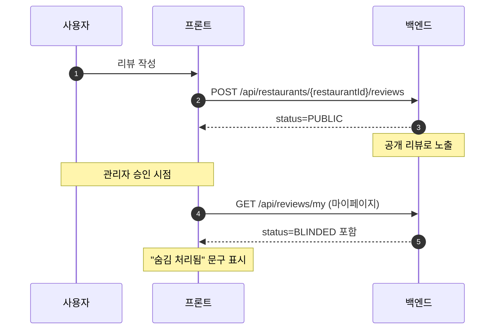
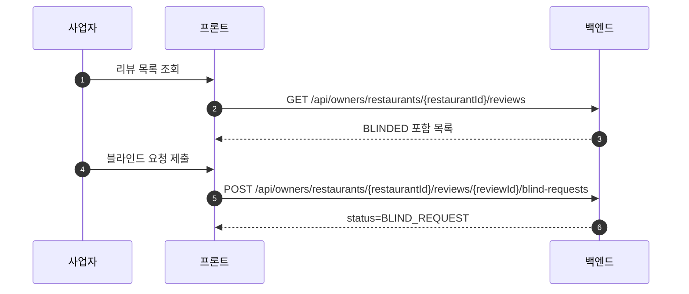
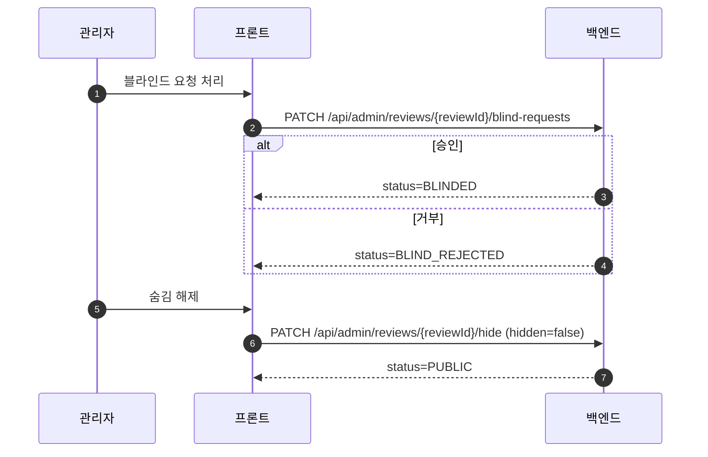
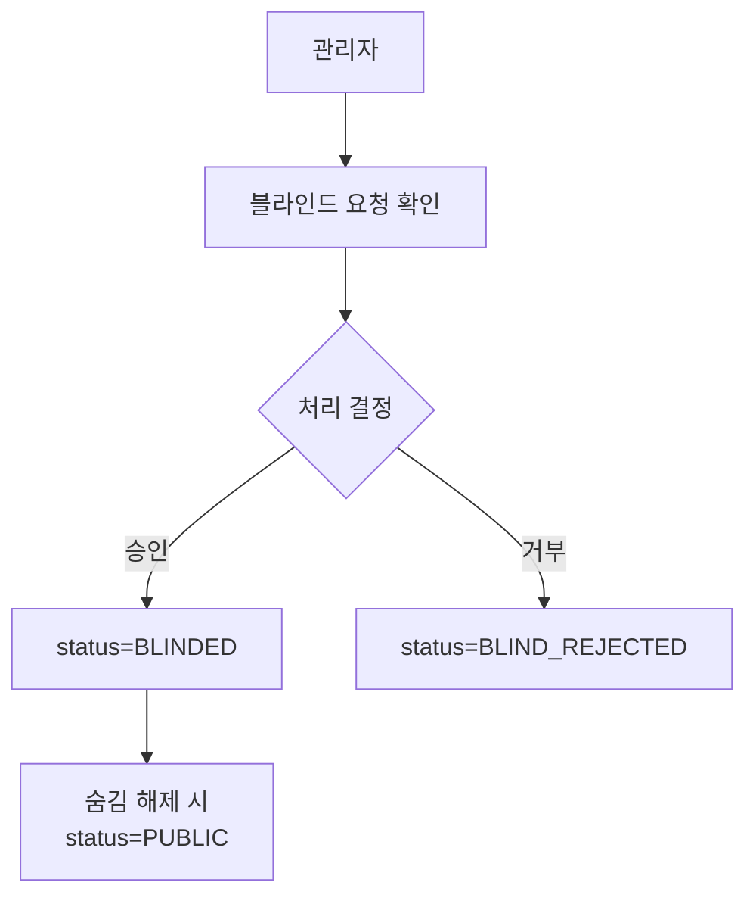

# 🛡️ 리뷰 블라인드 처리 구현

이 문서는 런치고의 리뷰 블라인드 처리 흐름과 구현 내용을 정리합니다.

## ✅ 목표

- 일반 사용자는 블라인드된 리뷰를 볼 수 없다.
- 리뷰 작성자는 마이페이지에서 블라인드된 리뷰를 확인할 수 있고, 정책 문구가 표시된다.
- 사업자/관리자는 블라인드된 리뷰를 확인하여 운영·검토가 가능하다.

## 🧭 상태 모델

- `PUBLIC`: 전체 공개
- `BLIND_REQUEST`: 사업자 블라인드 요청(관리자 대기)
- `BLINDED`: 블라인드 처리(공개 목록에서는 제외)
- `BLIND_REJECTED`: 블라인드 요청 거부

## 🔌 API 요약

공개 조회(블라인드 제외):
- `GET /api/restaurants/{restaurantId}/reviews`
- `GET /api/restaurants/{restaurantId}/reviews/{reviewId}`

사업자 조회(블라인드 포함):
- `GET /api/owners/restaurants/{restaurantId}/reviews`
- `GET /api/owners/restaurants/{restaurantId}/reviews/{reviewId}`

관리자 처리:
- `PATCH /api/admin/reviews/{reviewId}/blind-requests`
- `PATCH /api/admin/reviews/{reviewId}/hide`

## 🧩 사용자/사업자/관리자 흐름도 (Mermaid)



```mermaid
flowchart TD
  U[사용자] --> U1[리뷰 작성]
  U1 --> U2[공개 상태(PUBLIC)]
  U2 -->|관리자 승인| U3[BLINDED]
  U3 --> U4[마이페이지\n"숨김 처리됨" 문구 표시]
```



```mermaid
flowchart TD
  O[사업자] --> O1[리뷰 목록 조회(블라인드 포함)]
  O1 --> O2[부적절한 리뷰 발견]
  O2 --> O3[블라인드 요청 제출]
  O3 --> O4[상태: BLIND_REQUEST]
  O4 --> O5[관리자 처리 결과 반영]
```





## 🧠 백엔드 구현

### 리뷰 목록/상세 필터링

- 공개 조회는 `BLINDED`를 제외한다.
- 사업자 조회는 `BLINDED`를 포함한다.
- 관리자 목록은 기존 API를 유지하고, 상세 조회는 사업자 조회 API를 사용한다.

관련 파일:
- `src/main/resources/mapper/ReviewReadMapper.xml`
  - `includeBlinded` 플래그로 조회 조건 분기
- `src/main/java/com/example/LunchGo/review/service/ReviewServiceImpl.java`
  - `getRestaurantReviewsInternal(..., includeBlinded)`
  - `getReviewDetailInternal(..., includeBlinded)`
- `src/main/java/com/example/LunchGo/review/controller/OwnerReviewReadController.java`
  - 사업자 전용 목록/상세 API

핵심 코드:
```xml
<!-- ReviewReadMapper.xml: includeBlinded에 따라 BLINDED 포함 여부 분기 -->
<choose>
  <when test="includeBlinded">
    AND r.status IN ('PUBLIC', 'BLINDED', 'BLIND_REQUEST', 'BLIND_REJECTED')
  </when>
  <otherwise>
    AND r.status IN ('PUBLIC', 'BLIND_REQUEST', 'BLIND_REJECTED')
  </otherwise>
</choose>
```

```java
// ReviewServiceImpl: 내부 공통 로직으로 includeBlinded 분기
return getRestaurantReviewsInternal(restaurantId, page, size, sort, tagIds, false);
// 사업자용
return getRestaurantReviewsInternal(restaurantId, page, size, sort, tagIds, true);
```

```java
// OwnerReviewReadController: 사업자 전용 조회 API
@GetMapping
public ResponseEntity<RestaurantReviewListResponse> list(...) {
    return ResponseEntity.ok(
        reviewService.getOwnerRestaurantReviews(restaurantId, page, size, sort, tagIds)
    );
}
```

### 관리자 숨김/해제

- 관리자 숨김 처리 API:
  - `PATCH /api/admin/reviews/{reviewId}/hide` (요청 바디: `{ "hidden": true|false }`)
- 처리 결과로 `BLINDED` ↔ `PUBLIC` 상태를 토글한다.
- 토글 허용 상태: `PUBLIC`, `BLINDED`, `BLIND_REQUEST`

관련 파일:
- `src/main/java/com/example/LunchGo/review/service/ReviewAdminService.java`
- `src/main/java/com/example/LunchGo/review/controller/AdminReviewController.java`
- `src/main/java/com/example/LunchGo/review/dto/AdminReviewHideRequest.java`
- `src/main/java/com/example/LunchGo/review/dto/AdminReviewHideResponse.java`

핵심 코드:
```java
// ReviewAdminService: 숨김/해제 상태 토글
if (!"PUBLIC".equals(status) && !"BLINDED".equals(status) && !"BLIND_REQUEST".equals(status)) {
    throw new IllegalStateException("review status cannot be toggled");
}
if (request.isHidden()) {
    review.setStatus("BLINDED");
} else if ("BLINDED".equals(status)) {
    review.setStatus("PUBLIC");
}
```

```java
// AdminReviewController: 숨김 처리 API
@PatchMapping("/{reviewId}/hide")
public ResponseEntity<AdminReviewHideResponse> hideReview(...) {
    AdminReviewHideResponse response = reviewAdminService.hideReview(reviewId, request);
    return response == null ? ResponseEntity.notFound().build() : ResponseEntity.ok(response);
}
```

### 마이페이지(내 리뷰)

- 내 리뷰 응답에 `status`를 포함한다.
- `BLINDED` 리뷰는 목록에 남고, 정책 문구로 표시된다.

관련 파일:
- `src/main/resources/mapper/MyReviewMapper.xml`
- `src/main/java/com/example/LunchGo/review/dto/MyReviewItem.java`
- `src/main/java/com/example/LunchGo/review/service/MyReviewServiceImpl.java`

핵심 코드:
```xml
<!-- MyReviewMapper.xml: 내 리뷰에 status 포함 -->
SELECT
  r.review_id AS reviewId,
  r.status AS status,
  r.content AS content
FROM reviews r
WHERE r.user_id = #{userId}
```

```java
// MyReviewServiceImpl: status 포함 응답 구성
return new MyReviewItem(
    row.getReviewId(),
    row.getReservationId(),
    new MyReviewItem.RestaurantInfo(...),
    row.getVisitCount(),
    row.getRating(),
    row.getCreatedAt(),
    row.getVisitDate(),
    forbiddenWordService.maskForbiddenWords(row.getContent()),
    row.getStatus(),
    splitList(row.getTags()),
    splitList(row.getImages())
);
```

```vue
<!-- ReviewsPage.vue: BLINDED 리뷰 표시 -->
<div v-if="review.isBlinded" class="rounded-lg border border-[#e9ecef] bg-[#f8f9fa] px-3 py-2">
  <p class="text-xs font-semibold text-[#dc3545] mb-1">숨김 처리됨</p>
  <p class="text-sm text-[#6c757d]">
    런치고 리뷰 정책에 의해 블라인드 처리되었습니다.
  </p>
</div>
```

### 보안

- 사업자 전용 리뷰 조회는 `ROLE_OWNER` 또는 `ROLE_STAFF`만 허용한다.
- 관리자도 상세 확인을 위해 사업자 조회 API를 사용할 수 있다.

관련 파일:
- `src/main/java/com/example/LunchGo/common/config/SecurityConfig.java`

핵심 코드:
```java
// SecurityConfig: 사업자/관리자 조회 허용
.requestMatchers(HttpMethod.GET, "/api/owners/restaurants/*/reviews")
  .hasAnyAuthority("ROLE_OWNER", "ROLE_STAFF", "ROLE_ADMIN")
```

## 🎛️ 프론트 구현

### 사업자 리뷰 관리

- 사업자 전용 API로 조회하여 `BLINDED`를 포함한다.
- 승인된 블라인드 리뷰도 목록에서 확인 가능하다.

관련 파일:
- `frontend/src/views/business/reviews/BusinessReviewsPage.vue`

핵심 코드:
```js
// BusinessReviewsPage.vue: owner API 사용
httpRequest.get(`/api/owners/restaurants/${restaurantId}/reviews`, { page, size, sort });
```

```js
// BusinessReviewsPage.vue: owner 상세 API 사용
httpRequest.get(`/api/owners/restaurants/${restaurantId}/reviews/${reviewId}`);
```

### 관리자 리뷰 관리

- 목록은 `/api/admin/reviews`
- 상세는 사업자 전용 API로 조회
- 숨김 처리 버튼은 백엔드 API 호출로 상태 토글

관련 파일:
- `frontend/src/views/admin/reviews/AdminReviewsPage.vue`

핵심 코드:
```js
// AdminReviewsPage.vue: 숨김 토글
await httpRequest.patch(`/api/admin/reviews/${review.id}/hide`, { hidden });
```

```js
// AdminReviewsPage.vue: 관리자 상세는 owner API로 조회
await httpRequest.get(`/api/owners/restaurants/${review.restaurantId}/reviews/${review.id}`);
```

### 마이페이지 리뷰

- 블라인드 리뷰는 아래 문구로 표시:
  - 제목: `숨김 처리됨`
  - 내용: `런치고 리뷰 정책에 의해 블라인드 처리되었습니다.`
- 블라인드 리뷰는 수정/삭제/상세 링크 등 사용자 액션을 숨김 처리

관련 파일:
- `frontend/src/views/mypage/reviews/ReviewsPage.vue`

## 🧪 데이터 참고

- 리뷰 목데이터 보정:
  - `src/main/resources/sql/fix_mock_review_reservations.sql`
- 테스트용 예약 샘플:
  - `src/main/resources/sql/insert_mock_data_reservation.sql`
