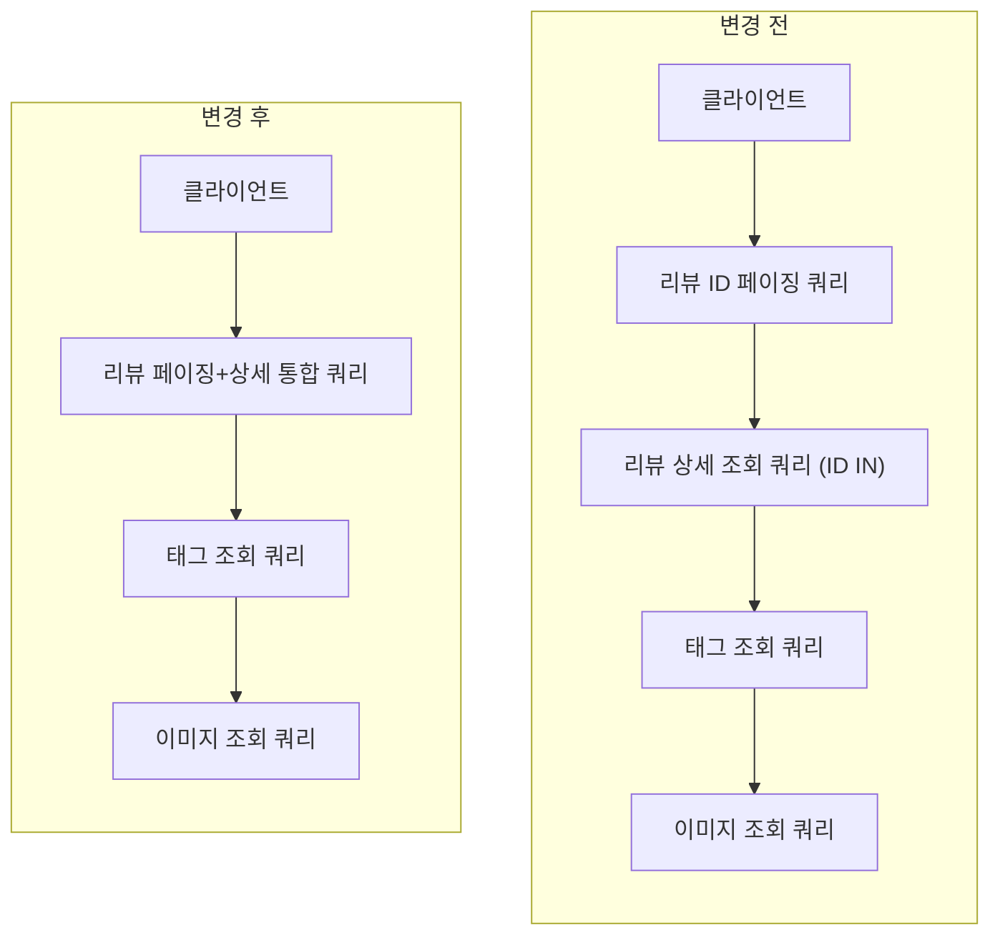

# 리뷰 조회 쿼리 최적화 계획

## 현황
- 대상 API: `GET /api/restaurants/{restaurantId}/reviews`
- 현재 동작(Scouter 로그 기준)
  - 평균 7개 쿼리 실행
  - 흐름: 요약(평점/개수) → 상위 태그 → 리뷰 ID 목록 → 리뷰 상세 → 태그/이미지 → 총 카운트
  - 리뷰 상세/태그/이미지 조회가 분리되어 N+1 패턴에 가까움

## 문제점
- 쿼리 수가 많아지고 네트워크 round-trip 증가
- 정렬 기준(`created_at`)과 필터(`restaurant_id`, `status`)가 분리되어 인덱스 효율 저하 가능
- 요약 데이터(평점/상위 태그)가 매 요청마다 재계산됨

## 목표
- 동일 기능 유지하면서 쿼리 수 7 → 3 이하로 축소
- 페이지 응답 시간과 DB 부하 감소
- 지표(응답시간/쿼리수/DB CPU)로 개선 효과 검증

## 최적화 계획
1) 쿼리 합치기
   - 리뷰 ID 페이징 + 상세 조회를 단일 쿼리로 통합
   - 태그/이미지는 IN 절 2회 조회 유지
2) 인덱스 보강
   - `reviews(restaurant_id, status, created_at, review_id)`
   - `reviews(restaurant_id, status, rating, created_at, review_id)`
   - `review_tag_maps(review_id)`
   - `review_tag_maps(tag_id, review_id)`
   - `review_images(review_id, sort_order)`
3) 요약 캐시
   - 평균 평점/리뷰 수/상위 태그에 TTL(60초) 캐시 적용
4) 응답 데이터 축소
   - 불필요한 컬럼 제거, 이미지/태그는 요청 옵션으로 분리

## 구현 체크리스트
- [x] ReviewReadMapper 쿼리 구조 정리
- [x] 인덱스 추가 SQL 작성
- [x] 요약 캐시 적용(서비스 레이어)
- [ ] API 응답 구조 변경 영향 확인(프론트/모바일)

## 쿼리 변경 내용
### 쉽게 보는 변경 요약
- 변경 전: 리뷰 ID를 먼저 뽑고, 그 ID 목록으로 다시 상세를 조회하는 2단계 방식
- 변경 후: 페이징 대상 ID를 서브쿼리로 만들고, 상세 조회를 1번에 합친 1단계 방식
- 효과: 네트워크 왕복(쿼리 1회) 감소 + 동일 정렬 기준 유지

### 흐름 다이어그램


### 변경 전
```sql
-- 1) 리뷰 ID 페이징만 먼저 수행
--    필터: restaurant_id, status, tag_id
--    정렬: created_at DESC (또는 rating 기준)
SELECT t.review_id
FROM (
    SELECT DISTINCT
        r.review_id,
        r.created_at,
        r.rating
    FROM reviews r
    JOIN review_tag_maps m ON m.review_id = r.review_id
    WHERE r.restaurant_id = #{restaurantId}
      AND r.status IN ('PUBLIC', 'BLINDED', 'BLIND_REQUEST', 'BLIND_REJECTED')
      AND m.tag_id IN (...tagIds...)
) t
ORDER BY t.created_at DESC
LIMIT #{size} OFFSET #{offset}
```

```sql
-- 2) 1)에서 구한 ID로 상세 조회 (두 번째 쿼리)
--    정렬: 입력된 reviewIds 순서 유지
SELECT
    r.review_id AS reviewId,
    CASE
        WHEN u.nickname IS NOT NULL AND u.nickname != '' THEN u.nickname
        ELSE CONCAT(LEFT(u.name, 1), '**')
    END AS author,
    u.company_name AS company,
    r.rating AS rating,
    r.content AS content,
    r.created_at AS createdAtTs,
    r.status AS status
FROM reviews r
JOIN users u ON u.user_id = r.user_id
WHERE r.review_id IN (...reviewIds...)
ORDER BY FIELD(r.review_id, ...reviewIds...)
```

### 변경 후
```sql
-- 1) 페이징 쿼리와 상세 조회를 단일 쿼리로 통합
--    필터: restaurant_id, status, tag_id
--    정렬: created_at DESC (또는 rating 기준)
SELECT
    r.review_id AS reviewId,
    CASE
        WHEN u.nickname IS NOT NULL AND u.nickname != '' THEN u.nickname
        ELSE CONCAT(LEFT(u.name, 1), '**')
    END AS author,
    u.company_name AS company,
    r.rating AS rating,
    r.content AS content,
    r.created_at AS createdAtTs,
    r.status AS status
FROM reviews r
JOIN (
    -- 페이징 기준이 되는 리뷰 ID 목록을 서브쿼리로 생성
    -- 필터/정렬을 이 서브쿼리에서 결정
    SELECT DISTINCT
        r.review_id,
        r.created_at,
        r.rating
    FROM reviews r
    JOIN review_tag_maps m ON m.review_id = r.review_id
    WHERE r.restaurant_id = #{restaurantId}
      AND r.status IN ('PUBLIC', 'BLINDED', 'BLIND_REQUEST', 'BLIND_REJECTED')
      AND m.tag_id IN (...tagIds...)
    ORDER BY r.created_at DESC
    LIMIT #{size} OFFSET #{offset}
) page ON page.review_id = r.review_id
JOIN users u ON u.user_id = r.user_id
ORDER BY page.created_at DESC
```

## 결과 기록
- 변경 전
  - 평균 쿼리 수: 6.73 (Scouter XLog, 220건 평균)
  - 평균 응답 시간: 34.52 ms (Scouter XLog, 220건 평균)
  - P95 응답 시간: 256.9 ms (Scouter XLog)
  - DB SQL 평균 시간: 0.889 ms (SQL Summary, weighted avg)
  - DB CPU/IO: N/A (별도 지표 필요)
- 변경 후
  - 평균 쿼리 수: 4.71 (Scouter XLog, 126건 평균)
  - 평균 응답 시간: 16.86 ms (Scouter XLog, 126건 평균)
  - P95 응답 시간: 25.65 ms (Scouter XLog)
  - DB SQL 평균 시간: 0.937 ms (SQL Summary, weighted avg)
  - DB CPU/IO: N/A (별도 지표 필요)
  - 적용 인덱스: `src/main/resources/sql/migration_add_review_query_indexes.sql`

## 성능 비교 표
P95 응답 시간은 전체 요청 중 상위 5%를 제외한 최대 응답 시간입니다.
즉, 극단적인 아웃라이어를 배제한 상태에서의 최악 지연을 의미합니다.

| 지표 | 변경 전 | 변경 후 | 개선(배) | 개선(%) |
| --- | --- | --- | --- | --- |
| 평균 응답 시간 | 34.52 ms | 16.86 ms | 2.05x | 51.16% ↓ |
| P95 응답 시간 | 256.9 ms | 25.65 ms | 10.01x | 90.02% ↓ |
| 평균 SQL Count | 6.73 | 4.71 | 1.43x | 29.92% ↓ |
| DB SQL 평균 시간 | 0.889 ms | 0.937 ms | 0.95x | 5.40% ↑ |
